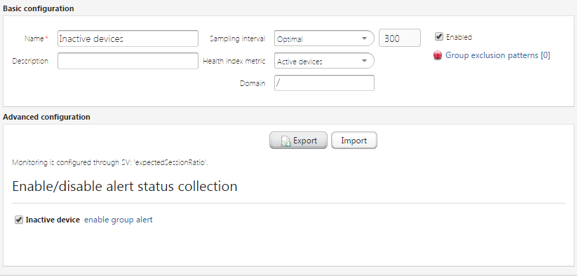

# Inactive devices

Use the **Inactive devices** monitoring to identify devices which last visit in the system is older than expected. It is calculated with
this formula: *last visit time + expectedSessionRatio * periodicInformInterval*.
This monitoring does not have any contact with devices, it only inspects the system for devices that were supposed to connect.

**Prerequisites:** To execute the monitoring, the *expectedSessionRatio* (in %) and *periodicInformInterval* (in seconds) SVs must be set on a device or a group of devices.

   *Fig. Monitoring - Inactive devices*

Alerts that can be triggered by this monitoring:

 * **Inactive device** - the alert is triggered when a device does not visit the system in the expected time period.

The following KPI is available:

**Active devices**:

 * For a device - KPI shows the last value and when it displays 0% this means that the device is inactive, and when it displays 100% this means that the device is active.
 * For a group of devices - KPI shows a percentage of active devices in the last hour. The higher value the better.
