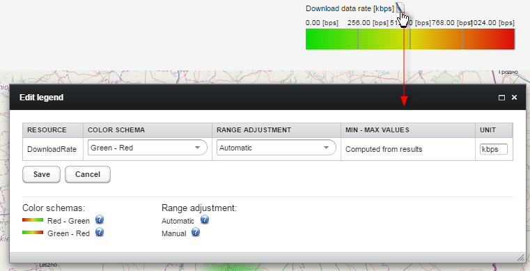

# Monitoring map

To visualize monitoring that you configured in your system on a map, go to **Monitoring & Reporting --> Monitoring map**.

## Interface

The **Monitoring map** view is divided into three main panels:

1. **Time range** - use it to set a time period for which you want to see visualization. To set a date, use the button or the calendar.
2. **Tabs** - use the tabs to decide which monitoring and options you can see on the map:

    * [Monitoring](#monitoring)
    * [Options](#options)
    * [Filters](#filters)
    * [Search](#search)

3. **Map** - use it to see monitoring data location.

    * On the map you can click a group or a subgroup to see more details in a pop-up window. When the pop-up window opens, depending on displayed data, you can save it as an image or a CSV file. What is more, you can click the group name to go to **Device groups**.
    * If there is any data collected for a selected resource, then a proper legend is displayed above the map. For some monitoring resources you will be able to edit the legend by clicking the **Edit** icon. To learn more about legend settings, read the [Monitoring configuration](../Monitoring_Configuration.html) chapter. Changes you make on the monitoring map will be also implemented in monitoring configuration.

* Groups circles displayed on the map will be highlighted with colors depending on the collected value and according to the scale.
* To zoom the map, use the zoom slider or your mouse scroll wheel.
* A level in a group hierarchy depends on zoom on the map (thus when zoom is closer, you are able to see smaller groups or even devices). The default association between zoom and depth in the group hierarchy can be overridden by setting a proper SV. Learn how to do it in the [Overriding a default zooming feature using SV](Overriding_a_default_zooming_feature_using_SV.html) chapter.

### Monitoring

Use the **Monitoring** section to select a group and monitoring that you want to display on the map.

* **Root group** - select a group from which you want to display monitoring. Groups added in **Administration —> Import monitoring groups** are available on the **Root group** list automatically. To add other groups use the **Edit** link (you can also use it to remove any groups). The group selected from the list will be used as a root of a hierarchy displayed below as a tree and as groups circles on the map. If you do not want to show all subgroups, hover over the subgroup and clear the check box next to it.
* **Monitoring** - click a monitoring name to display it on the map.
* **Resource** - select what resource you want to display.
* **Aggregation** - select a proper aggregation of values from the list.
* **Next** - click it to go to another tab.

### Options

Use the **Options** section to display additional information on the map.

* **Mark min value** - select it to mark groups or devices for which a value of a selected resource (in the **Monitoring** section from the **Resource** list) is the lowest.
* **Show values** - select it to show values of the selected resource.
* **Show names** - select it to show names of groups, subgroups, or devices.
* **Voronoi diagram** - select it to display the Voronoi diagram on the map.
* **Saturation** - move the slider to select proper saturation of the Voronoi diagram.
* **Show in group circle** - use this list to display additional information on the map, such as a number of subgroups or devices in the particular group. The number also influences the color of the particular group circle, this helps you to visually compare the size of groups when the map is zoomed out.
* **Mark max value** - select it to mark groups or devices for which a value of the selected resource is the highest.
* **Show locations** - select it to display a geographical location on the map.
* **Draw beams (BTS)** - select it to display a direction of emission of base transceiver stations (BTS).
* **Next** - click it to go to another tab.

### Filters

Use the **Filters** section to display only specified information. You can add more than one filter.

* **Add filter** - click the icon to add a filter. Configure the filter by selecting from lists proper configuration and providing values. Data that you can select for each monitoring type differs. To add another filter, click the icon again.
* **Apply filters** - click it to execute the filter on the map.
* **Delete** - click the icon to delete the filter.
* **Next** - click it to go to another tab.

### Search

Use the **Search** section to find a particular device on the map. Type a device identity and click the **Search** icon. When the device is displayed on the map, you can click it to see more details.

**See also:**

* [Overriding a default zooming feature using SV](Overriding_a_default_zooming_feature_using_SV.html)
* [Importing monitoring groups from CSV](../../../User_Interface/Administration/Importing_monitoring_groups_from_CSV.html)
