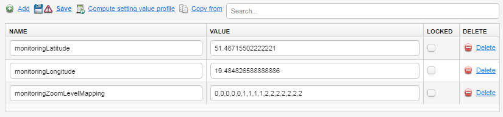

# Overriding a default zooming feature using SV

The default association between zoom and a depth in the group hierarchy can be overridden by setting a proper SV.

## Example

To better understand the format of the SV you will need to type, read the below example.
Let's assume that your groups hierarchy looks like the one below:

```
    monitoring-root
        |----- country-1-subgroup
        |         |------ city-1-subgroup   <- each group contain devices, no more subgroups
        |         |------ city-2-subgroup
        |         \------ city-3-subgroup
        \----- country-2-subgroup
                  |------ city-4-subgroup
                  \------ city-5-subgroup
```

Each value from SV corresponds to a level in your group hierarchy:

 * **0** is interpreted as a monitoring group root (in the example - **monitoring-root**).
 * **1** is interpreted as a monitoring root's direct children (in the example - **country-1-subgroup** and **country-2-subgroup**).
 * **2** is interpreted as the second level children (in the example - all **cities subgroups**).
 * And so on if you have more levels.

In the example, you have only three levels in the group hierarchy, that is **0**, **1** and **2** but you can always use one more to display devices. Thus in this case, you can use **3** to denote devices.
SV is composed of 16 non-decreasing numbers because this is the number of available zoom levels on the map. The first number indicates the most zoomed out view (the farthest view), the second indicates a slightly closer view and the last one indicates the most zoomed in view (that is the closest one).

Let's analyze this SV: **0, 0, 0, 0, 0, 1, 1, 1, 1, 2, 2, 2, 2, 2, 2, 2** in the context of the above sample group hierarchy:

 * Through the most 5 farthest zooms, only **monitoring-root** will be shown (5 because there are 5 zeros at the beginning).
 * Through the next 4 map zooms, **country-1-subgroup** and **country-2-subgroup** will be shown (4 because there are four 1).
 * Through the last 7 closest map zooms, all **cities subgroups** will be shown.

If you change last four 2 to 3 then you will get **0, 0, 0, 0, 0, 1, 1, 1, 1, 2, 2, 2, 3, 3, 3, 3** and in this case, for last four most close zooms you will see devices.

## Procedure

To override the default zooming feature using SV:

1. Go to **Device groups**.
2. From the group tree, select a group.
3. Go to **Profiles** and add into:

    * The **Name** field, type *monitoringZoomLevelMapping*.
    * The **Value** field, type a comma separated list of 16 non-decreasing values.

    

4. Click the **Save** link.
5. To check if your configuration works, go to **Monitoring & Reporting —> Monitoring map**.

**See also:** [Monitoring_map](Monitoring_map.html)
