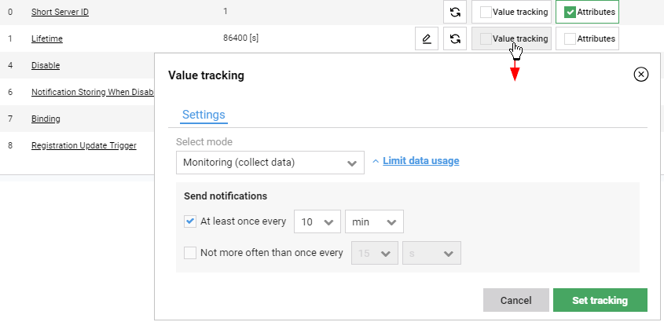

# Monitoring a single parameter on a device

Read this chapter to learn how to monitor a single parameter on one device.

To monitor a parameter:

1. Go to **Device inventory**.
2. From the list of devices, select a proper device.
3. Go to the **Objects** tab.
4. Find a parameter you want to monitor, and click the **Value tracking** button.
5. From the **Select mode** list, select **Monitoring (collect data)**.

    {: .center }

6. To limit data usage, click the **Limit data usage** link and select proper check boxes.
7. Click the **Set tracking** button. As a result, the **Observe** request is sent to the device and notifications (results) are saved in the database and their history is visible on the chart.

!!! tip
    * To view results of monitoring , click the **Value tracking** button.
    * To stop monitoring, click the **Value tracking** button, go to the **Settings** tab, and click the **Delete tracking** link. Keep in mind, that if you stop monitoring then its results will not be saved and visible on the chart anymore.
