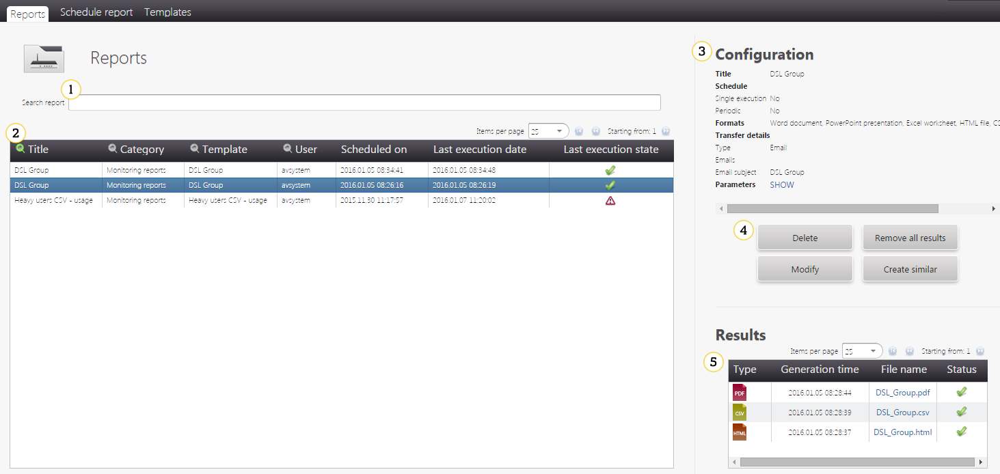
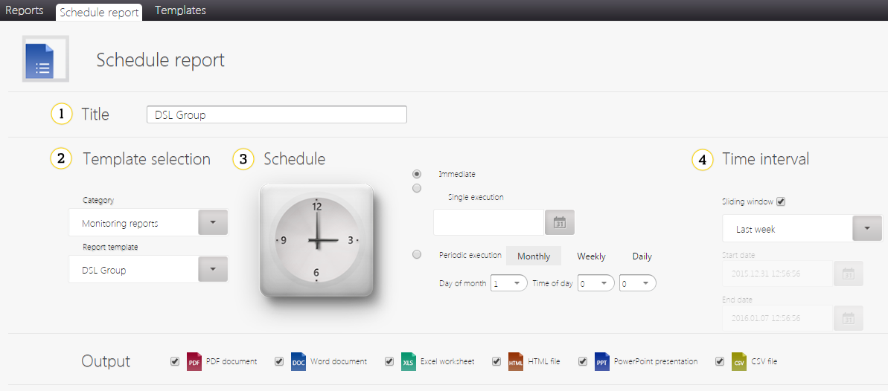
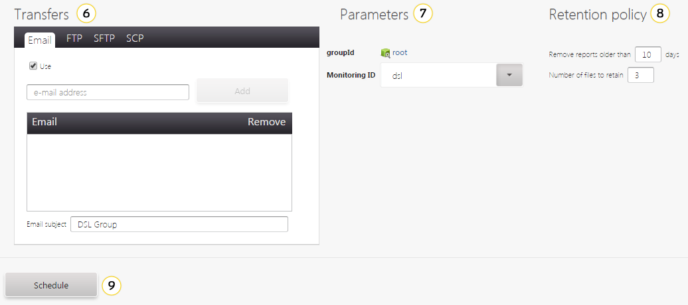
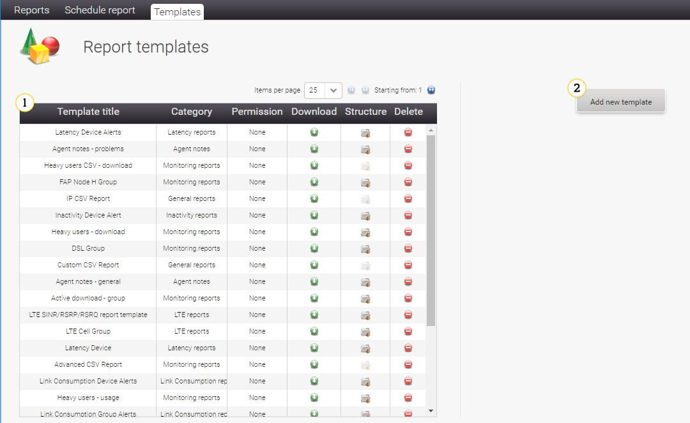
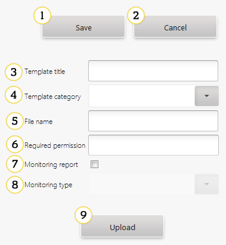
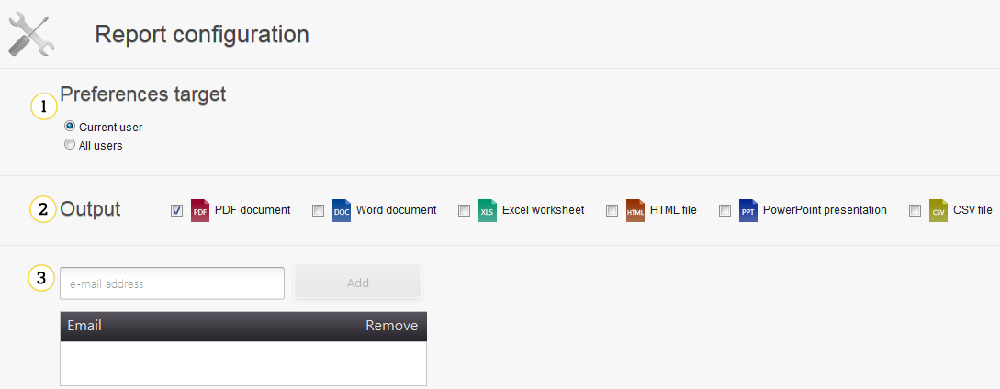
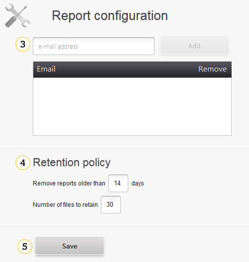

# Reporting

This document describes the reporting module. In this module you can find information about:

* Viewing and scheduling reports
* Managing reports templates
* Configuring reports

## Reports

In this tab you can view all scheduled reports and their results.


   *Fig. Reports*

1. Reports search input - you can filter reports by a column from a table. You can select a filtering column by clicking the :mag: icon in the table header.
2. The table contains most important information about scheduled reports:

 * :white_check_mark: - a report was generated successfully
 * :clock5: - a generation process is not finished yet
 * :warning: - there were some problems with the report generation

3. Configuration - you can read more about a configuration in the [Reporting Configuration Details](#reporting-configuration-details) section.
4. Buttons:

 * **Delete** - use it to delete a report.

!!! warning
    Reports are deleted without confirmation. If you click the **Delete** button, then the report will be deleted immediately.

 * **Remove all results** - use it to delete all files generated by report executions.

!!! warning
    Results are deleted without confirmation. If you click the **Remove all results** button, then report results will be deleted immediately.

 * **Modify** - use it to modify a report.
 * **Create similar** - use it to quickly create a new report on the basis of the report you view.

5. **Results** - use it to find all results files and to download them.

## Schedule report

Reports can be customized in many ways. Read a short description of a layout and a detailed description of a configuration with examples.

### Layout


   *Fig. Scheduling a report*

1. **Title** - use it to name a report.
2. **Template selection** - use it to select a template of a report. You can find more about templates in the [Templates](#reporting_templates) section.
3. **Schedule** - use it to select when the report will be created:

 * **Immediate** - use it to generate a report as soon as possible.
 * **Single execution** - use it to generate a report once on selected date.
 * **Periodic execution** - use it to generate a report periodically.

4. **Time interval** - use it to select a period from which data will be used to generate the report.
5. **Output** - use it to select a format of the report, for example, PDF, HTML or CSV.


   *Fig. Scheduling a report - GUI*

6. **Transfers** - use it to select how the generated report will be sent, for example, by email or uploaded to a remote server using FTP, SFTP or SCP.
7. **Parameters** - use it to set detailed parameters of the report.
8. **Retention policy** - use it to set rules of cleaning up old report files.
9. **Schedule** - use this button to schedule a report.

### Reporting Configuration Details

This part describes the report configuration in details.

#### Template selection

There is a lot of templates you can select to generate the report. All templates are grouped in categories, for example:

 * **General Report** - reports connected with general information about users and devices.
 * **Hosted** - a report for clients of the Coiote DM Cloud installation.
 * **Monitoring reports** - all reports based on monitoring.
 * **Inactivity reports**.

The selected template can impact possible options in other sections of configuration.

#### Schedule

There are three types of a report execution schedule:

 * **Immediate** - a report will be generated only once as soon as possible.
 * **Single execution** - the report will be generated once on a selected date, you can select any future date.
 * **Periodic execution** - the report will be generated every selected time period:

   * **Monthly** - on a selected day of a month and time of the day. Be careful with selecting the last day of a month, for example, February has only 28/29 days.
   * **Weekly** - on a selected day of a week and time of the day.
   * **Daily** - everyday on selected time.

#### Time interval

This part defines a time period that will be taken to the report. There are two ways of selecting it:

 * **Sliding window** - this option is useful for periodic reports, you can select interval relatively to generation time, for example, last 6 hours, last month.
 * **Custom** - you can select custom time, for example, 8 days 2 hours and 15 minutes.
 * **Start and End date** - a fixed time period, useful for a single execution.

#### Output

You can select an output type for the report. Possible formats may differ between report templates. Usually you can use: CSV, DOC, HTML, PDF, PPT or XLS.

#### Transfers

Beside downloading report files, you can use four transport mechanisms (you need to select the **Use** check box to activate this option):

 * **Email** - after every execution, results will be sent to added emails.
 * **FTP** - results will be uploaded to a provided server using the FTP protocol.
 * **SFTP** - results will be uploaded to the provided server using the SFTP protocol.
 * **SCP** - results will be uploaded to the provided server using the SCP protocol.

In FTP/SFTP/SCP you can select **Add date to generated file name** check box, than every transferred file will have a generation date
added at a beginning of a file name. If you do not select this option, then newer files will be overridden by older ones. To eliminate any problems with file names, since the 16.01 version an additional setting was added in `cdm.conf`:
```
    reports.replaceForbiddenChars=true
```

By default it is set to *true*, and it replaces all forbidden characters with proper ones. For example, a report title is *FAP Node H CPE* and its file name was generated in versions previous to 16.01 as *FAP Node H CPE* and now it will be *FAP_Node_H_Group*.


!!! tip
    Remember that a user password provided in this form is not encrypted.

#### Parameters

Content of this part depends on a selected report template. Usually you can find device or group selection, monitoring ID selection for monitoring based reports.

#### Retention policy

You can set two parameters:

 * **Remove reports older than** - all report files older than a provided number of days will be removed (default: 14 days).
 * **Number of files to retain** - if report executions will generate more files than a provided number (default: 30), then the system will remove all beside the newest number.

!!! note
    This rules concern only local report files, they do not affect files uploaded to a remote server using the [Transfers](#Reporting_Configuration_Details_Transfers) feature.

## Templates

Here you can read more about report templates and a panel to manage them.

### Layout


   *Fig. Templates*

1. **Report templates** - use it to browse through all report templates. Additionally, you can download, delete or check their details. If a report template has an invalid file format, then you will see information *Invalid file* in the **`Structure** column. What is more, you will not be able to use this template while scheduling a report.
2. **Add new template** - use it to open a creation form. Check :ref:`Reporting_Templates_Custom` for more details.

When you select the report template from a table, an edition form will open. It looks exactly the same as the creation form.

### Custom templates creation

Look at the list below to find information about creating custom report templates.


*Fig. Custom templates creation*

1. **Save** - use it to save changes.
2. **Cancel** - use it to discard all changes.
3. **Template title** - use it to set a name of a template.
4. **Template category** - use it to set a category from which the template will be accessible.
5. **File name** - use it to set a name of a file with the template.
6. **Required permission** - use it to select a permission that will be required to use the template. This field is optional.
7. **Monitoring report** - use it to indicate if the template is based on monitoring.
8. **Monitoring type** - if the template is based on monitoring, then you should select which one.
9. **Upload** - use this button to upload the report template file. A template file must be in a .rptdesign or .cft format. If you try to upload the file in another format, then you will see information that a structure is invalid and you will not be able to save this template. There is a limit regarding a size of the report template, information about it is displayed when you try to upload the bigger file than allowed. If needed, you can change the limit in the configuration file. To learn how to do this, please refer to the Admin Guide, **Changing the size of a report template** section.


## Reports configuration

This panel allows you to configure default reports properties and make scheduling of new reports faster.


   *Fig. Reports configuration - 1*

1. **Preferences target** - use it to select if this settings should be visible only for you (*Current user*) or for everyone in UMP.
2. **Output** - use it to select default output formats. You can use CSV, DOC, HTML, PDF, PPT or XLS.


   *Fig. Reports configuration - 2*

3. **Email address** - use it to add email addresses to which reports will be sent.
4. **Default retention policy** - look at the :ref:`Reporting_Configuration_Details_Retention_Policy` section for details.
5. **Save** - click it to save changes in default reports settings.
