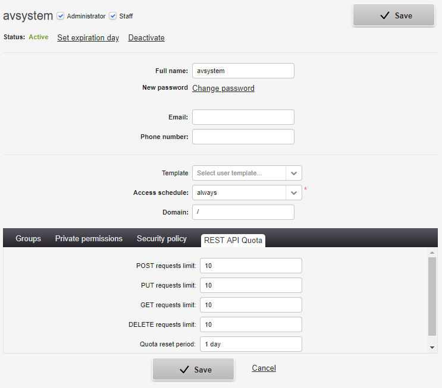

# Limiting the number of REST API requests

Read this instruction to learn how to set a limit on the number of REST API requests that can be sent by a particular user.

To set a limit on a number of requests:

1. Go to **Administration —> Users management**.
2. Click the **System users** tab.
3. From a list of users, select a user for which you want to set a limit on a number of requests.
4. Click the **Edit** button.
5. Click the **REST API Quota** tab.
6. Configure limits:

    * Into the proper fields, type a number of requests. If you leave any of request fields empty then a user can send an unlimited number of these requests.
    * Into the **Quota reset period** field, type a time period after which count for requests is cleared. You can express time in days, hours, minutes and seconds, for example, 2 days or 2 hours or 2 minutes or 2 seconds. You can also use abbreviations such as *d* - for day, *h* - for hours, *min* - for minutes and *s* - for seconds. If you leave this field empty, then the default value is **1 day**.

    {: .center }

7. Click the **Save** button.
