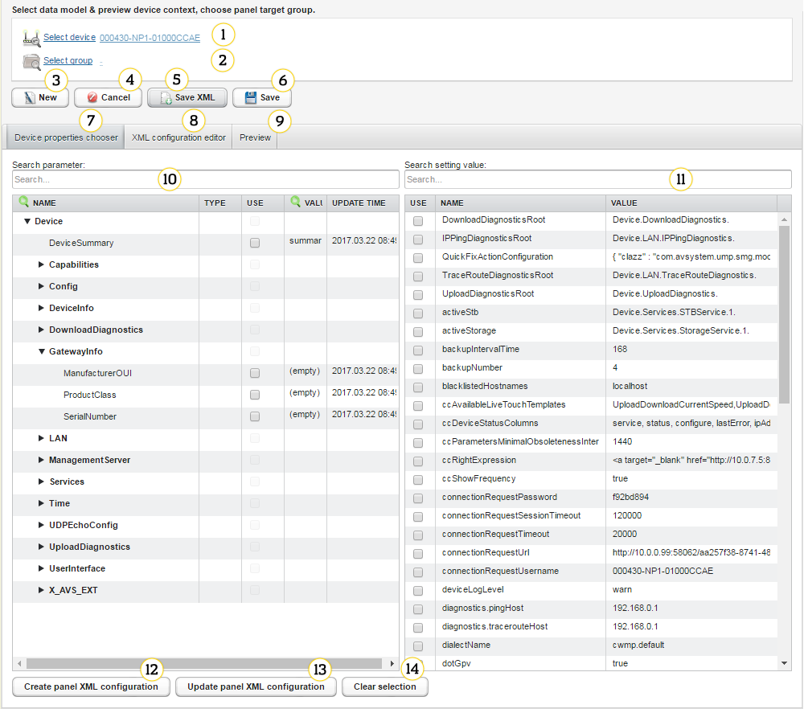
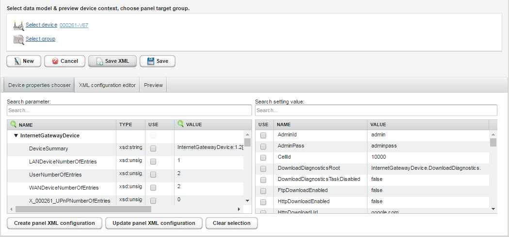
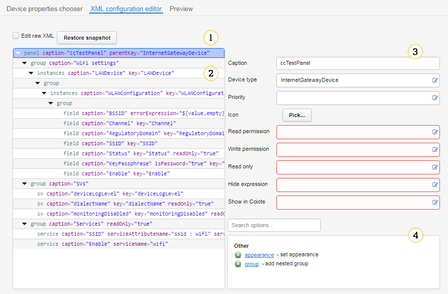
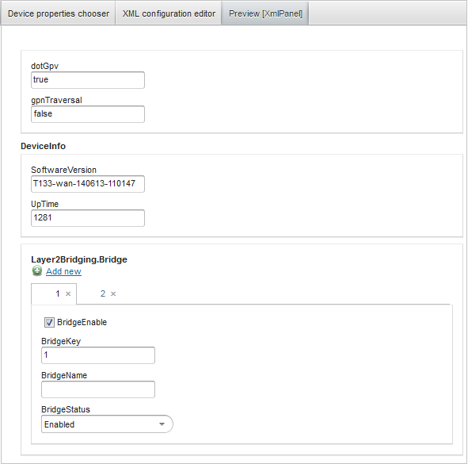

.. _UIR_A_Panel_editor:

Panel editor
============

Use :guilabel:`Panel editor` to create highly customized device settings panels. It is accessible from the main menu
:menuselection:`Administration --> Panel editor`.
This panel provides help through the whole settings panel design process:

* A wizard that uses a device source data model and a setting value profile, and generates an XML definition.
* An advanced XML editor that provides a visual XML panel definition builder.
* A preview panel that lets you see a live component generated from the current definition.

Layout
------

   *Fig. Panel editor GUI*

1. :guilabel:`Select device` - use it to select a device.
2. :guilabel:`Select group` - use it to select a group of devices.
3. :guilabel:`New` - use it to create an empty panel definition.
4. :guilabel:`Cancel` - use it to discard changes and close the editor.
5. :guilabel:`Save XML` - use it to start downloading the XML panel definition.
6. :guilabel:`Save` - use it to save the panel in a context of the selected group.
7. :guilabel:`Devices properties chooser` - an XML panel definition wizard.
8. :guilabel:`XML configuration editor` - a visual XML definition editor.
9. :guilabel:`Preview` - a live panel preview.
10. :guilabel:`Search parameter` - use it to search for parameters.
11. :guilabel:`Search setting value` - use it to search for values of the selected device.
12. :guilabel:`Create panel XML configuration` - use it to create or override the panel XML configuration.
13. :guilabel:`Update panel XML configuration` - use it to update the configuration in the XML panel.
14. :guilabel:`Clear selection` - use it to clear all selected parameters and values.

Devices properties chooser
--------------------------

You can generate for a selected device, a panel definition using its data model parameters and setting values. 
Select desired properties and click the :guilabel:`Create panel XML configuration` button to generate the panel definition.

   *Fig. Creating a panel definition*

* In this panel you can search for parameters and setting values.
* On left side of the panel you can see a data model of the selected device.
* On right side of the panel you can see values of the data model.

XML configuration editor
------------------------

Use this panel to edit the XML configuration.

   *Fig. Editing XML configuration*

1. Editor mode switch - it switches between a visual editor and a plain-text editor.
2. Visual editor tags table - an XML document structure display, allows you to drag, copy and delete tags.
3. Visual editor selected tag properties - it displays available tag properties and helps you fill them by prompting allowed values and providing expression syntax completion.
4. Visual editor tags adder - it displays allowed subtags. To learn more about available tags and subtags, read the :ref:`UG_UIR_A_Panel_editor_tags` chapter.

Live preview
------------

Use the :guilabel:`Preview` panel to generate a component using the definition from :guilabel:`XML configuration editor`, which allows you to interactively test the edited configuration. Each time you use the panel, the preview is rebuilt from scratch in order to reflect every change in the definition.

   *Fig. Live preview*

**See also:**

.. toctree::
   :maxdepth: 1
   
   ./Panel_editor_tags
