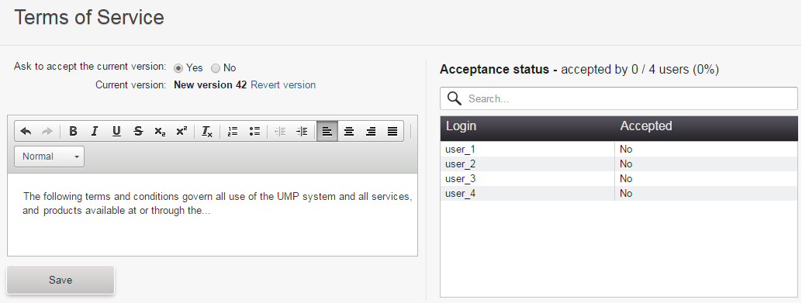

# Adding Terms of Service

As an administrator of the Coiote DM installation you can add and edit Terms of Service that your users have to accept before having access to the system.

To add Terms of Service:

1. Go to **Administration --> Terms of Service**.
2. Click the **Create a new version** link.
3. Type a proper text containing Terms of Service. You can use various formatting tools.

    !!! tip
        While creating a new version, you can come back to the previous version by clicking the **Revert version** link.

4. Decide if users have to accept new Terms of Service by selecting the **Yes** or **No** option.

    {: .center }

5. Click the **Save** button. New Terms of Service will be visible to your users.
6. You will see how many users accepted them (if you selected that acceptance is required) in the table on the right and you can use the search field to look for particular users by their logins.

## Editing Terms of Service

At any time you can edit Terms of Service and users will not have to accept it again.

To edit Terms of Service:

1. Make necessary changes in the text field.
2. Click the **Save** button.
