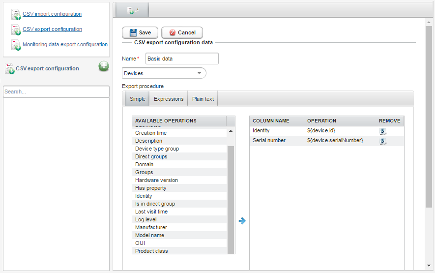

# Adding CSV export configurations

Read this section to learn how to create a new export configuration.

To add a CSV export configuration:

1. Go to **Administration** and select **CSV Import/Export templates**.
2. Click **CSV export configuration**.
3. Click the **Add** icon.
4. Provide a name for a configuration.
5. From the list select whether you want to export devices or assets.
6. Select one of editor modes:

    * **Simple** - to add a column, click it in the **Available operations** table.
    * **Expressions** - to add the column, click the **Add column** link and start typing expressions. To see expression suggestions for a device, use the **Select representative of imported devices** option.
    * **Plain text** - to add the column, start typing expressions. You should type one column name and expression per line, for example, *Identity,${device.id}*.

7. After adding all columns you can remove, edit or move them:

    * To remove a column in the **Expressions** or **Simple** tab, click the **Remove** icon next to it.
    * To edit the column, go to the **Expressions** or **Plain text** tab, and make necessary changes.
    * To change an order of columns, go to the **Simple** tab, and use the drag and drop functionality.

    {: .center }

8. Click the **Save** button.

**What to do next:** Use the newly created CSV export configuration, for example, to [export devices to CSV](../../../DM_Exporting_devices_to_CSV.html) in **Device inventory**.
