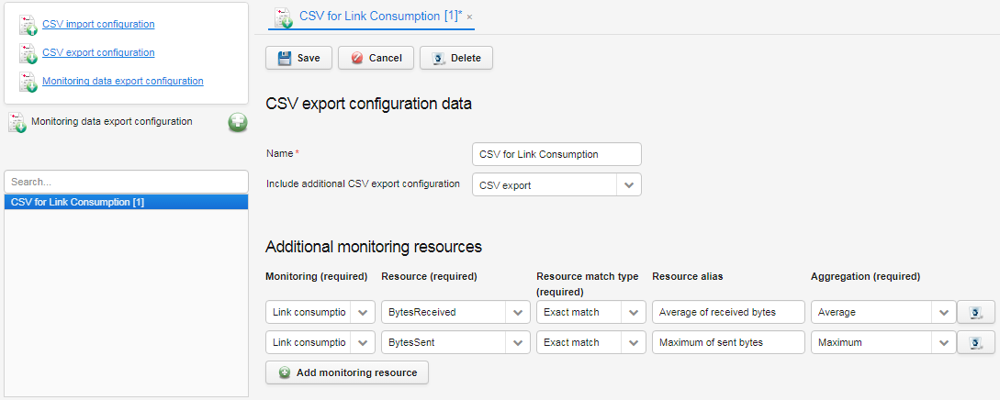

# Adding CSV monitoring data export configurations

Read this section to learn how to create a new export configuration for monitoring data that you can use later to generate a report.

To add a CSV monitoring data export configuration:

1. Go to **Administration** and select **CSV Import/Export templates**.
2. Click **Monitoring data export configuration**.
3. Click the **Add** icon.
4. Into the **Name** field, type a unique name for a configuration (it will be later visible in **Reports**).
5. To include some additional data (for example, domain, hardware version or other setting values) from other CSV export configurations, select a proper export configuration name. To learn how to add the CSV export configuration, that you can use in this procedure, read the [Adding CSV export configurations](Adding_CSV_export_configurations.html) chapter.
6. Add as many monitoring resources as you need from different monitoring types by clicking the **Add monitoring resources** button.
7. Configure each of resource in the following way:

    * From the **Monitoring (required)** list, select a monitoring name.
    * From the **Resource (required)** list, select a monitoring resource.
    * From the **Resource match type (required)** list, select:

        * **Exact match** if a resource selected from the **Resource (required)** list is an exact match.
        * **Prefix** if a resource selected from the **Resource (required)** list is only a prefix of existing resources. Then all resources starting with this prefix will be exported.

     * Into the **Resource alias** field, type a meaningful name for the column in which the selected resource will appear. It is recommended to include a type of aggregation in the name, for example, *Maximum of received bytes*. If you do not specify the name, then the raw name of the resource will be taken.
     * From the **Aggregation (required)** list, select a way in which data should be aggregated. Available aggregation types depend on the type of the selected resource:
     * For numerical parameters you will have: **Average**, **Maximum**, **Minimum**, **Sum**, and **Sum of delta** (for monitored numerical parameters, such as uptime or bytes sent or received, which data type is a counter in order to calculate an accurate sum in a data range, it is necessary to find a sum of peaks in data series and subtract the first and last value).
     * For alerts you will have: **Count** (a number showing how many times the selected alert occurred) and **Percentage** (a percentage of alert samples).
     * For textual parameters you will not be able to select aggregation because such values cannot be aggregated. You will see the **-** sign in a row.

    !!! tip
        * To delete a particular resource, click the **Remove** button next to it.
        * An aggregation type is not taken into consideration, if you select the **Raw** export type while scheduling the report.

8. Click the **Save** button.

{: .center }

**What to do next:** Use the newly created CSV monitoring data export configuration to schedule **Advanced CSV Report** in **Monitoring & Reporting --> Reports**. Read how to do it in the [Scheduling advanced CSV report](../../../Monitoring_and_Reporting/Scheduling_Advanced_CSV_Report.html) chapter.

**See also:**

 * [Scheduling advanced CSV report](../../../Monitoring_and_Reporting/Scheduling_Advanced_CSV_Report.html)
 * [Adding CSV export configurations](Adding_CSV_export_configurations.html)
