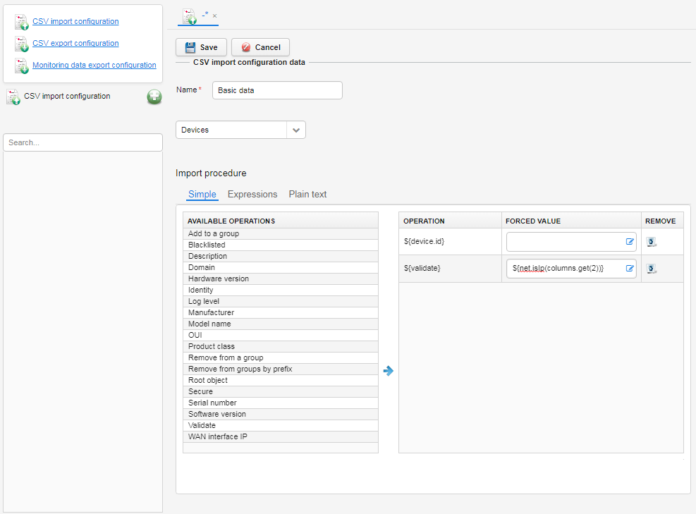

# Adding CSV import configurations

Read this section to learn how to create a new import configuration.

To add a CSV import configuration:

1. Go to **Administration** and select **CSV Import/Export templates**.
2. Click **CSV import configuration**.
3. Click the **Add** icon.
4. Provide a name for a configuration.
5. From the list select whether you want to import devices.
6. Select one of editor modes:

    * **Simple** - to add a column, click it in the **Available operations** table.
    * **Expressions** - to add the column, click the **Add column** link and start typing expressions. To see expression suggestions for a device, use the **Select representative of imported devices** option.
    * **Plain text** - to add the column, start typing expressions. You should type one expression per line.

    !!! tip
        * Remember to add a column that specifies an ID of a device.
        * To set particular values for some columns and override values from a file, type them into the **Forced value** field.

7. Before importing the CSV file, you can validate it. For example, you can check if IP addresses of devices (they are in the third column in the file) are correct by selecting **Validate** from **Available operations** and typing into the **Forced value** field the following expression: *${net.isIp(columns.get(2))}*.

If any IP address is incorrect, then the list will not be imported and a proper message will be shown in the **Import log** field. Add validation at the end of the import configuration if you do not want to skip content of any column from the CSV file or use this content as a validation condition.
To use a current column content from the CSV file as the validation condition, use **Validate** with no value in the **Forced value** field.

8. After adding all columns you can remove, edit or move them:

    * To remove a column in the **Expressions** or **Simple** tab, click the **Remove** icon next to it.
    * To edit the column, go to the **Expressions** or **Plain text** tab, and make necessary changes.
    * To change an order of columns, go to the **Simple** tab, and use the drag and drop functionality.

    

9. Click the **Save** button.

**What to do next:** Use the newly created CSV import configuration, for example, to [import devices](../../Device_Actions/DA_Importing_devices_from_CSV.html) from CSV in **Device inventory**.
