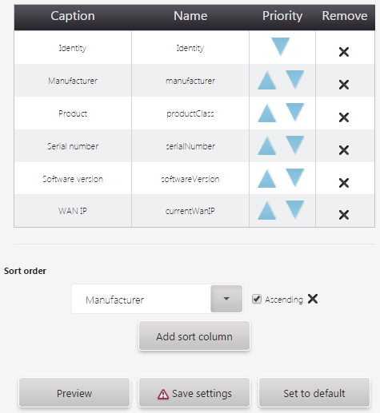

# Customizing device list

Read this chapter to learn how to customize the device list displayed in **Device inventory**.

To customize device list:

1. Go to **Administration —> Device inventory preferences**.
2. From the **Target** list, select the target.
3. Configure the device list:
    * To change an order of entries, use the drag and drop functionality or in the **Priority** column, click the triangles to move the particular entry up or down.
    * To add sorting for the device list, click the **Add sort column** button and from the list select a column that will sort the list. To sort in an ascending order, select the **Ascending** check box.

    

    * To add a new entry, configure it and click the **Add entry** button.
    * To delete the entry, find it in the table and click the **Remove** icon.
    * To see changes before saving them, click the **Preview** button.
    * To reset your changes, click the **Set to default** button.

5. Click the **Save settings** button.
