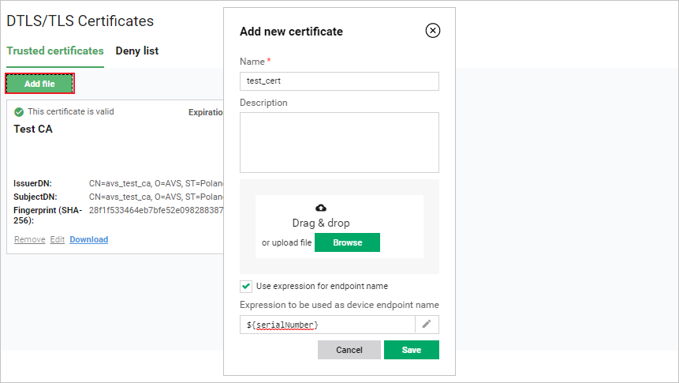

# DTLS/TLS Certificates

As an administrator of the Coiote DM installation, you can add and manage device certificates and their CAs.

## Adding a certificate

To add a certificate:

1. Go to **Administration --> DTLS/TLS Certificates**.
2. Click the **Add file** button.
3. Type your custom certificate name and description.
4. Drag and drop the certificate file or upload it using the **Browse** button.

    {: .center }

5. Optionally, mark the **Use expression for endpoint name** and enter an expression to be built from client certificate data that will be used for endpoint names of devices authorized by this ceritificate.
6. Click the **Save** button.

## Managing a certificate

At any time you can edit, download or remove your certificate.

!!! note
    Certificates defined in the configuration files cannot be edited or removed.

1. To edit a certificate name and description:

    * Choose a certificate to edit and click the **Edit** link.
    * Introduce the required changes in the text fields.
    * Click the **Save** button.

2. To download a certificate:

    * Choose a certificate to download and click the **Download** link.
    * The certificate will be downloaded automatically to your drive.

3. To remove a certificate:

    * Choose a certificate to remove and click the **Remove** link.
    * Click the **Confirm** button.

## Adding certificates to the Deny list

To make Coiote DM reject a device certificate, you need to add it to the **Deny list**. To do that, follow these steps:

1. In the **Administration --> DTLS/TLS Certificates**, go to the **Deny list** tab and click **Add file**.
2. In the pop-up, specify name, description, and upload your certificate file by using the *drag & drop* function or the **Browse** button.
3. Click **Save**.
4. After the certificate has been added correctly to the list, you can remove, edit or download it in the same way as in the **Trusted certificates** list.

!!! note
    The **Deny list** has precedence over the **Trusted certificates** list, so if a certificate is placed in both lists, the Server will reject it.
