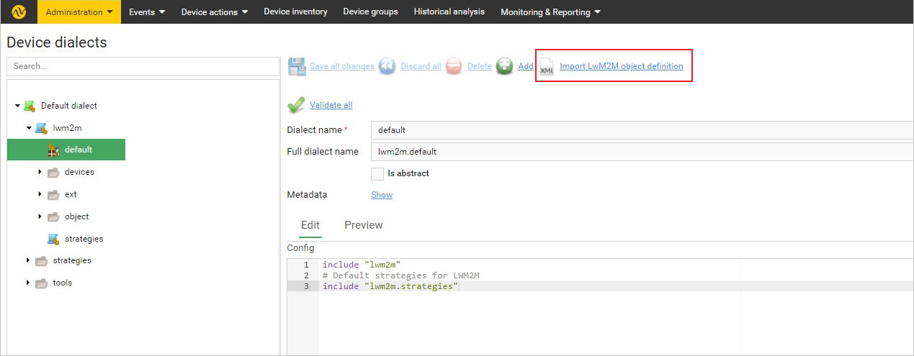
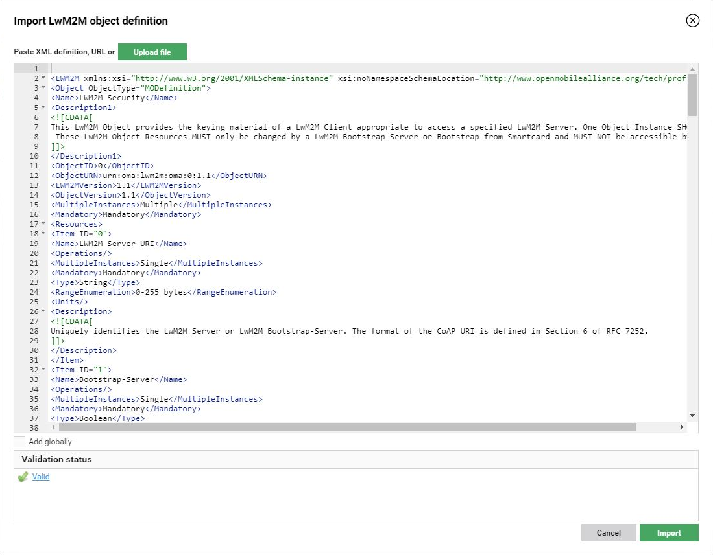
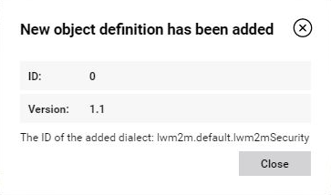

# Adding new object definitions to device dialects

Read this chapter to learn how to add new object definitions to your device dialect tree.

To add a new object definition:

1. Go to **Administration --> Device dialects**.
2. In the **Device dialects** panel, click **Import LwM2M object definition**.

    {: .center }

3. In the window that opens, import the desired LwM2M object definition. You can paste an XML definition or an URL in the field, or use the **Upload file** button.

    !!! note
        The imported object definition will be validated. In the **Validation status** field, you will see errors associated with specific XML lines.

    {: .center}

4. After the definition is positively validated, click **Import**.
5. The object definition is now added. Click **Close**.

{: .center }

**See also:**

 [Adding new object definitions](../../../Device_management/Device_operations/LwM2M_operations/Adding_new_object_definitions.html)
