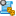
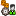
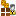
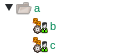
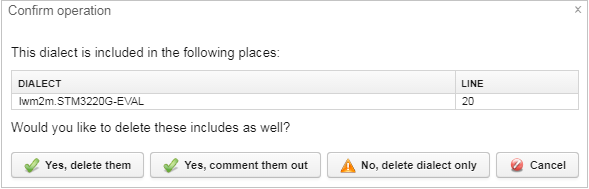
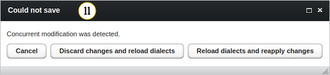

# Device dialects

This chapter describes the user interface for dialect modification. For more information about dialects see the [Dialects - Introduction](Dialects_-_Introduction.html) section.

This panel allows you to view and configure [device dialects](Dialects_-_Introduction.html) present in the system. Dialects are pieces of configuration which can be attached to a device description. They help mitigate differences which need to be taken into account when communicating with different types of devices. No changes made in this panel are saved until you click the **Save all changes** button. When dialects are saved, they are checked for structural errors (for example, syntax errors, incorrect include directive).

## Types and hierarchy

Dialects can be divided into three types:

* **Static dialects** - which are bundled with the system and cannot be modified.
* **User-defined dialects** - which can be added, modified and deleted.
* **Default dialect** - which is a special instance at the top of the tree that is automatically included in all other dialects.

Dialects can also be **abstract**, which means that they cannot be put directly on devices, and can only be included in other dialects. Types of dialects are represented by icons, user-defined dialects are also marked with green:

*  - an abstract user-defined dialect
*  - an abstract static dialect
*  - a default dialect
*  - a user-defined dialect
*  - a static dialect
*  - a dialect contains unsaved changes

To show all dialects in a compact way, they are put into a tree structure. Internally there is no hierarchy of dialects, but conventionally their names are split into components on dots. For display purposes these components are put into a tree, so that dialects `a.b` and `a.c` are displayed as:

{: .center }

## Layout

{: .center }

1. **Search tool** - it limits displayed dialects to ones containing a given text in their name.
2. **Dialect tree** - it displays names of all dialects present in the system.
3. **Action toolbar**:

    * **Save all changes** - it saves and applies all changes to all currently modified dialects.
    * **Discard all** - it discards all unsaved changes to dialects which also restores unsaved deletion.
    * **Delete** - it deletes a currently selected dialect. The delete action is not immediately saved and can be discarded. If the dialect is included in other places, all places will be listed and you will be asked if you want to delete the dialect from all of them.

    {: .center}

    * **Add** - it adds a new empty dialect positioned inside a currently selected item in the tree.
    * **Validate all** - it performs a dialect validation, displaying possible errors in a label on the right of this button.
    * **Import LwM2M object definition** - it is available for LwM2M devices in the LwM2M dialect branch. It allows to import an XML file as a dialect. The XML file has to have a proper schema described in http://www.openmobilealliance.org/tech/profiles/LWM2M.xsd. If you want to include your new dialect into the *lwm2m.object.users.global* dialect, select the **Add globally** check box.

4. **Color scheme** - use it to change a color scheme of the dialect in **Contents**.
5. **Update includes** - use it if you want to update dialect's name in all places it is included.
6. **Details** - it shows properties of a currently selected dialect:

    * **Dialect name** - a name of the dialect with all but the last ``.``- separated components are removed.
    * **Full dialect name** - an actual name of the dialect.
    * **Is abstract** - if the dialect is abstract, it cannot be used directly on devices, but can only serve as a template to be included in other dialects.

7. **Contents** - it shows HOCON contents of the selected dialect (in an edit mode) or full contents of the dialect (in a preview mode).

    {: .center }

8. **Preview properties** - options for modifications of the preview display:

    * **Render comments** - do not strip comments from an input.
    * **Render origin comments** - it prints a comment above all config lines describing the name of the dialect and a line number in which they were defined.
    * **Render as JSON** - it uses a JSON-like version of a HOCON syntax. If you do not select **Render comments** and **Render origin comments** check boxes, the preview of a valid JSON string will be displayed.

9. **Preview window** - contents of the resulting dialect data structure.
10. If more than one user edits any dialects and both want to save their changes, then the first user saves changes but the second will get a pop-up with three options:

    * **Cancel** - clicking it gives up performing any actions.
    * **Discard changes and reload dialects** - clicking it ignores performed changes and reloads all dialects.
    * **Reload dialects and reapply changes** - clicking it keeps performed changes, reloads dialects and pastes a modified content.

{: .center}

**See also**
[Dialects - Introduction](Dialects_-_Introduction.html)
