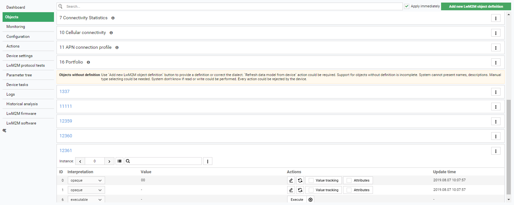

# Managing unknown device objects in the Objects panel

It is sometimes the case that devices may feature objects that are not defined by any of the dialects available by default in the platform. Read the instructions below to learn how to manage such unknown objects:

1. Go to **Device inventory** and choose a device with objects that are not yet defined by the existing dialects.
2. In the **Objects** panel, scroll down the list of objects until you see a notice about **Objects without definition** and a list of unknown objects beneath it (with names marked in blue).

    {: .center}

3. Now, you can either configure the available object instances manually or use the **Import LwM2M object definition** button to import the desired LwM2M object definitions.

    !!! note
        See the [Adding new object definitions](../../../Device_management/Device_operations/LwM2M_operations/Adding_new_object_definitions.html) chapter for details on how to import the missing object definitions.

4. For manual configuration, click on the chosen unknown object to view the list of its resources.
5. In the **Interpretation** column, choose from among the following data formats to interpret the resource values:

    * boolean
    * integer
    * float
    * objlnk
    * executable
    * corelnk
    * opaque
    * unsigned integer
    * time
    * string

6. Thus, you'll be able to define the previously unknown resource values and manage the object to some extent.

!!! warning
    Support for objects without definition is incomplete. Please note that the system do not display names nor descriptions and that the device may reject actions taken on such objects.
