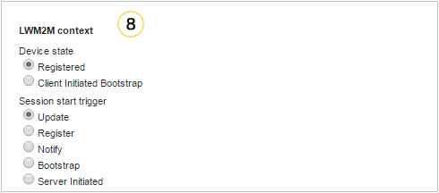

# Expressions sandbox

Use **Expressions sandbox** to test your expressions in a safe, read-only mode without waiting for provisioning session with a device. You can create a context in which your expression will be evaluated.

Layout
------
On the left side of the panel, you can specify your expression and you can see the results. On the right side of the panel, you can specify the context in which the expression will be executed.

{: .center }

1. **Select result type** - use it to select a desired result type of an expression. The expression you write must return a value of a selected type.
2. **Write your expression** - use it to write your expression here. If your expression is incorrect, then a background color of a text field will be red. To see error messages just hold the cursor over the text field. Click the icon on the right side of the field to open the text field as a pop-up.
3. **Evaluate expression** - click this button to evaluate your expression. The results will be shown below.
4. **Select device** - use it to execute the expression in a context of any device which exists in the system. Each device has its own device properties and data model parameters which you can use in the expression.
5. **Device navigation** - use it to navigate through a devices list.
6. **Select task** - use it to always execute the expression in a context of a task which exists on a selected device. The task has its own properties and report which you can use in the expression.
7. **Set local variables** - an expression can use local variables which were defined, for example, in an XML task statement. You can set values of local variables here and use them in your expression.

    {: .center }

8. **LWM2M context**
