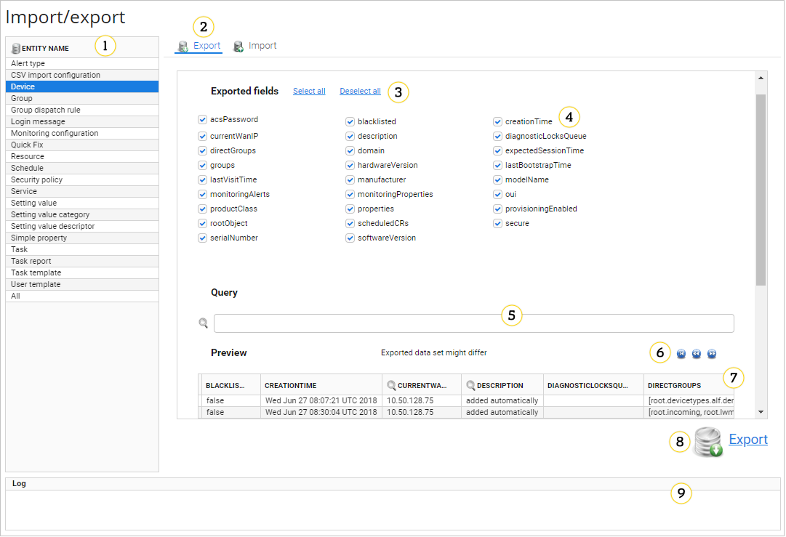
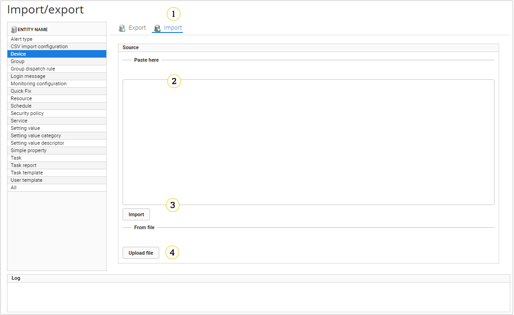

# Import/export

Use the import and export data module to:

* Easily manage application entities
* Import default data at the application launch

Import/export is available in **Administration --> Import/export**.

!!! warning
    Use importing and exporting carefully because wrong usage can lead to database inconsistency.

## Supported entities

The below entities are supported in UMP:

* Alert type
* CSV import configuration
* Device
* Group
* Group dispatch rule
* Login message
* Monitoring configuration
* Quick fix
* Resource
* Schedule
* Security policy
* Service
* Setting value
* Setting value category
* Setting value descriptor
* Simple property
* Task
* Task report
* Task template
* User template

## Export

Look at the below picture to see how the **Export** panel looks like.

{: .center }
   :align: center

1. **Entity Name** - a list of all supported entities.
2. **Export** - use it to manage an export operation.
3. **Select all**, **Deselect all** - use it to select or to clear all fields.
4. **Exported fields** - a list of fields that will be exported.
5. **Query** - use it to search for particular values of parameters.
6. **Reset**, **Previous**, **Next** - use **Previous` and **Next** icons to quickly go through all entities, use the **Reset** icon to go back to the first page.
7. **Preview** - use the table to preview entities.
8. **Export** - use this link to export selected entities.
9. **Log** - use this panel to see logs from your operation.

## Import

Look at the below picture to see how the **Import** panel looks like.

{: .center }

1. **Import** - use it to manage an import operation.
2. **Paste here** - a place where you can paste a source configuration. You can paste here up to 1 MB of a text.
3. **Import** - use this button to import parameters.
4. **Upload file** - use this button to upload the source configuration from a file.

**What to do next:** Learn how to [export](Exporting_entities.html) and [import](Importing_entities.html) entities.
