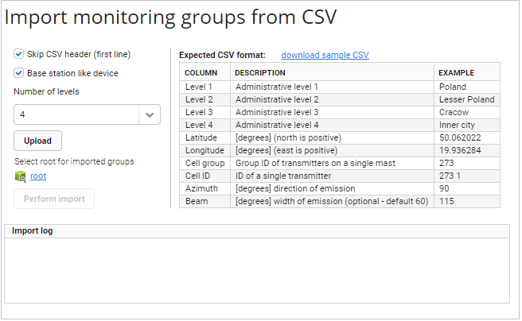
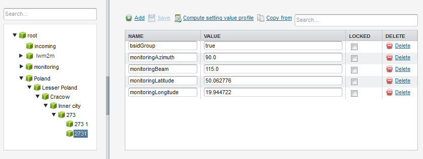

# Importing monitoring groups from CSV

Learn how to import monitoring groups from a CSV file to prepare a group structure for monitoring maps.

To import monitoring groups from a CSV file:

1. Go to **Administration** and select **Import monitoring groups**.

    !!! tip
        Before you import a file, take a look at a table that shows how a structure of the file should look like. You can also click the **download sample CSV** link to download a sample file and use it while creating the correct file.

2. If the first line of the file is not important, select the **Skip CSV header (first line)** check box.
3. To include **Cell group**, **Cell ID**, **Azimuth** and **Beam**, select the **Base station like device** check box.
4. From the **Number of levels** list, select how many administrative levels you want to include (up to 10 are possible).
5. Click the **Upload** button to upload the file from your disk. Importing is not performed at this point.
6. Select a root for your groups by clicking the **Select group** link and clicking the selected group.
7. Click the **Perform import** button.

    !!! tip
        If any entry is duplicated, the first set of data is imported.

    {: .center }

8. Go to **Device groups** and on the list of groups you should see you monitoring groups.
9. Go to **Profiles** and you can see **Latitude**, **Longitude**, **Azimuth** and **Beam** as setting values.

    {: .center }

    !!! tip
        * If you cleared the **Base station like device** check box, then **Azimuth** and **Beam** will not be set as setting values and **Cell group** and **Cell ID** will not create additional administrative levels.
        * If the **Beam** column is empty in your file, then its value is set to *60*.
        * Values of **Latitude** and **Longitude** for a parent are average of values of its children, if there is more than one child in the group.

**See also:** [Monitoring map](../../Monitoring_and_Reporting/Monitoring_Module/Monitoring_map/Monitoring_map.html)
