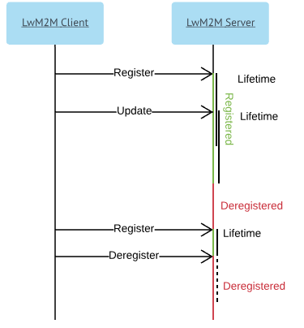

# LwM2M servers

Use **LwM2M servers** menu to add LwM2M servers (both Bootstrap and Management) and use them later to configure a bootstrap procedure by using a task or a bootstrap profile.

!!! tip
    By default, four preconfigured servers are created - Management with and without PSK, and Bootstrap with and without PSK.

## Layout

{: .center }

1. Search - use it to look for particular data by typing it into the field.
2. **Add** - use it to add a new server.
3. Table - use it to view server's settings or delete a server (after clicking the delete icon you will be informed if any tasks and task templates are assigned. You need to keep in mind, that they will be deleted with the server). Click a particular server to see its details and edit its settings.
4. **Configure a LwM2M server**:

    * **Name** - a name in a human-readable format. It will be used to refer to the server configuration in the Coiote DM system. When using a task it is better to refer to the server by its ID rather than name.
    * **Server type** - a type of a server: **Management** or **Bootstrap**.
    * **Transport** - a type of a protocol - **TCP** or **UDP**.
    * **SSID** - an ID of the server from the device perspective.
    * **URI** - the server hostname and port are specified in this field. The system automatically adds a schema (coap:// or coaps://) depending on a selected security mode. It is also not necessary to provide a port because the system appends a default one instantly.
    * **Client hold off time** - a defined period of time to wait before initiating a **Client Initiated Bootstrap** once a device (LwM2M Client) has determined it should initiate this bootstrap mode. This option allows to perform **Server Initiated Bootstrap** within the defined time.
    * **Bootstrap-server account timeout** - the device deletes the LwM2M Bootstrap Server Account after the defined timeout value.
    * **Binding** - a type of a biding. Some of binding types has Queue Mode. When Queue Mode is set the server can send a request to the device only if it is online. The device is online immediately after the **Registration** request is sent and it lasts for ACK_TIMEOUT. Timeout is prolonged by ACK_TIMEOUT if during being online the device receives any request from the server. A value of ACK_TIMEOUT depends on device implementation (a default value is 2 seconds).

    {: .center }

 The below types are available:

   * **U (UDP)** - the server expects that the device is reachable via the UDP binding all the time it is registered (see the **Lifetime** description below). All communication between uses UDP binding. This is a standard mode of operation.
   * **UQ (UDP with Queue Mode)** - the server queues all requests to the device and sends them via UDP when the device is online. All communication between uses  the UDP binding.
   * **S (SMS)** - the server expects that the device is reachable via the SMS binding all the time it is registered (see the **Lifetime** description below). All communication between uses the SMS binding.
   * **SQ (SMS with Queue Mode)** - the server queues all requests to the device and sends them via UDP when the device is online. All communication between uses the SMS binding.
   * **US (UDP and SMS)** - the server expects that the device is reachable via UDP and SMS bindings all the time it is registered (see the **Lifetime** description below). When communication is initialized using the UDP or SMS binging, a response must be sent over the same binding.
   * **UQS (UDP with Queue Mode and SMS)** - the server queues all requests to the device and sends them via UDP when the device is online. The server expects that the device is reachable via the SMS binding at any time. If the server sends requests to the device using the UDP binding, a response is sent over the same biding. If the server sends requests to the device using the SMS binding, a response is sent over the same biding. The server may request the device to perform the **Update** operation via UDP by sending the **Execute** operation on the **Registration Update Trigger** resource via SMS.

* **Lifetime** - a meaning of this parameter depends on a binding type:

    * For direct bindings, that is **U**, **S** and **US** it is a period of time after which the device is accessible after the **Register** or **Update** operation. If the device needs to be accessible the whole time, updates must be sent before time defined in the field elapses. The device can also send **Deregister** to inform that it will not be available anymore.

    {: .center }

    * For bindings with Queue Mode, that is **UQ**, **SQ** and **USQ** it is maximal time between consequent registrations. The device is accessible only when it is online (as described above). Additionally, in the **USQ** mode during a lifetime period LwM2M Server can send SMS to wake up the device (see the UQS binding description above).

    !!! note
        If traffic between the device and the server passes through a public network, the device may get inaccessible to the server before lifetime elapses. It happens because the device uses an ephemeral port to communicate, and NATs on the way may drop its association, and effectively drop all messages from the server to the device.

   * **Store notifications** - use it to decide if the device should store notifications when it is in the **Deregister** phase and then send them to the server, or discard them.
   * **Security mode** - use it to configure security mode:

       * **NoSec** - no security mode is set, it could be used only in the test environment.

       * **Pre-Shared Key** - communication between the device and the server will be encrypted. To decrypt the communication, **PSK identity** and  **PSK** are needed. Note that the bootstrap procedure will set these values on the device, but not on the server.

       * **PSK identity** - identification of the device during DTLS Handshake. It is recommended to use a default value (so that the device has the same PSK identity and the endpoint name).
       * **PSK** - the actual key (password) shared between the device and the server.

    !!! note
        For greater security, you can use the ``${string.secureRandom(enter any number)}`` expression by typing it into the **PSK** field.

 * **Support SMS** - select it if the server supports communication over SMS. Note that this option is available only when **S**, **SQ**, **US** or **UQS** bindings are used.

    * **SMS number**
    * **SMS security mode** - use it to configure a security mode.

 * **Configure device on target server** - use it to create device entity on target server via API and add it to the correct domain automatically. This option is required for the bootstrap procedure to work if adding devices automatically on the target server is off.
 * **Provision credentials to the server** - use it to provide credentials to the server if the configured server is Coiote DM.

     * **AVSystem API URI** - URI to the Rest API
     * **API user** - an API user
     * **API password** - a user password.

5. **Save**/**Cancel** - use them to save or cancel an action you performed.
