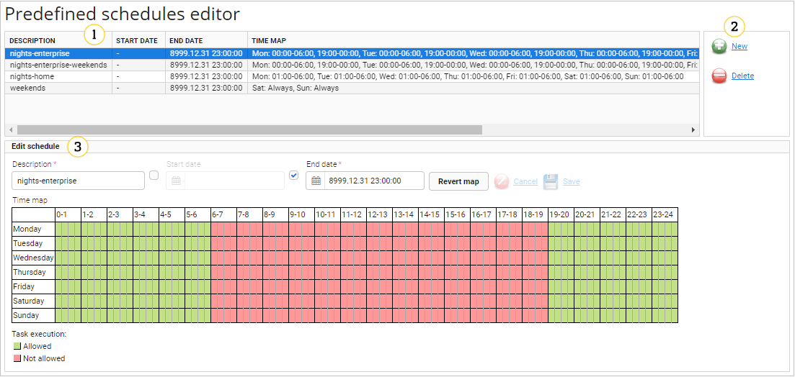

# Predefined schedules

Schedules are used in many cases in UMP. For example, you can select time periods when the server can execute a task or when a user can log in to the system. This document deals with predefined schedules. These are named, pre-configured, globally visible schedules.

## Layout

Use the **Predefined schedules editor** to manage all predefined schedules in the system. Go to **Administration --> Predefined schedules**.

{: .center }

1. The main table lists all existing predefined schedules in the system. You can select one, see its details, and modify or delete it.
2. Use the buttons to add new or delete predefined schedules.
3. Schedule details panel contains interface for editing the schedule. Schedules do not have to be unique in any way, but it is a good practice to give them unique descriptions.

!!! warning
    Remember that editing predefined schedules has impact on devices to which these schedules are assigned so be careful while doing any modifications.

There are several predefined schedules available by default. Active time periods (denoted by green boxes in the editor) are described here:

   * **Nights-enterprise** - everyday (non-business hours) between 19:00 and 06:00
   * **Nights-enterprise-weekends** - a sum of **nights-enterprise** and **weekends**, that is, Monday to Friday between 19:00 and 06:00, Saturday and Sunday
   * **Nights-home** - every night between 01:00 and 06:00
   * **Weekends** -  Saturday and Sunday day and night (00:00-24:00)

!!! note
    These schedules are maintained by the system - any changes will be lost after the next Coiote DM restart.

### Adding a new predefined schedule

To add a new predefined schedule:

1. Click the **New** button.
2. Enter a schedule description.
3. Optional: Type start and end dates. To do this, select check boxes next to these fields.
4. On a time map with 15 minutes resolution where green color denotes active (allowed) time periods, and red denotes not allowed ones, select proper time periods. You can change a color by clicking and dragging it.
5. To revert your selection, click the **Revert map** button.
6. Click the **Save** button.

### Editing the predefined schedule

To edit a predefined schedule:

1. From the list, select a schedule. The panel in the bottom should display schedule details editing interface.
2. Provide new details.
3. Click the **Save** button.

### Deleting the predefined schedule

!!! tip
    You will not be able to delete a schedule that is assigned to task or task template, user or user template, or group action trigger. You will see a warning while trying to delete it.

To delete a predefined schedule:

1. From the list, select the schedule.
2. Click the **Delete** button. The schedule will be deleted from the system after confirming this action.

## Where predefined schedules are used?

Look at the list below to see places where you can use predefined schedules:

* [Group action trigger](Device_Actions/Group_Action_Trigger.html) - you can select time periods when connections requests can be executed.
* [Task templates](Task_Templates.html) - you can select time periods when a task based on a template can be executed.
