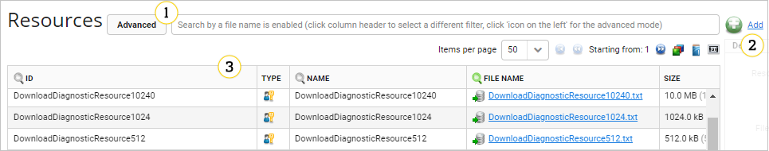
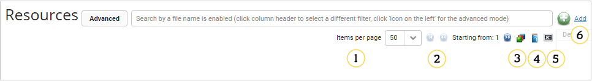
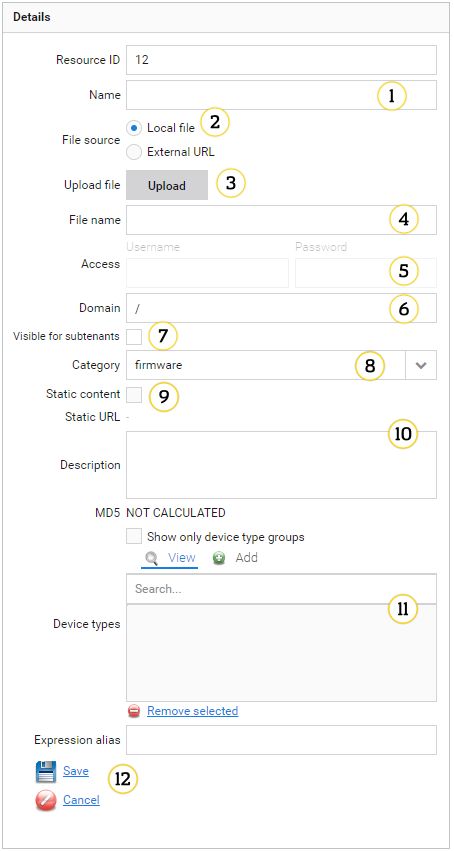
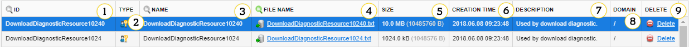

# Resources

Use this panel to browse, edit and add new resources to the system.

## Panel layout

{: .center }

There are three main elements of the panel layout:

1. Search bar and navigation buttons
2. The **Add** link
3. Resources table

### Search bar and navigation buttons

Item display buttons (1-6) make navigation between objects easy and intuitive.

{: .center }

1. **Items per page** - click it to select how many resources you want to see on a single page (25, 50, 100).
2. **Navigation arrows** - click arrows to change pages.
3. **Show all resources** - click it to display all types of resources.
4. **Show only firmware** - click it to show only firmware.
5. **Show other resources than firmware** - click it to show resources other than firmware (for example, logs or configuration files).
6. **Add** - click it to upload a new file with certain properties.

### Resources details

{: .center }

1. **Name** - unique resource name.
2. **File Source** - select if the resource is local or external. Local file means that the file will be stored on the server after you click the **Upload** and **Save** buttons. If you select the **External URL** option, you will see a field for a link to the resource.
3. **Upload** - click it and select a local file which you want to upload. When the file is selected uploading starts immediately. Remember that the file cannot be bigger than a configured size limit.
4. **File name** - this name is set automatically by Coiote DM based on a uploaded file name, it can be overwritten.
5. **Access** - password and username to secure the resource.
6. **Domain** - indicates a domain of system users that are allowed to see this resource.
7. **Visible for subtenants** - select it if you want the resource to be visible for all your subtenants. This also applies, for example, to the *static documentation* category, which means that your subtenants will be able to view the files you include in the top menu **Help**.
8. **Category** - category of the resource file.

    !!! note
        Select the **static-documentation** category to include the file into the top menu **Help**. Both external and internal files are accepted. After you upload the file, remember to log out and log in again to see the result.

9. **Static content** - it gives a resource a static URL accessible outside the system. This check box is disabled by default but it can be enabled so that creating the static URL is possible. It can be done by changing one parameter value in configuration (learn how to do this in the **Enabling generation of a static content** section of Admin Guide).
10. **Description** - file description.
11. **Device types** - it allows you to bind the resource and the device type. To do so click the **Add** tab first, then select device types (you can select multiple with the `Ctrl` key). After that click **Add selected**.

    !!! important
        When you add firmware resources you need to add them to groups (preferably to device type groups), otherwise they will not be visible in **DMC**.

12. **Save/Cancel** - after uploading a file and editing all necessary fields, click **Save** to add the resource or **Cancel** to discard changes.

### Resources table

{: .center }

1. **ID** - a database ID.
2. **Type** - it indicates a resource type.
3. **Name** - a name of the resource.
4. **File name** - a name of a downloaded file.
5. **Size** - a file size in B/kB/MB.
6. **Creation time** - time when the resource was created.
7. **Description** - a short description of the resource.
8. **Domain** - it indicates system users that are allowed to see this resource.
9. **Delete** - click it to delete that resource.
