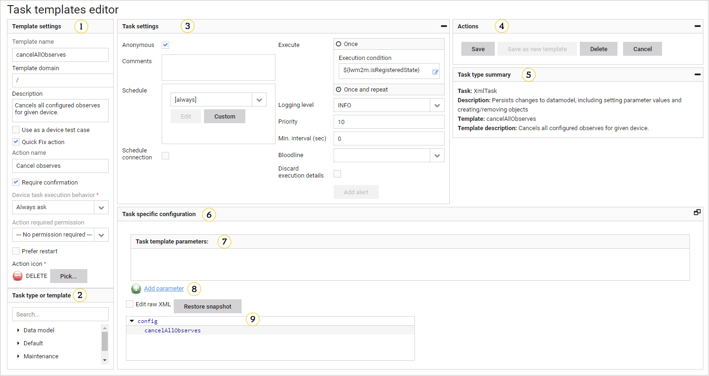
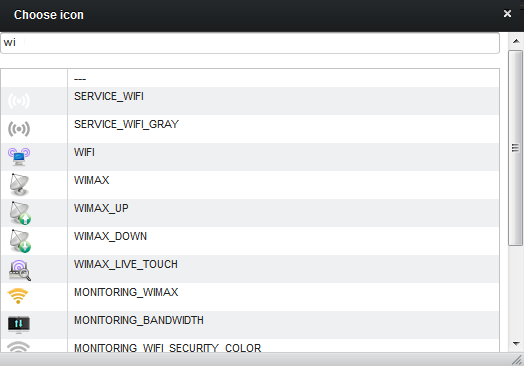
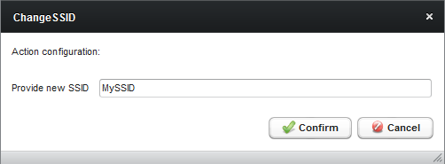
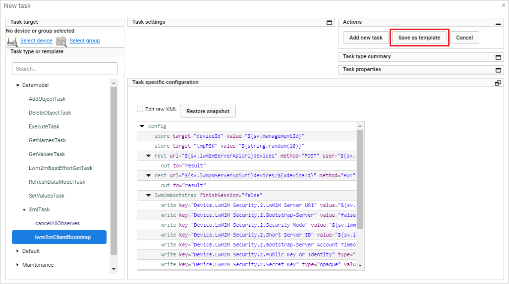
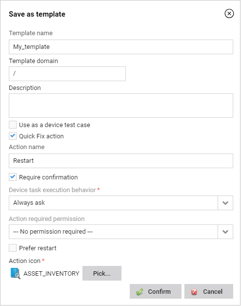

# Task templates

Task templates are pre-configured tasks stencil that can be used as a foundation for specific task configuration.
This is a feature intended to save your time, if you need to frequently schedule similar tasks or want to execute complicated ones.
Common practice is to provide **Quick Fix** actions for common problems.
The Task template editor is available in **Administration —> Task templates**.

## Layout

{: .center }

Except setting **Template settings** (1), (notice the multitenancy domain - which allows you to create a template for a specific tenant, more in [Managing multitenancy](../../Administration/Managing_Multitenancy.html) creating a task template is like creating a new task.
A comprehensive description can be found in [Tasks](../../Device_management/Device_operations/Tasks.html).

1. **Template settings** - a template configuration.

     * **Template name** - a unique name of a task template, it should briefly explain what the template is all about (as it is displayed in the **Task type or template** (4) section) (a required field).
     * **Template domain** - a multitenancy domain string (more details in [Managing multitenancy](../../Administration/Managing_Multitenancy.html)).
     * **Description** - a human readable description of a purpose of this template.
     * **Quick Fix action** - select this field if you wish to make the **Quick Fix** from that template. It means that the template will be accessible from **Device Management Center**, [Device groups details](Device_Groups/Device_Groups.html). To learn how to create the Quick Fix action from the task template, read the [Creating Quick Fixes from a task template](../../Device_management/Device_operations/Tasks/Creating_a_Quick_Fix_from_a_task_template.html) chapter.
     * **Action name** - if the **Quick Fix action** is selected then you must provide a name for Quick Fix - it must be unique and will be displayed on UI, this name can be different than the template name (a required field).
     * **Require confirmation** - select it to ask for confirmation before the task is executed.
     * **Connection request behavior** - it indicates when a connection request should be executed, select one of the options:

       * **Never execute** - Coiote DM never executes the connection request.
       * **Always ask** - Coiote DM asks each time you select the action, if the connection request should be executed.
       * **Always execute** - Coiote DM always executes the connection request to speed up the provisioning process.

    * **Action required permission** - it informs if a particular permission is required to perform the task.
    * **Action icon** - select an icon for the action (more details in [Picking an icon for Quick Fix](#picking-an-icon-for-quick-fix).
    * **Prefer restart** - Coiote DM restarts the action instead of creating the new one. It is useful for frequently used actions.

    !!! tip
        If you select the **Prefer restart** option, a task history will contain only the last execution of **Quick Fix**, however all historic executions will be available in [Historical analysis](../Historical_Analysis.html).

2. **Task type or template** - use it to select an existing template, edit it or select the task type to add the new template.
3. **Task settings** - use it to set settings of the task that will be created from that template (more details in [Tasks](../../Device_management/Device_operations/Tasks.html).
4. **Actions** - actions that can be performed on a currently edited task template:

    * **Save** - use it to save the current template.
    * **Save as new template** - use it to add a new task template (available if you modify the template settings).
    * **Delete** - use it to delete the current template.
    * **Cancel** - use it to cancel current edition without saving changes.

5. **Task type summary** - detailed information about a task type (more details in [Tasks](../../Device_management/Device_operations/Tasks.html) and a currently selected task template.
6. **Task specific configuration** - use it to configure a task.
7. **Task template parameters** - a list of parameters that you must provide before a task will be created.
8. **Add parameter** - use this button to configure additional parameters, click the **Add** to add a new entry.
9. **Task configuration** - it contains an XML editor (more details in [XML task editor](../../Device_management/Device_operations/Tasks/Task_Configuration.html#xml-task-editor).

## Adding a new task template

To add the task template go to **Administration —> Task templates** and:

1. Provide a name.
2. Select a domain (more details in [Managing multitenancy](../../Managing_Multitenancy.html)).
3. Add a template description.
4. Optional: Select **Quick Fix** and fill required fields.
5. Select the task type (you can use the search).
6. Provide a task configuration.
7. Save the task template form by clicking the **Add new template** button or discard changes by clicking the **Cancel** button.

## Picking an icon for Quick Fix

{: .center }

1. Search for an icon name.
2. Click a row to select the icon.
3. Click to close a window without selection.

## Template use

Templates can be used in the following contexts:

* Global - **Device actions —> Tasks —> Add new task**
* Group -  **Device groups —> Group tasks —> Add task**
* Device - **Device inventory —> Device Management Center —> Device tasks —> Add new task**

## Executing Quick Fix

Quick Fixes can be triggered form the **Device inventory** view or from the Customer Care view.
If the Quick Fixes actions require an additional input, then a proper prompt will be displayed.

An example of the **Quick Fix** action input:

{: .center }

## Saving a task as a template

{: .center}

1. Specify the task type.
2. Optional: Select one of predefined task templates shown in a violet font.
3. Configure task settings including general parameters of the task execution. More details in [Tasks](../../Device_management/Device_operations/Tasks.html).
4. Provide a task specific configuration including task commands.
5. Tasks can be saved as a task template from the standard task editor by clicking the **Save as template** button. Clicking the **Cancel** button takes you to the previous view.

    {: .center }

6. Fill in all required template data as described above.
7. To save the template click the **Confirm** button.
8. To discard changes click the **Cancel** button.
