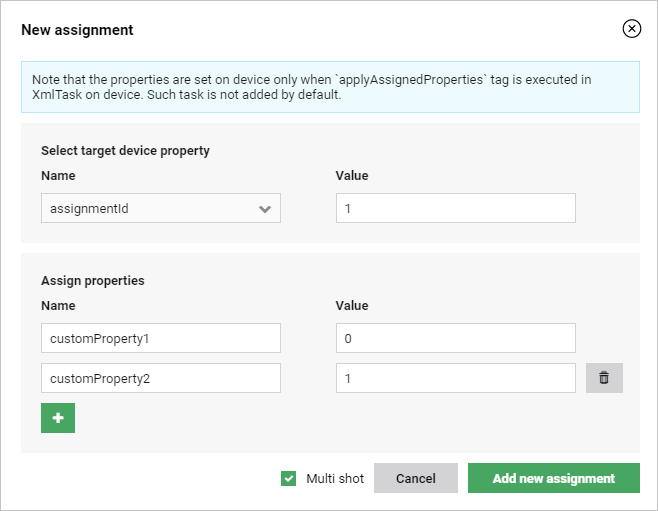

# Assigned device properties

The assigned device properties functionality is used to assign properties to a device based on a chosen pre-configured target setting value. Read this chapter to learn how to use it.

!!! warning
    This functionality is only available after prior setting up of arbitrary target device properties (e.g. ``coreServices.assignedDeviceProperties.allowedKeys  = ["assignmentId"]``) in the ``cdm.conf`` file.

To configure the registration status action extension:

1. Go to **Device actions --> Assigned device properties**.
2. Click the **Assign device properties** button.
3. In the **New assignment** pop-up:

   * pick the target device property from the **Name** list and enter its value,

   !!! note
       The device has to have the target property already assigned to make the whole procedure work.

   * add properties you want to assign to the device along with their corresponding values,
   * decide whether to uncheck the **Multi shot** checkbox (it is checked by default). If unchecked, the assignment will execute only once and will be applied to one device with this target property. If left checked (recommended), it will repeat after each execution of the ``applyAssignedProperties`` tag.
   * click **Add new assignment**.
     

     !!! note
         The properties will be assigned to the device only when the ``applyAssignedProperties`` tag is executed by an XMLTask. The task is not added by default.

4. After you have your assignment set, you have to configure and execute an XMLTask with the ``applyAssignedProperties`` tag. It is recommended to set the task on your main device group and check the **Automatic restart** option.
