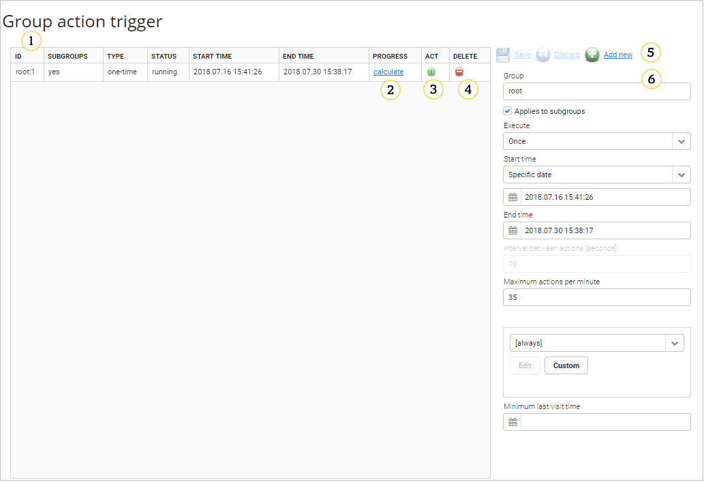

# Group action trigger

Use this panel to order a connection request for a group of devices at
once. The panel **Group action trigger** is accessible from the main menu
**Device actions --> Group action trigger**.

## Layout

1. **A list of group action triggers** - currently known group action trigger orders are listed in this view. You can edit any of them by selecting a row.
2. **Calculate progress** - clicking the **calculate** label will display the task progress, counting the number of devices contacted and the total number of devices for which contact is planned.
3. **Active status** - you can click the **Deactivate** icon to temporarily suspend performing the requests, and then re-enable it using the **Activate** icon.
4. **Delete** - you can click the **Delete** icon to delete the entry.
5. **Modification controls** - you can make changes to a selected entry by clicking the **Save** link to commit your changes, or the **Discard** link to revert to the currently stored version. You can click the **Add new** link to add a new entry.
6. **Editor** - this panel allows you to edit all the details of a group action trigger entry. The available fields are:

   * **Group** - A device group on which the action will be performed. This field supports auto-completion. Start typing to see possible options - typing in ``root`` or just ``r`` should show the list of possibilities. If **Applies to subgroups** is selected, the action will be performed on all members of child groups as well. Otherwise, only devices directly assigned to the exact group specified will be included.
   * **Execute**:
       * **Once** - the connection requests for each device will stop after a single successful connection.
       * **Continuously** - the connection requests will be ordered repeatedly over the entire time frame.
   * **Start time** and **End time** - it sets a time frame during which the connection requests may be performed.
   * **Interval between connections** - it sets the minimum number of seconds between connection requests for a single device (in the **Continuous** mode).

     !!! note
         This is the minimum interval. The actual interval might be longer, according to the rules set for **Maximum connections per minute**, but also because of the globally set *poll interval* for the group action trigger mechanism, which is currently hard-coded as 5 seconds.

   * **Maximum connections per minute** - not more than specified connection request attempts will be made per minute for the entry for all devices. It means that for a non-continuous entry, finishing it will take at least (number of devices/value) minutes.
   * **Schedule** - it allows you to set a task execution schedule. You can use **Edit** and **Custom** buttons to define a custom schedule from within this panel.
   * **Minimum last visit time** - connection requests will not be sent to devices that are registered in the system, but did not have any activity since the specified date and time. It can be used to filter out devices that are most likely not active on the network any more.
