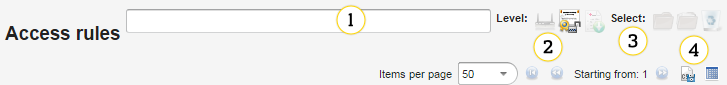
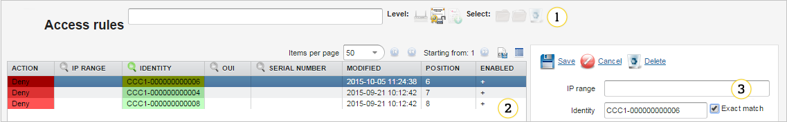
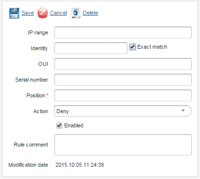
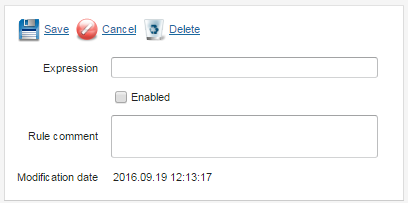

# Access rules

!!! warning
    Use this functionality with caution as it may impact system performance.

The **Access rules** panel is accessible from the main menu
**Device actions --> Access rules**

## Overview

If no rule (block or allow) matches a device, access is **GRANTED** as the default behavior.
The list is ordered by the position column (per level) and **the first matched rule takes effect**.
In addition, the list is also divided into three levels (and is processed in the enlisted order):

 * **CoAP level** - entries checked at the beginning of the LwM2M session.
 * **device 'blacklisted' column level** - every device has a flag indicating whether it is blacklisted or not. **This level is not a part of the access list, but it is checked after Coap level and before management level so we can consider it as another level of authentication**.
 * **management level** - entries checked after incoming message parsing.

If the device is denied, the *DeviceAccessDeniedEvent* event is published.

**Search bar (1)**

1. A search bar
2. A level select button - rules matched by:

   * Blacklisted devices
   * Inform information
   * Expressions (granting access using expressions can be used in many scenarios)

3. Selection buttons - selecting multiple rules allows you to bulk editing (enable/disable, allow/deny, remove)
4. Export buttons - use it to export data to a lightweight table view or to a CSV file.

**Rule list (2)**

1. A management view panel
2. A devices rule list panel
3. A panel to create a new entry for the device:

   * Rules matched on inform
   * Rules based on device properties

**Rules matched on inform**

 

   * **IP range**- examples: 192.168.1.1, 192.168.0-255.0-255, 192.168.60-20.0-255.
   * **Exact match**- an identity rule will be matched using an exact match instead of a regular expression.
   * **Identity**- a regular expression to match a device identity or an exact match string, if the exact match flag is off.
   * **OUI**- a regular expression to match manufacturer OUI.
   * **Serial number**- a regular expression to match a device serial number.
   * **Position**- (required) it determines a position where to add this particular access rule.
   * **Action**- use it to deny or allow access, if the rule is matched.
   * **Enabled**- use it to enable a rule to be checked.
   * **Rule comment**- use it to provide an optional rule comment.
   * **Modification date**- it shows the last modification date.

**Rules based on device properties**

   * **Expression**- use it to type an expression that will be evaluated.
   * **Enabled**- use it to enable a rule to be checked.
   * **Rule comment**- use it to provide an optional rule comment.
   * **Modification date**- it shows the last modification date.

## Examples

### Example devices

| Name     | IP addresses   | Identity     | OUI     | Serial number | Blacklisted |
|----------|----------------|--------------|---------|---------------|-------------|
| device_1 | 192.168.70.100 | 002AC13-0001 | 002AC13 | 0001          | false       |
| device_2 | 192.168.30.120 | 002AC8-0021  | 002AC8  | 0021          | false       |
| device_3 | 192.168.60.100 | 002AC15-0045 | 002AC15 | 0045          | false       |
| device_4 | 192.168.60.100 | 002AC15-0045 | 002AC15 | 0045          | true        |

### Example entries

**Example 1**

| ipRange              | Identity | OUI  | Serial Number | Block | Position | Jetty Level | Example behavior                  |
|----------------------|----------|------|---------------|-------|----------|-------------|-----------------------------------|
| 192.168.60-200.0-255 | null     | null | null          | true  | 1        | false       | * device_1 blocked (rule matched) |
|                      |          |      |               |       |          |             | * device_2 allowed                |
|                      |          |      |               |       |          |             | * device_3 blocked (rule matched) |

**Example 2**

| ipRange        | Identity                        | OUI  | Serial number | Block | Position | Jetty level | Example behavior                    |
|----------------|---------------------------------|------|---------------|-------|----------|-------------|-------------------------------------|
| 192.168.70.100 | "002AC1.*" (regular expression) | null | null          | true  | 1        | false       | * device_1 blocked (rule matched)   |
|                |                                 |      |               |       |          |             | * device_2 allowed                  |
|                |                                 |      |               |       |          |             | * device_3 allowed (IP not matched) |

**Example 3**

| ipRange                 | Identity | OUI     | Serial number | Block | Position | Jetty level | Example behavior                                     |
|-------------------------|----------|---------|---------------|-------|----------|-------------|------------------------------------------------------|
| 0-255.0-255.0-255.0-255 | null     | 002AC13 | null          | false | 1        | false       | * device_1 allowed (rule matched)                    |
|                         |          |         |               |       |          |             | * device_2 allowed                                   |
|                         |          |         |               |       |          |             | * device_3 allowed                                   |
| 0-255.0-255.0-255.0-255 | null     | null    | null          | true  | 2        | false       | * device_1 allowed (previous (position) rule counts) |
|                         |          |         |               |       |          |             | * device_2 blocked (rule matched)                    |
|                         |          |         |               |       |          |             | * device_3 blocked (rule matched)                    |

!!! note
    Device 4 is always denied due to *'blacklisted'==true*.
