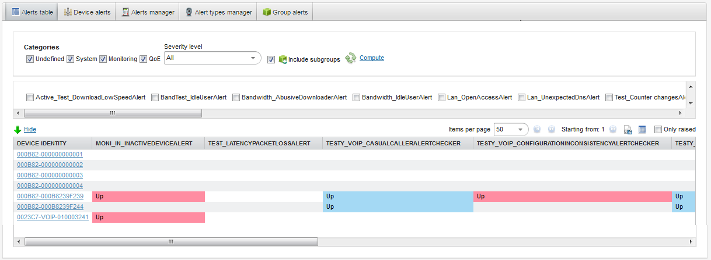
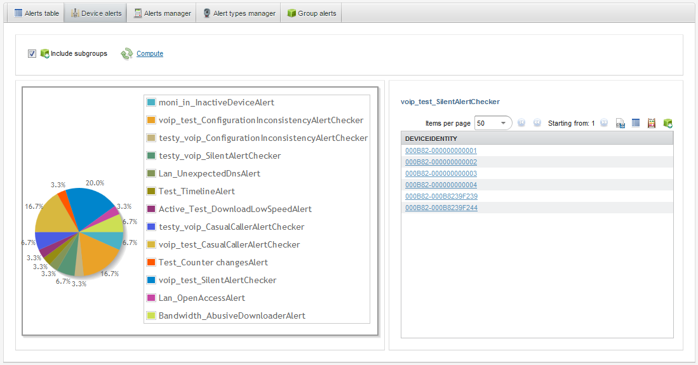
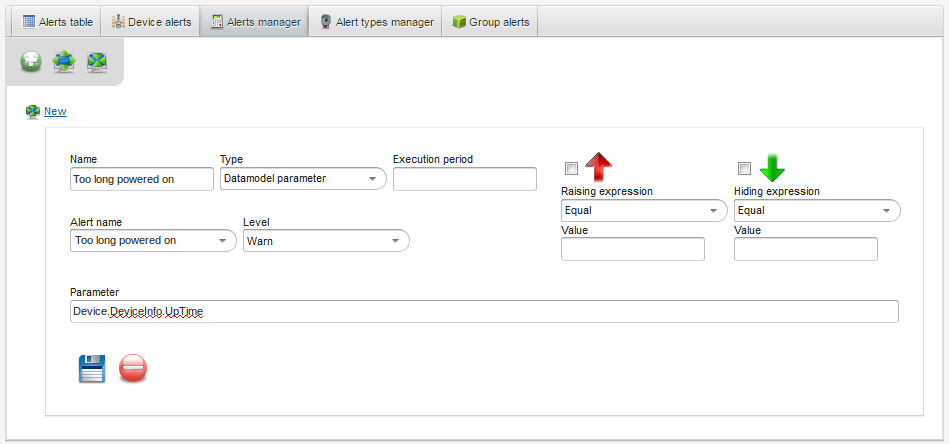
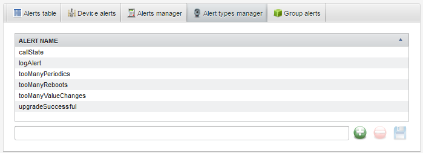

# Group alerts

Alerts notify about events occurring in the system. Each time there is a need to inform operators or users that something important or bad is going on - alerts are a good option. Each alert can be in one of two states: raised or lowered. Treat this as a boolean flag if some event has occurred. The system stores also a history of state changes of each alert. Alerts can be triggered by several mechanisms:

   * Parameter monitoring
   * Rule engine
   * Task (XMLTask)

A target of an alert can be various, in most cases alerts are bonded with a device, however they can also be applied on a group of devices or users. An example of an alerts could be:

   * A value of monitored parameter is too high or too low
   * A device is rebooting frequently
   * A user has disabled an important service.

Each alert is described by a set of attributes:

   * **Type** - a type of an alert you want to manage. It is the most important parameter. The system aggregates and processes alerts using this string. This attribute may have any value, but it is preferred to choose one of the predefined types - read more in :ref:`Alerts_Type_Manager`.
   * **Caption** - a managed alert caption. It is a name of the alert in a human-readable form.
   * **Description** - a managed alert description. The detailed description of the alert and a reason why it occurred.
   * **Raise** - a boolean value that indicates whether an alert should be raised (when set to *true*) or hidden.
   * **Severity** - a numerical severity level of a managed alert:
       * **DEBUG** - 0
       * **INFO** - 500
       * **WARN** - 1000
       * **ERROR** - 2000
   * **Target** - an alert target - when it is left empty, a device will be used as the target.

Group alerts are available in **Device groups  --> Alerts**.

## Alerts table

Use the **Alerts table** to see a state of selected alerts for all devices in a selected group.

To see alerts and devices of the selected group:

1. Select a corresponding group or a subgroup from a group tree.
2. Go to the **Alerts table** tab.
3. Select a check box **Include subgroups** to include all child subgroups.
4. Select minimal severity level from the combo box (**All**, **Info**, **Warn**, **Error**).
5. Click the **Compute** link. After computing additional panel with alerts appears.
6. Clear unused alerts using check boxes.
7. Change the status of alerts from raised to hidden using the **Hide** link.

The main table shows all devices of the selected group, which have at least one alert from selected ones with a severity greater or equal to selected.

## Device alerts

Use the **Device alerts** tab to see current alerts distribution in a selected group.

To see alerts distribution for the selected group:

1. Select a corresponding group or a subgroup from a group tree.
2. Go to the **Device alerts** tab.
3. Select a check box **Include subgroups** to include all child subgroups.
4. Click the **Compute** link.
5. You may click a series of charts to see all devices with the selected alert raised in the table.

## Alerts manager

Use the **Alerts manager** tab to define alerts conditions.

To define alerts conditions for a selected group:

1. Select a group from the group tree.
2. Go to the **Alerts manager** tab.
3. Click the **Add** button.
4. Fill in the conditions fields:
   - **Name** - a user defined name
   - **Type** - the most common is the **Data model parameter** type.
5. Fill conditions for raising and/or hiding the alert.
6. Click the **Save** icon.

## Alert types manager

Use the **Alert types manager** tab to define and modify names of alerts and predefine alert types.

To add a new alert type:

1. Enter a name of a new type in the text box.
2. Click the **Add** button. The new alert type is added to the table.
3. Click the **Save** icon.

To remove an alert type:

1. Select it from the table, you may select more than one.
2. Click the **Delete** icon. The selected alert is removed from the table.
3. Click the **Save** icon.
