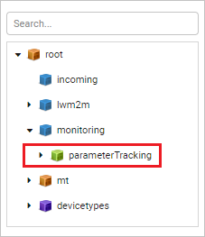
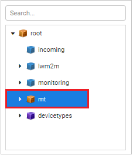
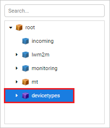

# Group types

There are four main types of groups in the system:

   * System
   * User
   * Multitenant (mt)
   * Device types

## System groups

Groups that cannot be edited by you but you can create user groups inside them. They have a blue icon. **root.lwm2m**, **root.lwm2m.bootstrap**, and **root.lwm2m.management** are examples of system groups and they are replicated for each tenant similarly to device type groups.

## User groups

Groups that can be added, edited and deleted by you. They have a green icon.

## Multitenant groups

Multitenant (mt) groups separate devices of several tenants (for example, your clients). Your tenants are isolated from one another and can see only their own devices, groups etc.. Tenants see their multitenat groups as top-level groups in the system. They have an orange icon. Read more about multitenancy in the :ref:`UG_M_Managing_Multitenancy` chapter.

## Device type groups

Device type groups (**devicetypes**) were created to simplify unified handling of different device types. They have a purple icon.
In contradiction to user groups, they are not created by you but automatically managed by the system.
For example, if a device changes a firmware version, it is automatically dispatched to a proper group.
If the proper group does not exist, it is automatically created. Device type groups cannot be edited and deleted using the :guilabel:`Device groups` menu and they are replicated for each tenant.

Most important properties of device type groups are the following:

   * Each device belongs to one and only one device type group.
   * A firmware upgrade of the device causes an automatic change of the group (due to a software version change).
   * Groups are shown with the icon that is different from user, system or mt groups.
   * They are placed in the **devicetypes** branch.
