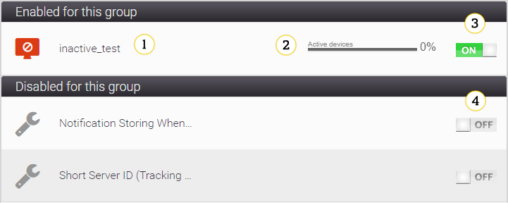

# Device groups details

Groups were introduced to simplify control and operation on several devices simultaneously. Each device can belong to many groups. Each group can include as many devices as possible, thus relationship many-to-many takes place. Grouping may be done by device manufacturer, geographic position, or any other relation.
**Device groups** is similar to **Device inventory**, however there are several differences such as migration rules that have sense only for a group context.

## Interface

 

1. **Edit** and **Add** buttons - use them to edit or add new groups:

 

   * Use the **Edit group** panel to edit a certain group.
       * **Delete** - use it to delete a group.
       * **Detach all devices from group** - use it to delete all devices from the selected group.
       * **Domain** - use it to set multitenancy options. To learn more about multitenancy, read the **Managing Multitenancy** chapter.
       * **Priority** - use it to set a priority for a group. Remember that the higher number you set, the higher priority the group has.
       * **Description** - use it to add comments for a group. The comments will be displayed in **Device inventory** in **General management** in the **Groups** panel.
       * **Save** - use it to save changes in the **Domain**, **Priority** and **Description** fields.
     
   * Use the **Add group** window to add a subgroup to the currently active group.
       * **Name** - use it to name your subgroup. This field is obligatory.
       * **Priority** - use it to set a priority for the subgroup you create. Remember that the higher number you set, the higher priority the group has.
       * **Description** - use it to add comments for the new subgroup. The comments will be displayed in **General management** in the **Groups** panel.
       * **Add** - use it to add the new subgroup.

2. Basic search - use it to look for groups. A provided search string is applied to the whole shown data and you cannot limit searching to a single column. In case of search for groups you need to type a group name (or its part) and press `Enter` to start searching. Results will be shown on the groups tree with a green background. Additionally, all child and parent groups of the marked group will be shown to easily browse through the group hierarchy.
 
3. Groups list - a list of available groups.
4. Tabs - use them to perform different operations on groups.
5. Monitoring - a list of monitoring configured for a selected group.
6. Tabs configuration - use it to decide which tabs you want to see and in what order they should be displayed. If you want to display the tabs drag them from **Available tabs** to **Selected tabs**. To reorder the tabs, drag them from one place to the other. You need to always save changes by clicking the **Confirm** button. To restore a default view, click the **Restore defaults** button.

 

## Available tabs

The following tabs are available in **Device groups**:

 * [Devices](#devices)
 * [Monitoring](#monitoring)
 * (#monitoring_alerts)
 * (#actions)
 * (#services)
 * (#migrations)
 * (#group_tasks)
 * (#profiles)
 * (#documents)
 * (#alerts)
 * (#statistics)
 * (#historical_analysis_groups)
 * (#setting_panels)
 * (#lwM2M_software)
 * (#lwM2M_firmware)
 * (#value_tracking)

### Devices

Use the **Devices** tab to see what devices belong to a particular group.

1. The **Include subgroups** check box.
2. Search use it to search using different parameters:

   * Identity (aka Device ID)
   * OUI
   * Model name
   * Software version
   * WAN Interface IP

    Switching between the search fields is available by clicking the magnifying glass in the corresponding column. Upon clicking the magnifying glass turns green and a search tip at the search bar changes to the corresponding parameter name. You can use the **Select filter** list to select a ready search that was previously saved in your domain.

   !!! note
       Click the magnifying glass to enable the advanced search mode.

3. Listing options:

   * Items for page
   * Navigation through device list pages

4. Additional actions buttons:

   * **CSV Export** - use it to export the list of devices to a simple table in the HTML format.
   * **Lightweight table view** - use it to export all devices that you can see on the list to the CSV file.
   * **Devices count** - use it to see how many devices are on the list.
   * **Devices count - advanced** - to learn more, read the **Devices count - advanced** section in User Guide.
   * **Add to group** - use it to add all devices that you can see on the list to a particular group.
   * **Remove from group** - use it to delete all devices that you can see on the list from a selected group.
   * **Add device to current group** - use it to add a selected device to a currently open group.
   * **Change devices domain** - use it to change a domain for all devices that you can see on the list (to learn more about multitenancy, read the Managing multitenancy chapter).
   * **Advanced export to CSV** - use it to configure how the list of devices should look like after exporting it to the CSV file.

### Monitoring

Use the **Monitoring** tab to see a real-time status of the most important parameters obtained from devices of a certain group.

The view is divided into two panels:

   * **Enabled for this group** - it shows monitoring configured for a group you selected.
   * **Disabled for this group** - it shows monitoring configured for other groups.

1. To see charts of the particular monitoring, click the monitoring name.
2. To learn what a particular KPI means, hover over it. To learn more about KPI, read the **Monitoring Type Specific Settings** chapter.
3. To remove the monitoring from the group you selected, click the **ON** icon.
4. To add the monitoring to a group you selected, click the **OFF** icon.

### Monitoring alerts

Use the **Monitoring alerts** tab to see a list of devices for which a particular alert was raised for a selected monitoring. If there is no monitoring set on the particular group, the **Monitoring** and **Alert** lists are disabled.

To learn how to display a list of devices read the **Viewing_monitoring_alerts** chapter.

### Actions

Use the **Actions** tab to perform quick actions on devices.

!!! warning
    Be careful when you create a Quick Fix on a group as in case it works not as intended, many devices will be affected.

### Services

Use the **Services** tab to enable services for a selected group of devices.

### Migrations

Use the **Migrations** tab to migrate devices.

!!! tip
    Syntax of each migration rule is checked while you type it. What is more, if the migration rule is not correctly performed; then the field in which you typed it is marked in red and when you hover over the field you will see a description of an error.

 

   * **Add new migration rule** - use it to  add a new rule.
   * **Save** - click it to save the rule.
   * **Discard changes** - use it to cancel changes made in the rule.
   * **Active** - use it to enable a migration rule.
   * **Condition** - type a condition into this field.
   * **Destination group** - type a group to which devices should be migrated.
   * **Remove from group** - use it to delete a device from a group after the rule evaluation.
   * **Apply in subgroups** - use it to execute the rule also for devices belonging to subgroups of the source group.
   * **Notes** - use it to type important information about the rule.
   * **Delete** - use it to delete the rule.

To learn how to add the rule and to see some examples, read the **Migrations** and **Setting_up_migration_rules** chapters.

### Group tasks

Use the **Group tasks** tab to schedule a task on a group level. This is a very good way to perform tasks for many devices.

When you select any task in the table, actions buttons (1), as well as **Configuration`
(2) and **Executions** (3) panels appear.

1. **Actions buttons**:

   * **Edit** - use it to open a task editor for a current task.
   * **Copy** - use it to open the task editor for a copy of the current task.
   * **Delete** - use it to delete the current task.
   * **Rerun task** - use it to rerun the current task.
   * **Rerun failed** - use it to rerun the current task on devices where it initially failed.
   * **Execution log** - use it to see additional information about task execution.
   * **Edition log** - use it to see additional information about edition of the task.
   * **Show reports** - use it to see reports of task execution for every device in the current group.
   * **Show statistics view** - use it to see detailed statistics of the task.

2. **Configuration** - use it to see main configuration of the task.
3. **Executions** - use it to see paused and finished tasks:

   * **Paused** - use it to pause a task on a particular device or a group of devices. If a task is paused on any of devices you will see them in a table. To go directly to a device on which the task is paused, click the link in the **Target** column.
   * **Finished** - click the **Compute statistics** button to see a chart. You can save a chart as an image by clicking the **Save as image** button.

You can activate and deactivate a task by clicking the icon in the column next to the **ID** column.

### Profiles

Use the **Profiles** tab to define setting values (SVs) on the group level.

 

   * **Add** - use it to add a new setting value.
   * **Save** - use it to save the setting value.
   * **Compute setting value profile** - use it to get setting values from the device.
   * **Copy from** - use it to copy setting values used in another group.
   * **Search** - use it to search for setting values by their name or value. Type a phrase and press :kbd:`Enter`.
   * **Locked** - use it to override the value of SVs with the same name in all subgroups of the selected group.
   * **Delete** - use it to delete the setting value.

To learn how to add a setting value to a group of devices, read the **Setting_values_for_devices** chapter.

### Documents

Use the **Documents** tab to see a list of documents that are relevant to a selected group.

The tab is divided into two panels:

1. A list of added documents with a search field.

   * Search - click the magnifying glass icon in the column to search using its content, for example, if you click the magnifying glass icon in the **Extension`
     column, type an extension you want to search for into the search field and press :kbd:`Enter`.
   * **To show** - click one of the options to display particular data:

       * **Just current group** - to show documents from a current group only
       * **Current group with subgroups** - to show documents from the current group and from all subgroups
       * **Only inherited** - to show documents inherited from parent groups.

   * Table with documents - a list of available documents. If you want to go directly to a group to which a particular document is added, click the link in the **Link to a group** column.

2. **Edit** - the panel where you can add, save, remove or download documents:

   * **Name** - a name of a document that will be displayed in the above table.
   * **Extension** - the extension of the document.
   * **Description** - a short description of the document.
   * **Type** - a type of the document, for example, a text or image.
   * **Inherit** - use it to make the document visible in subgroups.
   * **Upload** - use it to upload the document to the system after you complete proper fields.
   * **Add** - use it to activate the panel which allows you to add the document.
   * **Save** - use it to save changes done to the document.
   * **Remove** - use it to remove the document from the system.
   * **Download** - use it to download the document on your disk.

To learn how to add, download and delete documents, read the **Managing_groups_documents** chapter.

### Alerts

Use the **Alerts** tab to manage alerts and view their details. For more information see [Alerts](./Alerts.md).

### Statistics

Use the **Statistics** tab to analyze statistical data from different groups. Using this tab you can see how many devices of a particular manufacturer are in the system.

 

   * Click the chart to see detailed information. To come back to the previous view, click the **All** link.
   * **Include devices from subgroups** - use it to see also devices from subgroups.
   * **Download inventory report** - use it to download an inventory report in the HTML format.
   * **Image** - use it to save the chart as an image.
   * **CSV** - use it to save statistics as a CSV file.
   * **Full screen** - use it to see the chart in full screen.

### Historical analysis

Use **Historical analysis** tab to view some of the statistical data from **Historical_Analysis**, filtered by device groups.

1. List of device groups - it allows you to select a group from the device group structure defined on the server. A **Search** box is also available to filter out groups matching the entered sub-string.

  !!! note
      Historical analysis for a device group is *always* performed on the selected group as well as all its subgroups.

2. List of available charts - analysis types that can be performed for device groups are listed. Clicking a name of an analysis displays its properties panel, as well as its chart area.
3. Analysis properties - configuration options for the selected analysis, allowing to configure a time range for the chart, and other settings specific for a given analysis.
4. **Image**/**CSV** - use it to save the currently displayed chart as an image file, or data used to generate the chart as the CSV file.
5. Chart area - it displays an interactive chart, presenting historical data.

   !!! tip
       As this panel is a variant of the #Historical_Analysis** screen, refer there for the detailed description of the interface.

**Differences from global historical analysis**

| There are two major differences in #Historical_Analysis** available in the global context:

   * **Performance** - while the global historical analysis is a simple aggregation of data, which can be performed very quickly, in the case of the device group context, every data sample needs to be filtered based on the device group assignment. This is a computationally heavy operation. That is why, a progress window is displayed while calculating chart data.
   * **Available analysis set** - some of the analysis types do not make sense or are prohibitively expensive to implement for device groups. For that reason, only selected analyses are available in this scope:
       * **Session distribution`
       * **Session per devices devices`
       * **Session distribution per type`
       * **Task edition history`

### Setting panels

Use the **Setting panels** tab to edit devices properties. To learn more about the tab, read the **Setting Panels** chapter.

### LwM2M software

Use the **LwM2M software** tab to install, uninstall, upgrade, activate or deactivate software on a group of devices. This tab is for LwM2M devices.

1. **Installation history** - a list of operations that were performed because of installation, uninstallation, activation, deactivation or upgrade. You can click any ID to see more details of operations.
   * **Activate/Deactivate** - use this link to activate or deactivate software.
   * **Upgrade** - use this link to upgrade software on a group of LwM2M devices. To learn how to do this, read **Upgrading_software_packages_for_LwM2M_groups** chapter.
   * **Uninstall** - use this link to uninstall software on the group of LwM2M devices. To learn how to do this, read the **Uninstalling_software_packages_for_LwM2M_groups** chapter.
2. **Schedule new software installation** - use this link to install new software on the group of LwM2M devices. To learn how to do this, read the **Installing_software_for_LwM2M_groups** chapter.
3. Use this panel to see more details about the task, the panel refreshes automatically for the selected task to provide current data.
   * **Delete** - use it to delete a task from a history.
   * **Rerun task** - use it to run again the task.
   * **Rerun failed** - use it to run again a failed task.
   * **Execution log** - use it to see more details about execution of the task.
   * **Show reports** - use it to see reports about the task.

### LwM2M firmware

Use the **LwM2M firmware** tab to upgrade firmware. This tab is for LwM2M devices.

1. **Installation history** - a list of operations that were performed because of firmware upgrade. You can click any ID to see more details of operations.
2. **Schedule new firmware upgrade** - use this link to upgrade firmware on the group of LwM2M devices. To learn how to do this, read the **Upgrading_firmware_for_LwM2M_groups** chapter.
3. Use this panel to see more details about the task, the panel refreshes automatically for the selected task to provide current data.
   * **Delete** - use it to delete a task from a history.
   * **Rerun task** - use it to run again the task.
   * **Rerun failed** - use it to run again a failed task.
   * **Execution log** - use it to see more details about execution of the task.
   * **Show reports** - use it to see reports about the task.

### Value tracking

Use this **Value tracking** tab to observe resources for a group of devices. If resource observation is enabled on a single device; then settings configured on a group to which this device belongs are not taken into consideration (settings from the device are used).

1. **Add new** - use it to add a resource that you want to observe on a group.
2. A list of observed resources.
3. **Edit** - use it to edit settings of observation.
4. **Remove** - use it to remove the observation of the resource. Observation will be removed from all devices in the group except for devices whose observation was set individually from the devices level.
