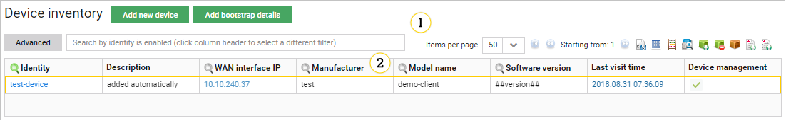
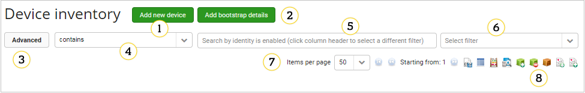
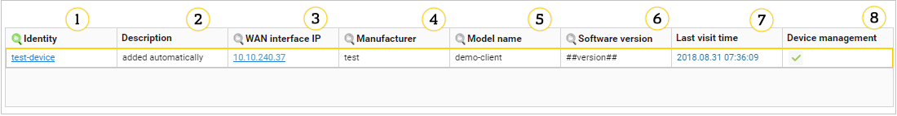
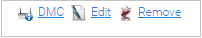
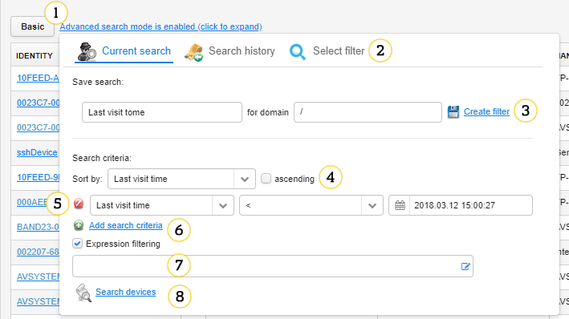

# Device inventory interface
==========================

## Device search and navigation

1. **Add new device** - use it to manually add a device to a server. Learn more in the :ref:**Add new device <Add_new_device>** section below or see the :ref:**UG_T_Adding_devices** chapter.
2. **Add bootstrap details** - use it to manually add a device to a server using the Bootstrap server. Learn more in the :ref:**Add bootstrap details <Add_new_device>** section below or see the **Adding_devices** chapter.
3. **Advanced** - click it to open the advanced search mode.
4. Search operator - you can select which operator you want to use to search for devices. There are four operators available (*==*, *!=*, *starts with*, and *contains*). By default *contains* is selected. Operator selection is saved automatically for a given column when you change the operator (the administrator can change this setting). If no preferences were saved for a given column, then the operator is the same as for the previous column. If an administrator sets a particular operator in the configuration file, you will not be able to change it.
5. Search field allowing to search by:
   * Identity
   * OUI
   * Model name
   * Software version
   * WAN IP
   You can switch between this criteria by clicking the magnifying glass in a proper column - it turns green.
6. Filter selection - you can select a saved filer here. You can see only filters belonging to your domain.
7. Listing options:
   * Items per page
   * Navigation through device list pages
8. Additional actions buttons:
   * **CSV Export** - use it to export all devices that you can see on the list to the CSV file.
   * **Lightweight table view** - use it to export the list of devices to a simple table in the HTML format.
   * **Devices count** - use it to see how many devices are on the list.
   * **Device count - advanced** - to learn more read the **Devices count - advanced** section.
   * **Add to group** - use it to add all devices that you can see on the list to a particular group.
   * **Remove from group** - use it to delete all devices that you can see on the list from a selected group.
   * **Change devices domain** - use it to change a domain for all devices that you can see on the list.
   * **Advanced export to CSV** - use it to configure how the list of devices should look like after exporting it to the CSV file (to learn more read the :ref:**Exporting devices to CSV <DM_Exporting_devices_to_CSV>** chapter).
   * **Import devices from CSV** - use it to import devices from the CSV file.

## Device list

1. **Identity** - a link to Device Management Center.
2. **Description** - a description of the origins of device information.
3. **WAN Interface IP** - a WAN IP address of the device UI.
4. **Manufacturer** - a manufacturer name.
5. **Model name** - a model name obtained from a data model.
6. **Software version** - a version of software.
7. **Last visit time** - time when the selected device last visited the server.
8. **Devices management** - an indicator if management is enabled for the device.

## Device buttons

Click a row with a device to see the additional buttons:

 * **DMC** - use it to go directly to **Device Management Center**.
 * **Edit** - use it to edit the details of a device. It also allows you to disable management for a chosen device. For a detailed instruction, please see **Disabling_device_management_for_single_devices**.

 * **Remove** - use it to remove the device.

   !!! warning
       Removing devices cannot be reverted.

---------------
Advanced search
---------------

.. warning:: Use this function with caution as it may impact system performance.

After clicking the **Advanced** button located on the left side of the search box, you can enable the advanced search mode.

1. A button to switch between a basic and advanced search.
2. Tabs:
   * **Current search** - use it to create and save an advanced filter.
   * **Search history** - use it to use filters that were used before.
   * **Select filter** - use it to manage filters saved earlier.
3. **Save search** - use it to create a filter for a particular domain and save it by clicking the **Create filter** link.
4. An order of the results settings.
5. Buttons for removing simple conditions.
6. **Add search criteria** - use it to add simple conditions.
7. **Expression filtering** - use it to enable an advanced search criteria. After clicking the check box, you can define your search further by typing *${*.

8. **Search devices** - use it to search for devices.

## Devices count - advanced

To see how many devices connected to Coiote DM between established thresholds, click the **Devices count - advanced** icon. The count is based on devices last visit. The statistics are created after clicking the **Count** button and they are displayed as a summary in a table. They are also visualized as a pie chart. You can then download this information as a pie chart image file by clicking the **Image** link, or as a CSV file by clicking the **Download CSV** link.

0. **Last visit time ranges thresholds** - a point in time that will divide the statistics. You can click the **Delete** icon to remove a threshold, and use the calendar to select a proper date.
0. **Add time threshold** - use it to add another time threshold.
0. **Count** - use it to trigger creation of statistics and display of a table (4) and a pie chart (5).
0. Table - a table displaying a count of devices between defined time thresholds.
0. Chart - a pie chart is a graphical representation of data from the table (4).
0. **Image** - use this button to open a new window with only a pie chart image displayed.
0. **Download CSV** - use this button to save the table as a CSV file.

## Add new device/bootstrap details window

  !!! note
      The **Add bootstrap details** window contains the same options as the **Add new device** window.

1. **Endpoint name** - choose the name that your device will be identified by.
2. **Security** - choose the preferred security mode from among the following options:
   * **NoSec** - no security mode is set, it can be used only in test environments.
   * **Pre-Shared Key** - communication between the device and the server will be encrypted. To decrypt the communication, **PSK identity** and **PSK** are needed.
   * **External Pre-Shared Key** - the device's Pre-Shared Key is stored externally. Here, only DTLS ID must be provided.
   * **Certificate** - security is established using a certificate.
3. **Pre-Shared Key** - enter your Pre-Shared Key. It can be specified either in plain text or hexadecimal format.
4. **DTLS identity** - specify the name with which the device identifies itself during the DTLS handshake. It is recommended to use endpoint name as DTLS identity.
