# Device management center interface

Use it to reconfigure devices that take part in provided services. It consists of the **Device summary** panel at the top and several tabs, which may slightly vary depending on a device model.

## Device summary

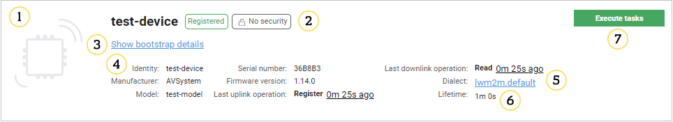

   *Fig. *

In the **Device summary** panel you can find basic information about the device.

1. Image - click an image to add your own. You can also add it using the **Resources** menu (refer to the **UG_UIR_DM_Adding_an_image_of_a_device** chapter to find out more). To delete the image, click it again and click the **Remove** button.
2. Status of a device - informs you in what state the device is, for example, **Registered**, **Deregistered**.
3. Link to another entity of the device - click this link to enter bootstrap or management entity of the device (click the scroll wheel on your computer mouse (or right click the link) to open the entity in the new tab). The link is available only when there is another entity of the device in the platform.
4. Information about the device such as an identity, manufacturer, serial address, and many more.
5. **Lifetime** - informs you when the device should register to the server. If **Lifetime** is set to, for example, 2 minutes then the device should register during this period of time.
6. **Dialect** - click it set a proper dialect on the device.
7. **Execute tasks** - click it to immediately perform tasks on a device. If the device is in the **Deregistered** status, then the button is not available. If the device has the **UQS** binding the button changes into the **Wake up** button.

## Available tabs

Selection of tabs depends on a type of the device:

 - For **bootstrap devices** you can see:
     * [Bootstrap dashboard](#dashboard-(bootstrap))
     * [Configuration](#configuration)
     * [LwM2M protocol tests](#lwm2m-protocol-tests)
     * [Device tasks](#device-tasks)
     * [Logs](#logs)
     * [Historical Analysis](#historical-analysis)
 - For **non-bootstrap devices** you can see:
     * [Dashboard](#dashboard-(management))
     * [Monitoring](#monitoring)
     * [Configuration](#configuration)
     * [Actions](#actions)
     * [Device settings](#device-settings)
     * [Parameter tree](#parameter-tree)
     * [Quick diagnostics](#quick-diagnostics)
     * [Device tasks](#device-tasks)
     * [Documents](#documents)
     * [Logs](#logs)
     * [Historical Analysis](#historical-analysis)
     * [LwM2M software](#lwm2m-software)
     * [SMS_connector](#sms-connector)
     * [LwM2M firmware](#lwm2m-firmware)
     * [LwM2M Config resource editor](#lwm2m-config-resource-editor)
     * [Objects](#objects)
     * [LwM2M protocol tests](#lwm2m-protocol-tests)

### Dashboard (Management)

Use the **Dashboard** tab to see basic information about devices.

1. **Device details** - use it to see information about a device.
2. **Real time values** - a list of observed resources (added using the **Objects** or **Value tracking** tabs). If the device is deregistered then the list is not available. Data presented on the list is refreshed automatically after a defined period of time.
3. **Location** - use it to see where a managed device is. A map and a table will not be displayed when data about location is incorrect.
4. **Alerts** - use it to view alerts raised on a device. They are divided by their severity. To see more details concerning a particular alert, hover over an alert's name.

### Dashboard (Bootstrap)

Use the **Dashboard** tab to see basic information about the device's bootstrap entity.

1. This panel shows you where the device will be connected after bootstrap.
2. The **Bootstrap settings** panel displays the following bootstrap task types (depending on the current setting):
     - **Default** - if the bootstrap was configured via the **LwM2M bootstrap** panel or inherited from a parent domain.
     - **Configured for a group** - if there is a bootstrap task set for a group that the device belongs to.
     - **Custom** - if there is a custom bootstrap task set for this particular device.

!!! note  
    Depending on the source of the bootstrap setting, the **Go to configuration** link will redirect you to the corresponding bootstrap setting location. If no bootstrap configuration exists for the device, the link will direct you to the **LwM2M bootstrap** panel.

### Monitoring

Use the **Monitoring** tab to show a list of monitoring available for the device. Inactive ones are grayed out. Click the selected monitoring to see its details.

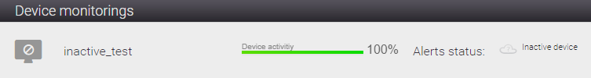

#### Configuration

Use **Configuration** to check and edit crucial device settings and properties. **Configuration** is divided into four panels:

1. **Connection security** - use it to configure a proper security mode. Read more in the **UG_MD_Editing_security_settings** chapter.
2. **Other** - use it to add a description or set a domain.
3. **Groups** - read more in **DMCGroups**.
4. **Properties** - read more in **Properties**.

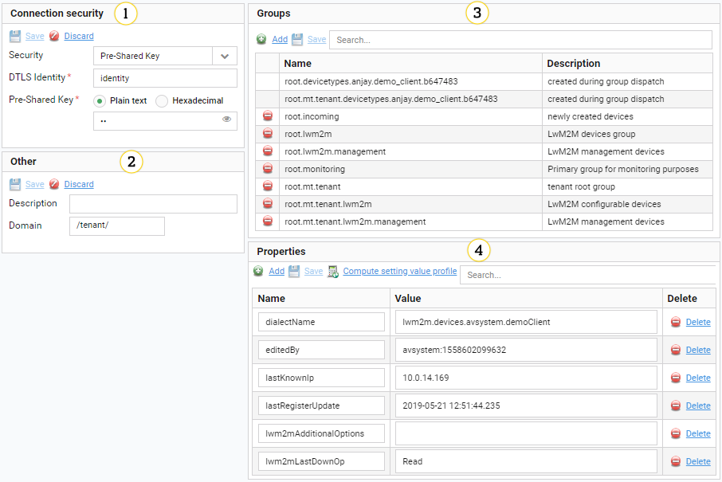

#### Properties

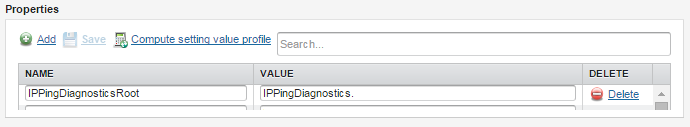

1. **Add** - use it to add a new property for the device. You have to provide a name and a value.
2. **Save** - use it to apply all the changes you made. Both adding the new properties and deleting existing properties must be confirmed by clicking this button.
3. **Compute setting value profile** - use it to check actual values of all properties, both of the device and groups to which it belongs.
4. **Search** - use it to search for properties and values. The search is case insensitive, so you can type any fragment of a property name or value. Type a phrase and press `Enter`.
5. A table with a list of properties. This list does not show properties inherited from groups to which the device belongs. Click a single property to edit it. To remove the property, click **Delete**.

#### Groups

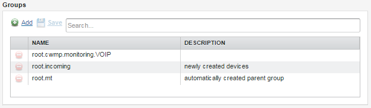

1. **Add** - use it to add the device to a new group and select the group from the list.
2. **Save** - use it to apply all the changes you made. both adding to the new group and deleting from groups must be confirmed by clicking this button.
3. **Search** - use it to search for groups. The search is case insensitive, so you can type any fragment of a group name or description. Type a phrase and press `Enter`.
4. A list of groups to which the device belongs. To remove the group, click **Delete**.

### Actions

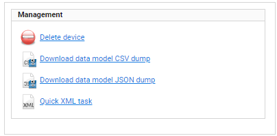

**Management** - use these actions to modify a state of the Coiote DM system - data connected with the device. These actions do not modify the device state.

### Device settings

Use the **Device settings** tab to browse and modify device settings in a more convenient way than by the parameter tree.

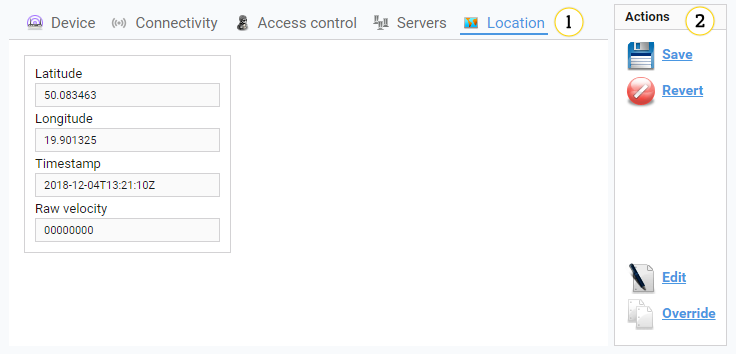

1. Tabs with specific settings and data. A number of tabs depends on the device data model. When tabs do not fit navigation arrows appear.
2. **Actions**:

   * **Save** - use it to save changes made in every tab.
   * **Revert** - use it to revert changes that were not saved.
   * **Edit** - use it to change data and structure of a currently selected XML panel. Changes will apply to all devices having that link.
   * **Override** - use it to override this panel by creating a duplicate in the most specific device type group.

### Parameter tree

Use the **Parameter tree** tab to:

   * See a device data model.
   * Check parameters names and values.
   * See when values were updated.
   * Request for values update.
   * Change values of specific parameters (if values are not read-only or executable).
   * Set notifications and perform the Execute action.

!!! tip After you perform any action on the parameter tree, you will see an icon showing a status of a task next to the parameter you work on. You can click this icon to see more data.

**Change parameters**

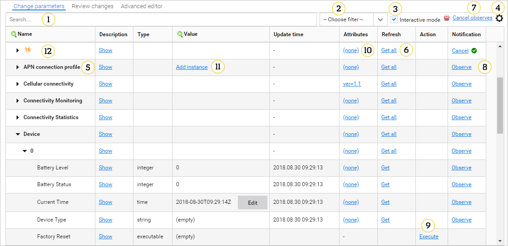

1. **Search** - use it to search for parameters both by names and values. The search is case insensitive. Type a phrase and press `Enter`.
2. **Choose filter** - use it to display for example only executable instances of a data model tree.
3. **Interactive mode** - use it to immediately set a task on a device and start a session. If you clear this check box you have to go to the **Review changes** or the **Advanced editor** panel to review your changes and set the task on the device.
4. Columns visibility settings - click the icon to hide or display selected columns. To display a column, click the check box next to it. To save the setting, click the **Done** button.
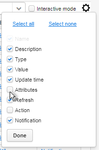
5. Data model node - you can expand it by clicking the black arrow on the left side.
6. **Refresh** - use the links in this column to create a task that gets recent values for:
    * All parameters beneath this node by clicking the **Get all** link.
    * A particular parameter by clicking the **Get** link.
7. **Cancel observes** - use it to execute **LWM2M_cancelAllObservesTask** that cancels observes configured for a selected device.
8. **Observe** - use it to execute **LWM2M_ObserveTask** on a selected device. Click the link and configure the task.
9. **Execute** - use it to perform an action on a selected device by executing **LWM2M_ExecuteTask**.
10. **Attributes** - use it to set or remove attributes. To learn how to set attributes, read the **Setting_and_removing_LwM2M_attributes** chapter.
11. **Add instance** - use it to add a new instance to a selected node. You can define the instance number (or leave it to be set automatically) and define values for the instance's resources. Resources that are required and you need to configure them to add the instance are marked with an asterisk.
12. Observed parameters are marked using an orange color and the **Cancel** link is available.

**Review changes**

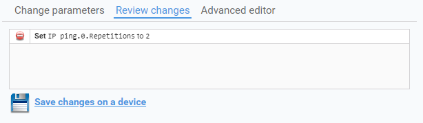

The tab shows a list of changes made in the **Change parameters** tab. You can discard each change by clicking the **Delete** icon.
To save changes, click **Save changes on device** that invokes an XLM task that sets required parameter values.

**Advanced editor**

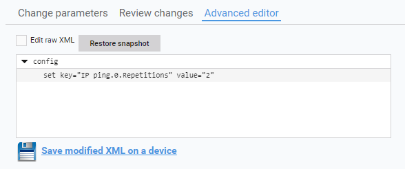

This tab allows you to build an advanced XML task. To save changes, click **Save modified XML on device**.

### Quick diagnostics

Use the **Quick diagnostics** tab to perform simple diagnostics on the device in order to check its connectivity. It contains also known devices and a table with last known WAN IP.

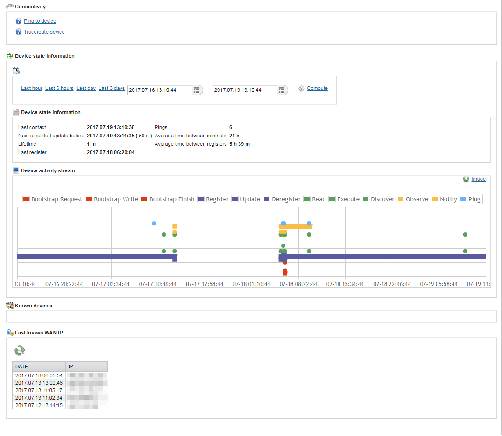

1. **Connectivity** - use it to set simple diagnostics.
2. **Device state information** - use it to see contacts statistics.
3. **Device activity stream** - use it to check events that come with the device.

   !!! tip
       Communication with a device is grouped in so called sessions, that is a group of exchanges employed to perform a logic unit of work (for example, execution of one or more tasks). To improve readability on the **Device activity stream** chart, requests from a single session are merged. For example, if in a session there were 4 *Read* requests and 1 *Write* request and no other actions, then there will be 2 dots on the chart - one for *Read* and one for *Write*.

4. **Known devices** - use it to see devices that were connected to the device from the LAN side (it works only if proper parameters are available in the device data model).
5. **Last known WAN IP** - use it to see a table containing five last known IPs with a date of last visit from that address (filled after the change).

### Device tasks

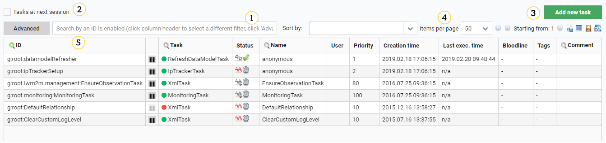

1. The search bar - you can select between a basic and advanced (the magnifying glass icon) search. Use it to search the task by an ID, task name and comment. Click a magnifying glass icon in a selected column to search by its content.
2. **Tasks at next session** - use it to show only tasks which will be invoked during the next session.
3. **Add new task** - use it to add a new task for the device.
4. Task list navigation buttons and action buttons: **CSV Export**, **Lightweight table view**, **Number of tasks** and **Current task statistics**.
5. A list of all the tasks for the device (including group tasks). Each task has its unique ID. The task can be deactivated by clicking the icon in the second column. The **Task** column shows the task type. The **Status** column shows a type of execution (a single execution or an automatic restart) and a state of the execution (not started yet - the question mark icon, in progress - the clock icon, completed successfully - the green tick, failed - the exclamation mark).

### Documents

Use the **Documents** tab to see all documents that were added to groups to which the device belongs. You can add documents in **Device groups**.

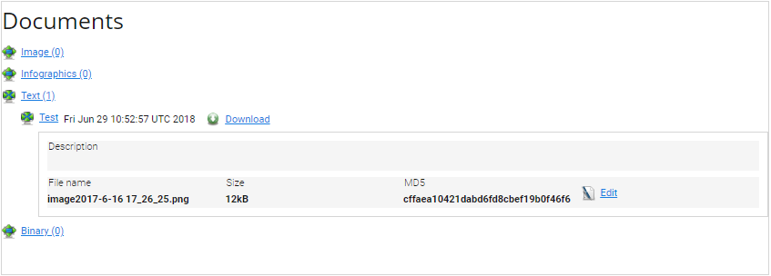

You can use the expandable list of documents and see details of the selected document after clicking its name. You can also edit (if it is a text file) and download the document.

### Logs

Each logs can be downloaded as a text file.

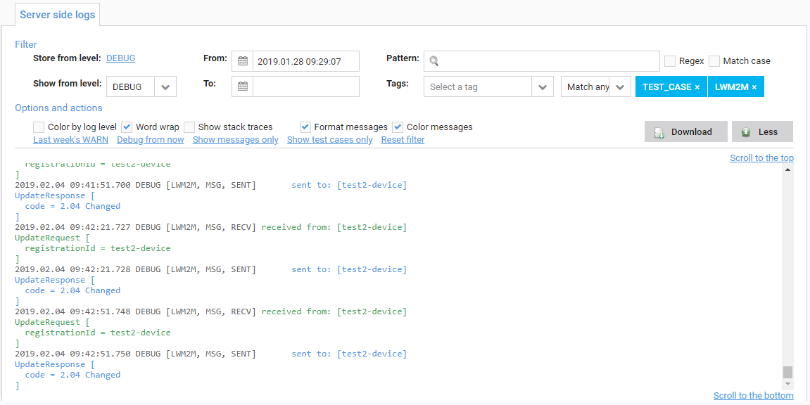

Server logs contain information about a provisioning process and full LwM2M communication. The tab is divided into two sections:

  !!! tip
      - To display advanced filters and options, click the **More** button.
      - If there are many logs from a selected period of time, use **Scroll to the bottom** and **Scroll to the top** links to navigate.
      - If a log entry is long, not all lines are displayed at once. To see more lines, click the **Show ... lines/characters more**.

1. **Filter**:
   * To define from which level logs should be stored, click the **Store from level** link. If you select a lower level that is currently used for the **Store from level** option, then the **Show from level** option also changes.
   * To decide from which level logs should be displayed, click the **Show from level** link.
   * To select a time period for which you want to see logs, use the **From** and **To** calendars.
   * To look for any word or phrase in logs, use the **Pattern** field and select:
     * **Regex** if you type a regular expression
     * **Match case** if search should be case sensitive.
   * To display only particular logs and logs of a higher level, use the **Show from level** list.
   * To filter logs by tags, use the **Tags** list and select which tags you want to use. If you want a result to match all selected tags at the same time, from the list next to the **Tags** list, select **Match all**.

2. **Options and actions**:

   * To color logs according to their level, select the **Color by log level** check box.
   * To wrap words of logs, select the **Word wrap** check box.
   * To load stack trace, select the **Show stack traces** check box.
   * To format messages in a more readable way, select the **Format messages** check box.
   * To see which messages were received (green color) and which were sent (blue color), select the **Color messages** check box.
   * To display all warnings that appeared during the last week, select the **Last week's WARN** link.
   * To view logs only from a current date each time a device connects with Coiote DM, click the **Debug from now** link.
   * To display only messages, click the **Show messages only** link.
   * To display logs only for protocols tests performed in the **LwM2M protocol test** tab, click the **Show test cases only** link. The link is not available if your installation does not support protocol tests.
   * To reset filters, click the **Reset filter** link.
   * To download logs from a particular period of time matching with used filters, click the **Download** button.

### Historical analysis

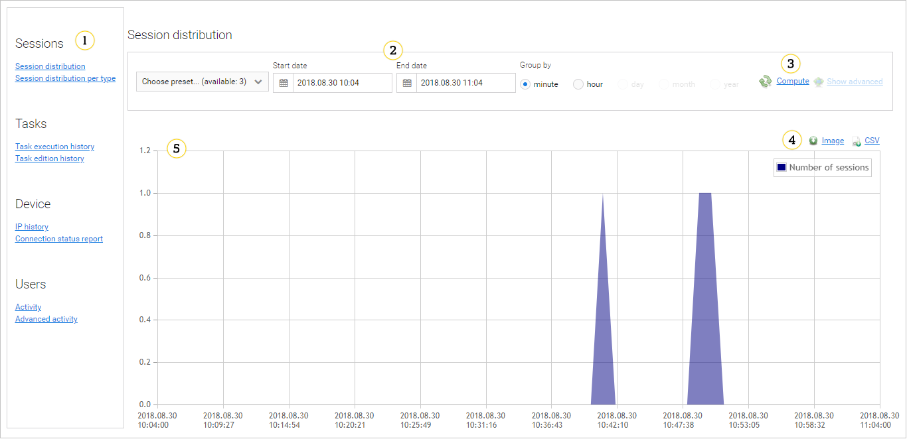

1. Analysis subjects are sessions, tasks, devices and users.
2. Select a period and data grouping.
3. After clicking the **Compute** link selected data will be displayed.
4. Image and CSV export buttons.
5. A graphical interpretation of the requested data.

### LwM2M software

This tab is dedicated for LwM2M devices.

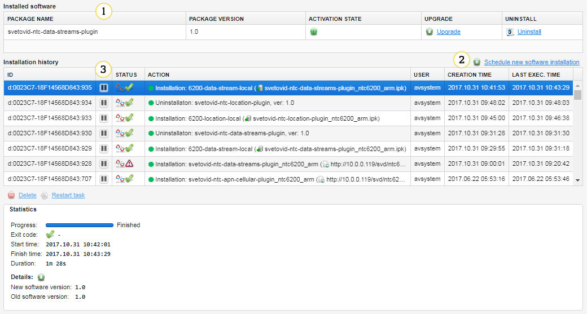

1. **Installed software** - a list of currently installed packages on a device.
   * **Activation state** - use it to activate or deactivate software.
   * **Upgrade** - use this link to upgrade software on LwM2M devices. To learn how to do this, read the **Upgrading_software_packages_for_LwM2M_devices** chapter.
   * **Uninstall** - use this link to uninstall software on LwM2M devices. To learn how to do this, read the **Uninstalling_software_packages_for_LwM2M_devices** chapter.
2. **Schedule new software installation** - use this link to install new software on LwM2M devices. To learn how to do this, read the **Installing_software_for_LwM2M_devices** chapter.
3. **Installation history** - a list of operations that were performed because of installation, uninstallation, activation, deactivation or upgrade. You can click any ID to see more details of operations.
   * **Delete** - use it to delete a task from a history.
   * **Restart task** - use it to restart the task.
   * **Download full report (txt)** - use it to download a report regarding the task.
   * **Download logs** - use it to download logs from a defined period of time or for a defined number of entries.

### SMS connector

This tab is dedicated for LwM2M devices.

!!! note  * To view the tab for your device, remember to add the **msisdn** property with a phone number as value.
         * Before communication is established, please configure the Kannel SMS gateway for your domain by following the steps in section **Configuring_Kannel**.

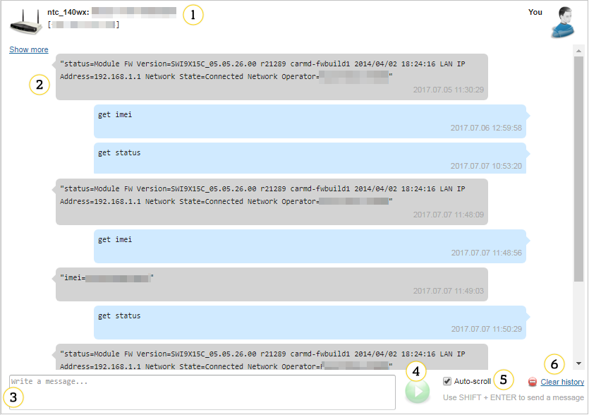

1. Information about the device.
2. The list of your messages and device's replies.
3. Text field - use it to type messages.
4. **Send** icon - use it to send a message.
5. **Auto-scroll** - select it to be scrolled down to the bottom of a page when a new message from the device appears.
6. **Clear history** - use it to remove all messages from a history.

### LwM2M firmware

This tab is for LwM2M devices.

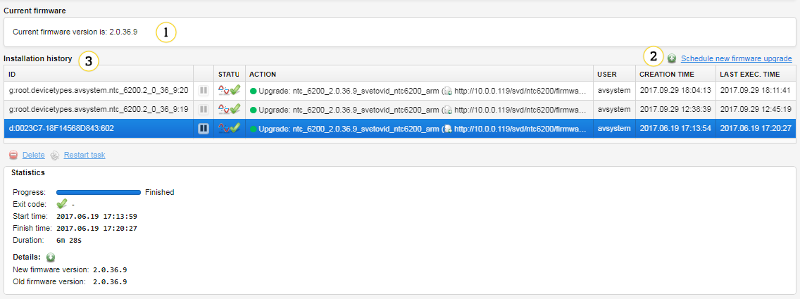

1. Information about current firmware version.
2. **Schedule new firmware upgrade** - use this link to upgrade firmware on LwM2M devices. To learn how to do this, read the **Upgrading_firmware_for_LwM2M_devices** chapter.
3. **Installation history** - a list of operations that were performed because of firmware upgrade. You can click any ID to see more details of operations.
   * **Delete** - use it to delete a task from a history.
   * **Restart task** - use it to restart the task.
   * **Download full report (txt)** - use it to download a report regarding the task.

### Config resource editor

This tab is for NTC devices only and you can use it to edit and view devices' configuration. To use this tab, NTC devices have to have:
   * AVSystem's LwM2M client Anjay installed
   * The *Configuration* plugin installed (you can install it using the **LwM2M software** tab).

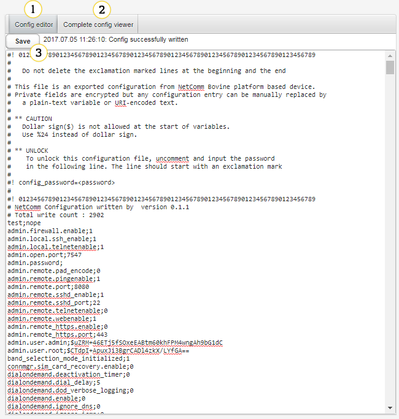

1. **Config editor** - use this tab to display device's configuration and edit it.
2. **Complete config viewer** - use this tab to display device's full configuration. No changes can be done in this tab.
3. **Save** - click this button to start a task that saves changes and initiates communication with devices.

### Objects

This tab is for LwM2M devices only and it allows you to see all objects, instances, and resources of a selected device.

1. **Search** - use it to find a particular object. To find the object, type its name.
2. If checked, the changes you make to device objects will be applied immediately. Otherwise, you will have to wait for the device to trigger action execution, or use the **Execute tasks** button (for devices in non-queue mode).

!!! note  
    The **Apply immediately** option is only available for devices in non-queue mode.

3. Use this button to add a new LwM2M object definition
4. Division into objects.
5. Info icon - click it to see the object description.
6. Managing instances:
   
   - **A** - Use it to select another instance of an object if the object has instances.
   - **B** - Use it to add a new instance if an object allows it.
   - **C** - Use it to select another instance or remove it.

7. **Search** - use it to find a particular resource. To find the resource, type its name.
8. Use it to refresh data, track values (send an Observe task) and add additional attributes to a selected instance.
9. Use it to refresh data, track values (send an Observe task) and add additional attributes to a selected object.
10. The table with resources of object's instance.

!!! tip
    An icon displaying the status of execution is available after clicking one of action buttons placed in the **Actions** column. If you click this icon, you will see additional information about execution.

  
11. Use it to refresh the resource.
12. **Value tracking** - use it to send an Observe task to the device and configure monitoring to collect data. If resource observation is set on a group of devices, after clicking **Value tracking** you will see that it is in the **Inherited** mode.
13. **Attributes** - use it to edit resource attributes or add new ones.
14. Use it to edit a value of a resource.
15. **Execute** - use it to send an Execute task to the device. Click the icon next to the button to add additional parameters.

### LwM2M protocol tests

Use the **LwM2M protocol tests** tab to perform test cases that verify if a device supports LwM2M specific features. To view this tab you need to have the **dmc.deviceTest** permission assigned by the administrator.

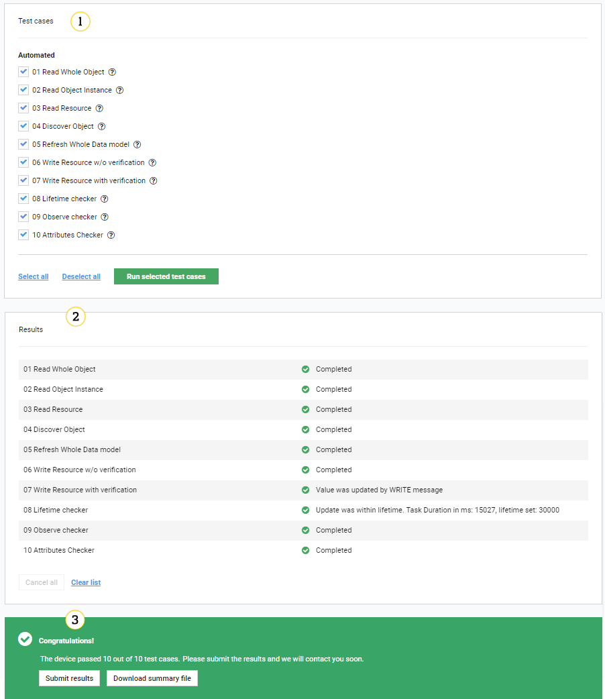

1. **Test cases** - a list of test cases that will be performed on a device if you select them. You can create your test cases. To learn how to do this, read the **UG_UIR_DM_Test_cases** chapter.
   * **Select all`/**Deselect all** - use these buttons to select or deselect all test cases.
   * **Run selected test cases** - click this button to start tests. For test duration, log storage level is set to **Debug** in the **Logs** tab.
2. **Results** - a list of test cases with their results.
   * **Cancel all** - click this button while performing tests to stop their execution.
   * **Clear list** - click this button to clear the results list.
3. Summary - a summary of performed tests.
   * **Add bootstrap tests results to summary** - click this check box if you want to include tests results from a bootstrap entity into the summary of the management entity presented in the CSV file and a report send by email. This check box is available only if a device has a bootstrap and management entity on the same platform.
   * **Submit results** - click this button to send an email with tests results to email addresses defined in the system configuration. To see this button you have to have the *dmc.deviceTest.sendEmailReport* permission assigned by the administrator. The button is disabled after sending the email and it is enabled when results of a device improve.
   * **Download summary file** - click it to download a file with tests results.
