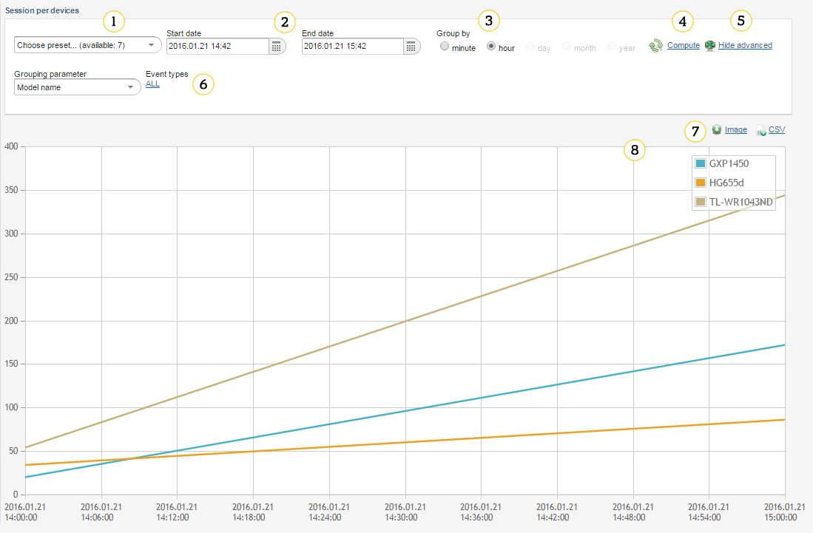
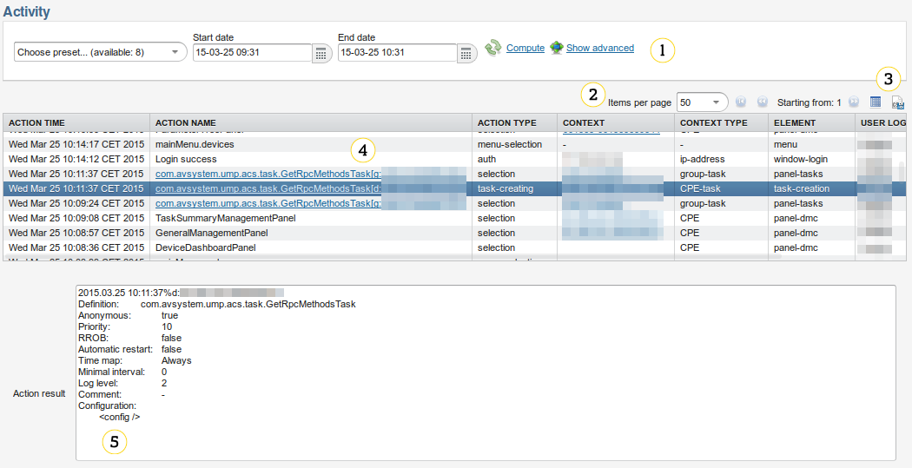

# Historical analysis

Use **Historical Analysis** to access various (mostly statistic) data that may be useful for an analysis of the system activity in the past. You can access several reports from this view.

## Available reports

Historical analysis reports are available in three contexts:

 * **Global context** - access it from **Historical analysis** on the global menu bar - it shows information relevant to the whole installation.
 * **Device context** - access it from the **Historical analysis** tab
   in **Device inventory** - it shows information about a selected device.
 * **Group context** - access it from the **Historical analysis** tab in **Device_Groups** - it shows information relevant to a selected device group.

The following reports are available in the current version:

   * | **Session distribution**
     | It is available in global, device and group contexts.
     | It displays a chart of a total number of sessions in relation to time.
   * | **Session per devices**
     | It is available in global and group contexts.
     | It displays the same chart as above, broken down by a specified device characteristic.
   * | **Session distribution per type**
     | It is available in global, device and group contexts.
     | It displays a chart of a number of sessions notifying about a specific event (that is, BOOTSTRAP vs. BOOT vs. PERIODIC and so on) in relation to time.
   * | **Inactive devices**
     | It is available in global context only.
     | It displays a list of devices that are registered in the server, but did not
       contact it for a specified period of time.
   * | **Task execution history**
     | It is available in global and device contexts.
     | It displays an optionally filtered list of :ref:**tasks <UG_Tasks>** that were
       executed during a specified period of time.
   * | **Task edition history**
     | It is available in global, device and group contexts.
     | It displays a list of :ref:**tasks <UG_Tasks>** that were created, deleted or modified during a specified period of time.
   * | **New devices**
     | It is available in global context only.
     | It displays a chart of number of devices that accessed the server for the first time in relation to time.
   * | **New devices by types**
     | It is available in global context only.
     | It displays the same chart as above, broken down by a specified device
       characteristic.
   * | **IP history**
     | It is available in device context only.
     | It displays a list of WAN-side IP addresses from which the device accessed
       the server during a specified period of time.
   * | **Number of devices**
     | It is available in global context only.
     | It displays a chart of the total number of devices registered in the system in relation to time.
   * | **WAN IP search**
     | It is available in global context only.
     | It displays devices that were known to be reachable at a specific WAN-side IP address at a specific point in time.
   * | **Activity**
     | It is available in global and device contexts.
     | It displays a detailed list of actions performed by system users during a specified time period, optionally filtered by a type of an action.
   * | **Advanced activity**
     | It is available in global and device contexts.
     | It displays a detailed list of actions performed by system users during a specified time period, that can be filtered by any data column.
   * | **Session histogram**
     | It is available in global context only.
     | It displays devices session frequency.
   * | **Connection status report**
     | It displays information about connections performed on particular devices in a specified time period.
   * | **Most active devices**
     | It displays a list of devices that had the biggest number of sessions with Coiote DM in a specified time period.

Chart reports view
------------------

1. **Choose preset** - use it to access the common presets (data for the last hour, day, and week) and 4 most recently used settings (they are automatically saved when the chart is displayed).
   Selecting the preset changes other displayed settings and automatically redraws the chart.
2. **Start date**/**End date** - use it to control a time period for which the report and the chart is generated.
3. **Group by** (it is not available in all reports) - use it to control a unit of time which will be used as the chart resolution.
4. **Compute** - use it to recalculate the report and redraw the chart according to the current settings.
5. **Show advanced** / **Hide advanced** (it is not available in all reports) - use it to display or hide the advanced settings controls.
6. **Grouping parameter**/**Event types** (only shown upon clicking **Show advanced**) - use it as an additional filtering and grouping option specific to the selected chart.
7. **Image**/**CSV** - use it to save the currently displayed chart as an image file, or data used to generate the chart as a CSV file.
8. Interactive chart - the report data displayed as a chart. Hover over the chart data to display details about a specific sample. Click entries in the legend to toggle visibility of the specific series.

## List reports view

1. Report settings - a preset, input range and filtering options for report generation. The controls have mostly the same meaning as in the chart view.
2. Paging controls (available for most of reports) - a standard options that you can use to navigate through a large number of entries.
3. Export controls (not all options are available for all reports):
    * **Lightweight table view** - use it to export data to the HTML view.
    * **CSV Export** - use it to export data to a CSV table.
4. List view - a result of the report. In case of large amount of data, use the paging controls
   (point 2) to see more entries beyond the simple scroll. In some reports, you can click the items to display the relevant details
   view. In the **Task execution history** report, click the **Details** link in the last column to see additional information.
5. Details view - it is available only in the **Task edition history** (permanently visible on the side) as well as **Activity** and **Advanced activity** (visible on click at the bottom) reports. It presents additional information about the currently
   selected list entry.
