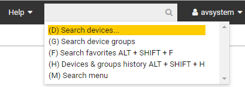
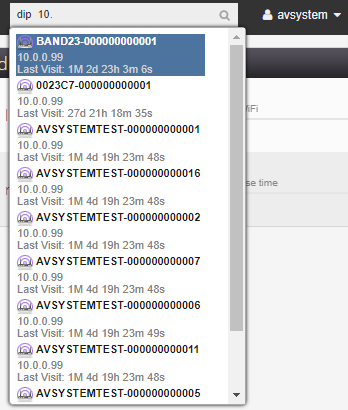

# Navigator

Navigator helps you to quickly access various entities. It can be found in the upper-right part of the Coiote DM layout. To perform search, enter the search box and navigate through attributes, finally provide a query and choose the best suggestion.

## Hints and structure

When you use navigator, structured hints are provided to accelerate your search. Let's take a domain as an example, it can be narrowed down by choosing subsequent hints or by providing a hint string directly. Let's assume, you want to search for a device by IP, it can be accomplished in two ways:

- Select **(D) search devices** --> select **(IP) by IP** --> provide IP prefix --> select a suggestion.

 

- Directly type the *dip* string into the text field --> provide IP prefix --> select a suggestion.

Notice that searching a device by IP is a two stage process, a grouping hint for the device is chosen first (hints name, that have nested search options, ends with triple dots (...)), then by the IP option.
Besides providing the hint directly by typing it, search options can be accessed via global shortcuts - shown on the right of the hint description.
