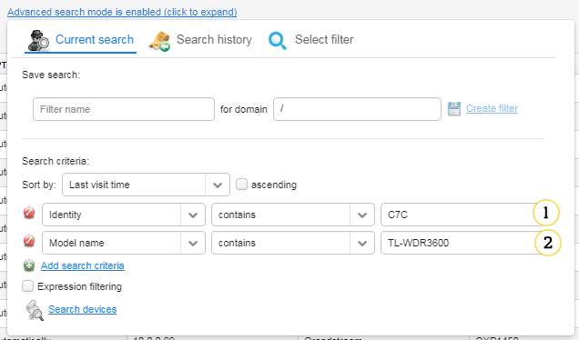

# Search

Most of the Coiote DM data browsing views allow you to limit and search through presented data based on provided criteria. There are basically three types of search views:

 * Basic search
 * Basic search on a specified column
 * Advanced search.

## Basic search

A provided search string is applied to the whole shown data and you cannot limit searching to a single column. You need to press :kbd:**Enter** to start searching. You can use this way of searching when a single column is shown, for example, in a group tree in **Device_Groups**.

 In case of this type of search, you can enter a group name (or its part) in the field (1), and the system will find matching groups. This will impact the group tree (2) where matching groups will have a green background. Additionally, all child and parent groups of the marked group will be shown to easily browse through the group hierarchy.

## Basic search by a specified column

In case of this search you can specify a column which will be used in a search process. You can use this way of searching, for example, in :menuselection:**Device actions --> Access rules**.

    :align: center

    *Fig. Basic search by a specified column*

View of that type can be distinguished by three elements:

1. Search field - use it to type a phrase
2. Current search column - indicated by a green magnifier icon in the column header. The column with this indicator will be used in the search process.
3. Available search columns - indicated by magnifier icons in the column header. You can change a current search column by clicking a corresponding column header.

## Advanced search

This search is the most powerful one in the system. There are two available modes of its work:

 * Simple mode - search based on a single column - the same as in Basic search on a specified column.
 * Advanced mode - this mode allows you to specify multiple conditions as well as to use the expression language.

 "Simple mode")

By default when entering a panel, search is in the simple mode. You can switch between simple and advanced modes by clicking the button near a search input.

1. Tabs:

   * **Current search** - use it for searching.
   * **Search history** - use it to view and use a search history. Read more in the :ref:**OG_Search_history** section.
   * **Select filter** - use it to select a filter that was created during previous searching. Read more in the :ref:**OG_Select_filter** section.

2. **Save search** - use it to create a search that you can save by clicking the **Create filter**. Select a domain to which the filter will belong (your domain is set by default). It will be visible only to users that belong to the same domain. You can later use it in the **Select filter** tab or you can select it from the **Select filter** list.
3. **Sort by** - use it to set an order of results.
4. **Delete** - use it to delete any of conditions.
5. **Add search criteria** - use it to define conditions (they work in conjunction with each other).
6. **Expression filtering** - use it to add an additional expression search.
7. **Search devices** - use it to start searching.

## Simple conditions

A simple condition consist of two basic parts:

   * Search option list (1) which allows you to modify a condition search property.
   * Rest of the layout (2) which depends on the selected search option. This usually consists of an operator list and a value field. When you select a simple condition the rest of the layout is modified according to a type of the selected search option.

The following types are currently available:

   * [Date](#date)
   * [Logical](#logical)
   * [Numeric](#numeric)
   * [Map](#map)
   * [Set](#set)
   * [Text](#text)

Each of them allows you to use its own operators and possible search values, so they will be discussed separately.

### Date

This option consists of an operator combo box selection (1) and a date selection field (2). The following operators are possible:

 * **>** - matches dates that are later than a given date.
 * **<** - matches dates that are earlier than a given date.
 * **=** - matches elements that are equal to a given date.
 * **!=** - matches elements that are not equal to a given date.

### Logical

    :align: center

    *Fig. *

This option consists of an operator combo box selection (1) and a list (2) providing a logical value. The following operators are possible:

 * **=** - matches elements that are equal to a given value.
 * **!=** - matches elements that are not equal to a given value.

### Numeric

This option consists of an operator combo box selection (1) and a field (2) that allows you to type numeric values. The following operators are possible:

 * **>** - matches dates that are greater than a given value.
 * **<** - matches dates that are smaller than a given value.
 * **=** - matches elements that are equal to a given value.
 * **!=** - matches elements that are not equal to a given value.

### Map

This option consists of two elements - a text input (1) specifying a map entry and a text search option configuration (2), that is applied to the specified entry.

### Set

This option consists of an operator combo box selection (1) and a text field (2). The following operators are possible:

   * **contains** - matches an element that contains a given text.

### Text

This option consists of an operator combo box selection (1) and a text field (2). The following operators are possible:

   * **contains** - matches elements that contain a given text.
   * **=** - matches elements that are equal to a given text.
   * **!=** - matches elements that are not equal to a given text.
   * **starts with** - matches elements that start with a given text.

## Example

See below an example of an advanced search.

1. Identity must contain *C7C*.
2. Model name must contain *TL-WDR3600*.

!!! tip  
    You can perform the same query using expressions: *${device.id.contains('C7C') && device.modelName.contains('TL-WDR3600')}*.

You can find more information about expressions below or in the **Expressions** chapter.

## Expression search

You can use the expression language based search to limit the results further. It provides you with a possibility of specifying any logical operators combination as well as using more advanced search criteria than provided by a simple conditions conjunction.
This search option works by evaluating a given expression for each entity matching simple conditions. If a result of evaluation is logically true, then an entity is accepted and added to visible rows.
The expression language used in the search is the same language as in the task configuration - the only difference is availability of root contexts. Following contexts are available in each instance of the expression search:

   * format
   * math
   * nets
   * string

Additionally, each search instance may define additional contexts depending on its location.

!!! warning
    This functionality may impose significant load on the system so remember to limit its use.

## Search history

Each search that you execute adds an entry in the **Search history** tab so that you can use old searches again. This history is stored in a browser storage so it does not affect Coiote DM logging sessions.
You can use the old search by clicking its name. Click a proper link and the view will be switched to the **Current search** tab with proper search options set - however search is not yet performed. To start searching, click the **Search devices** link. Additionally, each entry will show a multi-line description when you hover over it.
You can also clear the current search history for a specific view by clicking the **Clear search history** link.

## Select filter

Use the **Select filter** tab to use previously saved search configuration. Click a proper link and the view will be switched to the **Current search** tab with proper search options set. To start searching, click the **Search devices** link.

## Advanced search instances

Currently advanced search is available in the following places:

   * Resources
   * Device management
   * Task related views.

For each of them simple condition search options, ordering properties and additional expression contexts will be described.

## Resources

You can use the advanced search in :ref:**Resources <UIR_A_Resources>**. An additional expression context is a resource. Available sort properties are:

| Property name | Description                                |
|---------------|--------------------------------------------|
| Add date      | A date of adding a resource to the system. |
| File size     | A size of the resource.                    |

For the simple search, the following sort properties are available:

| Property name | Option type | Description                                                                                                          |
|---------------|-------------|----------------------------------------------------------------------------------------------------------------------|
| Creation time | date        | A date of adding the resource to the system.                                                                         |
| Category      | enumeration | A resource category. The following options are available:                                                            |
|               |             | * config                                                                                                             |
|               |             | * config.backup                                                                                                      |
|               |             | * device-logs                                                                                                        |
|               |             | * device-r                                                                                                           |
|               |             | * firmware                                                                                                           |
|               |             | * panel                                                                                                              |
|               |             | * reports                                                                                                            |
| Description   | text        | A resource description.                                                                                              |
| Device        | text        | An identity of a device with which the resource is associated.                                                       |
| Domain        | string      | A multitenant domain of the resource.                                                                                |
| File name     | string      | The resource file name.                                                                                              |
| File size     | numerical   | A size of the resource.                                                                                              |
| File type     | enumeration | A type of the resource. The following options are available:                                                         |
|               |             | * 1 Firmware Upgrade Image                                                                                           |
|               |             | * 1 Vendor Configuration File                                                                                        |
|               |             | * 2 Vendor Log File                                                                                                  |
|               |             | * 2 Web Content                                                                                                      |
|               |             | * 3 Vendor Configuration File                                                                                        |
|               |             | * 4 Tone File                                                                                                        |
|               |             | * 5 Ringer File                                                                                                      |
|               |             | * Not specified                                                                                                      |
|               |             | * X AVSYSTEM Report File                                                                                             |
|               |             | * X AVSYSTEM Vendor Configuration Template                                                                           |
| Groups        | set         | Group IDs with which the resource is available. Additionally, group name suggestion is available in the input field. |
| Id            | string      | The resource ID.                                                                                                     |
| Location      | enumeration | Localization of the resource:                                                                                        |
|               |             | * EXTERNAL - only URL to the resource location is stored                                                             |
|               |             | * INTERNAL - resources that are stored in the system                                                                 |
| Name          | string      | A name of the resource.                                                                                              |

----------------
Device inventory
----------------

The advanced search is available in a device inventory list view. This search, in addition to basic contexts in expression, allows you to use two additional root contexts:

 * **device <UG_E_PEC_device_object>** - referring to a currently tested device entity
 * **dm <UG_E_PEC_dm_object>** - browsing through the device data model.

!!! warning
    Using the dm (data model) context in the device search may significantly decrease search performance. It is recommended to use it only on small subsets of entities filtered by the simple condition conjunction.

For the advanced search, the following sort properties are available:

| Property name       | Description                                                                                                         |
|---------------------|---------------------------------------------------------------------------------------------------------------------|
| IP address          | An IP address of the device - note that this sorting will be done alphabetically on text IP address representation. |
| creation time       | Time of a device entry creation in the system.                                                                      |
| identity            | The device identity.                                                                                                |
| last register time  | Time of the last register message                                                                                   |
| last visit time     | Time of the last device session.                                                                                    |

For the simple search, the following properties are available:

| Property name          | Option type | Description                                                                                                                                                                       |
|------------------------|-------------|-----------------------------------------------------------------------------------------------------------------------------------------------------------------------------------|
| Creation time          | date        | Time of creating a device entry in the system.                                                                                                                                    |
| Data model root object | text        | A name of the device data model root object.                                                                                                                                      |
| Description            | text        | The device description.                                                                                                                                                           |
| Device groups          | set         | Groups to which the device belongs directly or indirectly (belonging to parent groups of direct groups). Additionally, the group name suggestion is available in the input field. |
| Device property        | map         | The device property map in which property names are used as keys. Additionally, there is the configurable suggestion for the property names.                                      |
| Direct group           | set         | Groups to which the device belongs directly. Additionally, the group name suggestion is available in the input field.                                                             |
| Domain                 | text        | A multitenant domain of the device.                                                                                                                                               |
| Hardware version       | text        | A hardware version of the device.                                                                                                                                                 |
| IP address             | text        | A WAN IP address of the device.                                                                                                                                                   |
| Identity               | text        | The device identity.                                                                                                                                                              |
| Last register time     | date        | Time of the last register message.                                                                                                                                                |
| Last visit time        | date        | Time of the last device session.                                                                                                                                                  |
| Manufacturer OUI       | string      | The device manufacturer OUI.                                                                                                                                                      |
| Model name             | string      | The device model name.                                                                                                                                                            |
| Serial number          | string      | A serial number of the device.                                                                                                                                                    |
| Software version       | string      | A version of the device firmware.                                                                                                                                                 |

## Task related views

Advanced search is available in multiple task related views:

   * Task history
   * Task execution log
   * Group task execution report
   * Tasks for the **Device inventory** tab.

In those view there may be up to 2 additional contexts available for expression search:

   * task - accessing task parameters when browsing through different tasks is enabled (not available for a group task execution report)
   * taskReport - accessing task execution reports - this is not available for a task history.

Searching for a task always uses default sorting configuration - for this reason no sorting options were provided. As for simple search criteria options - their availability is the same as corresponding expression contexts entities.
The following task related search options are available:

| Property name | Option type | Description                                                                                                      |
|---------------|-------------|------------------------------------------------------------------------------------------------------------------|
| Active        | logical     | Indicates whether a task is active.                                                                              |
| Creation time | date        | Time of task creation in the system.                                                                             |
| Device        | string      | A device identity for which the task was scheduled. May be *null* when the task is scheduled for a group.        |
| Domain        | string      | A multitenant domain of the task.                                                                                |
| Group         | string      | An ID of a group for which the task was scheduled. May be *null* when the task is scheduled for a single device. |
| Log level     | numerical   | A numeric value of the task logging level. The following log levels are available:                               |
|               |             | * 0 - trace                                                                                                      |
|               |             | * 1 - debug                                                                                                      |
|               |             | * 2 - info                                                                                                       |
|               |             | * 3 - warn                                                                                                       |
|               |             | * 4 - error                                                                                                      |
| Name          | string      | The task name.                                                                                                   |
| Periodic      | logical     | Indicates whether the task is scheduled with automatic restart (when *true*) or single execution (when *false*). |
| Priority      | numeric     | A numeric value of the task priority.                                                                            |
| Task class    | string      | A class name of the task.                                                                                        |
| Task id       | string      | An ID of the task.                                                                                               |

The following task report related search options are available:

| Property name  | Option type | Description                                                    |
|----------------|-------------|----------------------------------------------------------------|
| Status         | enumeration | A status of a task report. The following values are available: |
|                |             | * finished with an error                                       |
|                |             | * finished with a warning                                      |
|                |             | * in progress                                                  |
|                |             | * not started                                                  |
|                |             | * successfully finished                                        |
| Task report id | string      | An ID of the task report.                                      |
