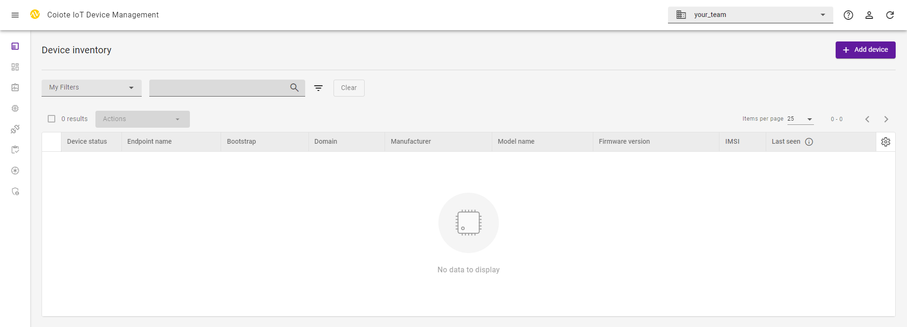
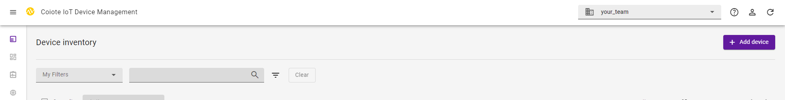
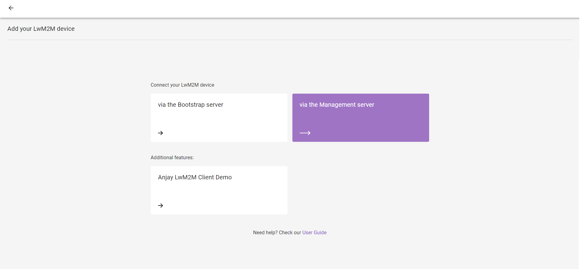
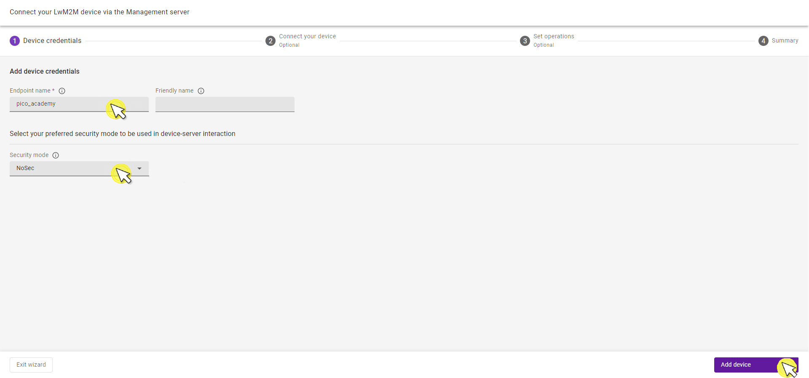
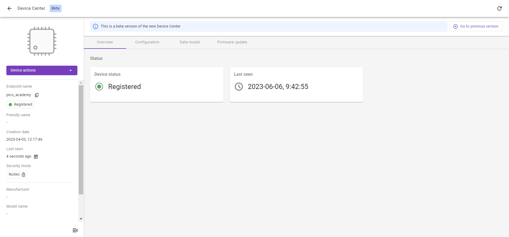
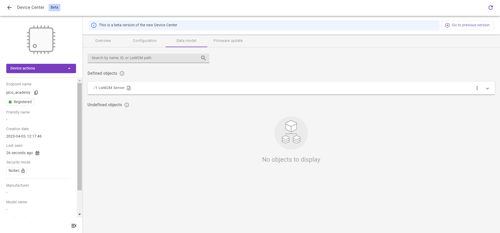

# Exercise 1: Connect the Raspberry Pi Pico W to a LwM2M Server

Let’s start with the first exercise on building an end-to-end LwM2M application by running Anjay LwM2M Client on the Raspberry Pi Pico W, and connecting your device to Coiote IoT Device Management LwM2M Server over WiFi.

## Prerequisites

* A Raspberry Pi Pico W board with a USB cable
* <a href="https://git-scm.com/downloads" target="_blank">Git</a>
* Access to a WiFi network
* Installed **minicom** (for Linux), **RealTerm**, **PuTTy** (for Windows), or another serial communication program.
* An active [Coiote IoT DM](https://eu.iot.avsystem.cloud/) user account.

## Prepare binaries

### Install dependencies

Configure and compile the LwM2M Client. To do so, you need to install some dependencies and clone three GitHub repositories: [Anjay Client for the Raspberry Pi Pico W](https://github.com/AVSystem/Anjay-pico-client), the [Raspberry Pi Pico W SDK](https://github.com/raspberrypi/pico-sdk), and the [FreeRTOS kernel](https://github.com/FreeRTOS/FreeRTOS-Kernel).

Start by creating a new workspace, installing the dependencies, and cloning all three GitHub directories into this workspace.

1. Create and open a new directory:
    ```
    mkdir lwm2m-academy
    cd lwm2m-academy
    ```

1. Install dependencies:

    === "Linux"
        When using **Ubuntu**, run the following command:

        ```
        sudo apt install cmake gcc-arm-none-eabi libnewlib-arm-none-eabi libstdc++-arm-none-eabi-newlib
        ```

        When using **Fedora**, run the following command:

        ```
        sudo dnf install python3 cmake minicom arm-none-eabi-newlib arm-none-eabi-gcc-cs-c++ arm-none-eabi-gcc-cs arm-none-eabi-binutils-cs gcc-arm-linux-gnu gcc-c++-arm-linux-gnu gcc gcc-c++
        ```

    === "Mac"
        When using MacOS, run the following command:

        ```
        brew install armmbed/formulae/arm-none-eabi-gcc
        ```

    === "Windows"
        Download and run the [installer](https://developer.arm.com/-/media/Files/downloads/gnu-rm/10-2020q4/gcc-arm-none-eabi-10-2020-q4-major-win32.exec) to install `arm-none-eabi-gcc` and `arm-none-eabi-gdb`.

        Select the default destination directory (E.g. `C:\GNU_Arm_Embedded_Toolchain`).

        Check the `Add path to environment variable` option **before** you click the `Finish` button for the installation.

        
---

1. Clone three GitHub repositories using Git.

    * Clone the RPi Pico SDK repository and update its submodules

        ```
        git clone -b 1.4.0 https://github.com/raspberrypi/pico-sdk.git
        cd pico-sdk/ && git submodule update --init && cd ..
        ```

    * Clone the FreeRTOS kernel repository
        ```
        git clone -b V10.5.0 https://github.com/FreeRTOS/FreeRTOS-Kernel.git
        ```

    * Clone the Anjay-pico-client repository and update its modules
        ```
        git clone https://github.com/AVSystem/Anjay-pico-client.git
        cd Anjay-pico-client && git submodule update --init --recursive && cd ..
        ```
---

!!! tip
    Need help? Head over to the **lwm2m-academy** channel on <a href="https://discord.avsystem.com/" target="_blank">**Discord**</a> to get in touch with our experts.
 

     
## Connect to the LwM2M Server

Before connecting your device to the cloud, log in to Coiote IoT Device Management: <a href="https://eu.iot.avsystem.cloud" target="_blank">**eu.iot.avsystem.cloud**</a>.

Once logged in, select **Device Inventory** from the left-side menu



In the Device Inventory, click **Add device**.



Select the tile **Connect your LwM2M device directly via the Management server**.



In the *Device Credentials* step:

0. Enter the Endpoint name. You can choose an endpoint name by yourself.
0. As the Security mode, choose **NoSec**.



Click **Add device** and **Confirm** in the confirmation pop-up.

Click **Go to Summary** to find your Device Center view.

## Compile the application
Let’s continue building the required files for the application. We are using NoSec mode where encryption and authentication are disabled and the data messages are passed in plain text over the network. In future exercises, we’ll cover secure implementation in more detail.

!!! Warning
    Use the NoSec mode only for development, testing, and debugging purposes, never in production environments unless end-to-end security is provided on a lower layer (e.g. IPSec).

To start the compilation of the application, go to the `Anjay-pico-client` directory. Build the project with `<ssid>` and `<pass>` replaced with your **WiFi network name** and **password** respectively. The LwM2M Client Endpoint Name is configured using the `<endpoint_name>` parameter.

!!! Note
    A LwM2M Client is uniquely identified by an **Endpoint Name**. Use the Endpoint Name you created in the [Connect to the Server](#connect-to-the-lwm2m-server) section.

Create and open a directory called **build**:
```
mkdir build && cd build
```
If you’re using **Linux** or **Mac**, run the following command:
```
cmake -DCMAKE_BUILD_TYPE=Debug -DWIFI_SSID="<ssid>" -DWIFI_PASSWORD="<pass>" -DENDPOINT_NAME="<endpoint_name>" ..
```

If you’re using **Windows**, run the following command:
```
cmake -DCMAKE_BUILD_TYPE=Debug -DWIFI_SSID="<ssid>" -DWIFI_PASSWORD="<pass>" -DENDPOINT_NAME="<endpoint_name>" .. -G "MinGW Makefiles"
```

Open up the build directory and run the following command:
```
cmake --build . -j
```

It will generate directories that contain the **.uf2** and **.hex** files. The **.uf2** files can be programmed using the bootloader (e.g. drag-and-drop method) and **.hex** files can be loaded directly into the memory of the device using the **rp2** tool.

In this example, we will use the **.uf2** file.

## Flash the board using the bootloader:
To program the Raspberry Pi using the bootloader, press and hold the **BOOTSEL** button while connecting the device through a USB cable - it should be recognized as a Mass Storage device.

In the **build/mandatory_objects** directory, you will find the **.uf2** file.

Copy the **mandatory_objects.uf2** file to the Mass Storage device directory, and wait until the process finishes - copying the firmware image may take a while

## Check the logs
With the board still connected to your PC, open a serial communication program. This will help you to check if everything is working correctly.
!!! Note
    To open the serial port interface you need to check the name of the connected device and choose the proper baud rate value:

    - Linux usually uses **/dev/ttyACM<number>** or **/dev/ttyUSB<number>** for a serial port device name.
    - Windows uses **COM<number>** for a serial port device name.
    - macOS uses **/dev/tty.usbmodem<number>** for a serial port device name.

    It’s important to set the correct baud rate, too. The baud rate is the number of symbols transferred in a communication channel per second and must be the same both on the serial communication program and on the board. The most common baud rates for serial ports are `9600` and `115200`.

In exercises throughout the academy, we use 115200 baud, since it’s the default value used by Raspberry Pi Pico W.


!!! Tip
    Those logs may help figure out why the device didn't connect to the server (e.g. because of the mistake in writing the WiFi password in the `cmake` command).

If all went well and logs show **registration successful/registration successfully updated**, you can go to Coiote IoT DM where the Registration status should show **Registered**.



Did you manage to connect the Raspberry Pi Pico W to the Coiote IoT Device Management server?

**Well done! You’ve created your first LwM2M application** 👏

## Data model view
Click the **Data model** tab from the top menu.

In this view, we can see all LwM2M Object the device supports. As of now, there is only the LwM2M Server Object, more objects will be added in future exercises.




!!! important "Provide your feedback"

    We're constantly working on improving the LwM2M Academy. Please share with us your feedback about this module so we can create an even better learning experience.

    [Feedback form](https://forms.gle/UAFLJs9LJocAeger9){: .md-button .md-button--big }
