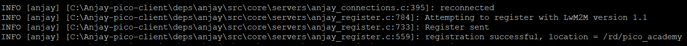

#Exercise 2B: Implement Pre-Shared Key Security Mode

In this exercise, we will change the security mode from **No-Sec** to **Pre-Shared Key** (PSK). In this mode, communication is symmetrically encrypted and authenticated using the same secret key (password), shared between the server and the client.

## Prerequisites

* A Raspberry Pi Pico W board with a USB cable.
* Completed [exercise 1](../academy/exercise1.md) from module 1.
* Completed [exercise 2A](../academy/exercise2a.md) from module 2.
* Installed minicom (for Linux), RealTerm, PuTTy (for Windows), or another serial communication program.
* An active [Coiote IoT DM](https://eu.iot.avsystem.cloud/) user account.

## Connect to the LwM2M Server

For LwM2M Servers like [Coiote IoT DM](https://www.avsystem.com/coiote-iot-device-management-platform/), server-side configuration needs to be updated to enable LwM2M Clients to connect using PSK. The simplest solution is to edit the connection parameters on the Coiote IoT Device Management configuration page. Follow the next steps to change the parameters and set them to Pre-Shared Key mode.


### Change connection parameters

0. Log in to Coiote IoT DM: [https://eu.iot.avsystem.cloud](https://eu.iot.avsystem.cloud).
0. Select **Device Inventory** from the left-side menu.
0. From the Device Inventory, go to your created device.
0. Go to the **Configuration** page and click the right pencil icon on the Connection parameters panel.

    

0. Update **Connection parameters**:

    - In the **Security mode** section, select the **Pre-Shared Key** mode:
    - In the **Key identity** field, it’s recommended to provide the same value as in the **Endpoint name** field.
    - In the **Key field**, create the shared secret used for device-server authentication. During the compilation step you will provide the *PSK_KEY* which must have the same value as the **Key**.

    

!!! Warning
    Nowadays it’s easy to guess simple human-generated passwords. Generating a password using a combination of alphanumeric characters and special symbols ensures its security. Avoid putting your personal information and generate a combination of keys to help you maximize safety and security.

Click the **Save** button and confirm the changes.

## Configure credentials in application sources
Let’s get started by going to the **Anjay-pico-client** directory and creating a new directory called **psk-mode**.

!!! Important
    Copy and paste the **main.c** and **CMakeLists.txt** files from the **Anjay-pico-client/mandatory_objects** directory into the **Anjay-pico-client/psk-mode** directory.

Open the **main.c** file in a code editor (e.g. VS Code).

In this file, we need to modify the `setup_security_object()` function to change Anjay’s security settings and add the configuration of PSK-based encryption. This can be done using the code below.

```
static int setup_security_object(anjay_t *anjay) {
    if (anjay_security_object_install(anjay)) {
        return -1;
    }

    static const char psk_identity[] = PSK_IDENTITY;
    static const char psk_key[] = PSK_KEY;

    const anjay_security_instance_t security_instance = {
        .ssid = 1,
        .server_uri = "coaps://eu.iot.avsystem.cloud:5684",
        .security_mode = ANJAY_SECURITY_PSK,
        .public_cert_or_psk_identity = (const uint8_t *) psk_identity,
        .public_cert_or_psk_identity_size = strlen(psk_identity),
        .private_cert_or_psk_key = (const uint8_t *) psk_key,
        .private_cert_or_psk_key_size = strlen(psk_key)
    };

    anjay_iid_t security_instance_id = ANJAY_ID_INVALID;
    if (anjay_security_object_add_instance(anjay, &security_instance,
                                        &security_instance_id)) {
        return -1;
    }
    return 0;
}
```

Next, open the **CMakeLists.txt**, change the file names and add the required information about the PSK mode.

```
cmake_minimum_required(VERSION 3.13)

add_executable(psk-mode
            main.c
            )

target_link_libraries(psk-mode
                    pico_stdlib
                    anjay-pico
                    FreeRTOS
                    )

target_include_directories(psk-mode PRIVATE
                        ${COMMON_DIR}/config
                        )

target_compile_definitions(psk-mode PRIVATE
                        WIFI_SSID=\"${WIFI_SSID}\"
                        WIFI_PASSWORD=\"${WIFI_PASSWORD}\"
                        ENDPOINT_NAME=\"${ENDPOINT_NAME}\"
                        PSK_IDENTITY=\"${PSK_IDENTITY}\"
                        PSK_KEY=\"${PSK_KEY}\"
                        )

pico_enable_stdio_usb(psk-mode 1)
pico_enable_stdio_uart(psk-mode 0)

pico_add_extra_outputs(psk-mode)

```

## Configure PSK Identity and Pre-Shared Key
After updating the `setup_security_object()` function in the **main.c** file, it is time to describe the most important variables to configure the **PSK** mode.

- **PSK Identity** (`PSK_IDENTITY`) is the name by which the device identifies itself during the DTLS handshake. It is recommended to use the endpoint name as the Key identity.
- **PSK Key** (`PSK_KEY`) is the shared secret (password) the device uses for server connections in PSK mode. You must enter this PSK Key in plain text.
- **Server URI** (`server_uri`) points to the LwM2M Server. Note that the URI port has changed from `5683` to `5684`.


!!! Note
    The complete code for a similar example targeting desktop platforms can be found in the `secure_communication` subdirectory of the Anjay-pico-client project repository.

## Recompile the application and flash the board
To recompile the application, go to the **Anjay-pico-client/build** directory.

If you’re using **Linux** or **Mac**, run the following command:
```
cmake -DCMAKE_BUILD_TYPE=Debug -DWIFI_SSID="<ssid>" -DWIFI_PASSWORD="<pass>" -DENDPOINT_NAME="<endpoint_name>" -DPSK_IDENTITY="<identity>" -DPSK_KEY="<psk>" ..
```

If you’re using ***Windows***, run the following command:
```
cmake -DCMAKE_BUILD_TYPE=Debug -DWIFI_SSID="<ssid>" -DWIFI_PASSWORD="<pass>" -DENDPOINT_NAME="<endpoint_name>" -DPSK_IDENTITY="<identity>" -DPSK_KEY="<psk>" .. -G "MinGW Makefiles"
```
Run the following command in the build directory
```
cmake --build . -j
```

Program your board using the bootloader. Press and hold the **BOOTSEL** button while connecting the device through a USB cable - it should be recognized as a Mass Storage device.

In the **build/mandatory_objects** directory, you will find the **.uf2** file which contains the added changes.

Copy the `mandatory_objects.uf2` file to the Mass Storage device directory, and wait until the process finishes - copying the firmware image may take a while

## Check the logs

If all went well and logs show **registration successfully updated**.



In Coiote IoT Device Management, the Registration status should show **Registered** and the **Security mode** in the bottom-left corner panel should now include the tag: `Pre-Shared Key`.


Can you see **Registered** in the registration status and the tag **Pre-Shared Key**? If yes, well done!  👏 👏
