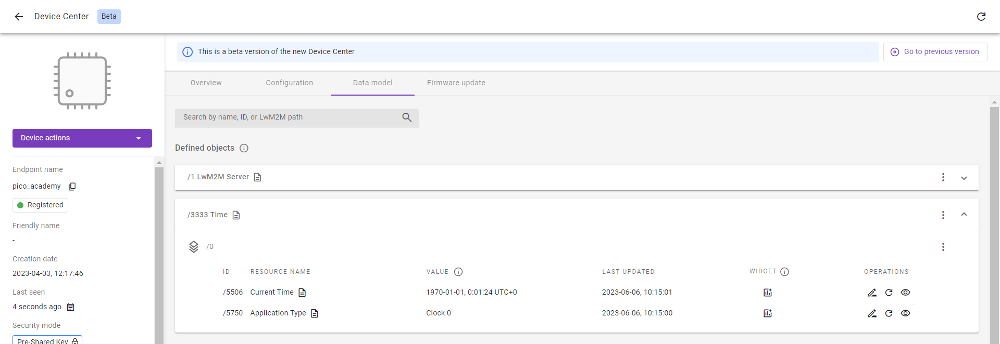

# Exercise 3A: Implement the Time Object
In this exercise, we are implementing the [Time Object /3333](http://devtoolkit.openmobilealliance.org/OEditor/LWMOView?url=https%3A%2F%2Fraw.githubusercontent.com%2FOpenMobileAlliance%2Flwm2m-registry%2Fprod%2Fversion_history%2F3333-1_0.xml) using LwM2M version 1.0. With only 3 Resources, it is one of the simplest Objects defined in the [OMA LwM2M Registry](https://technical.openmobilealliance.org/OMNA/LwM2M/LwM2MRegistry.html). The Object allows LwM2M Clients to report the current time in seconds since January 1, 1970, UTC.

The Time Object contains three Resources as shown in the table below.

|ID|Name|Operations|Mandatory|Type|Description|
|----------- | -----------| ----------- | ----------- |----------- | ----------- |
|5506|Current Time|RW|Mandatory|Time|Unix Time. A signed integer representing the number of seconds since Jan 1st, 1970 in the UTC time zone.|
|5507|Fractional Time|RW|Optional|Float|A fractional part of the time when sub-second precision is used (e.g., 0.23 for 230 ms).|
|5750|Application Type|RW|Optional|String|The application type of the sensor or actuator as a string depending on the use case. This description identifies Instance (e.g. description indicating the time comes from GPS, internal server clock, or another source)|

*Explanation of table rows:*

- ID - number used to identify the particular Resource.
- Operations - RW indicates that the Resource is Readable and Writable (the third possible option is E - Executable).
- Mandatory - not all Resources must be implemented to comply with the specification. In this case, only the Current Time Resource is mandatory.

!!! Note
    Current Time and Fractional Time Resources are writable, but for this exercise, we will only focus on implementing the read operation for these two resources.

With our **Time Object** we will initiate one Instance, implement the read and write functions, make the device responsive to server read commands, and make the Object register to the server at boot.

## Prerequisites

* A Raspberry Pi Pico W board with a USB cable
* Installed **minicom** (for Linux), **RealTerm**, **PuTTy** (for Windows), or another serial communication program.
* <a href="https://www.python.org/downloads/" target="_blank">Python</a>
* An active [Coiote IoT DM](https://eu.iot.avsystem.cloud/) user account.
* Completed [exercise 2B](../academy/exercise2b.md) from module 2


## Implement the Time Object
Let’s get started by going to the **Anjay-pico-client** directory and creating a new directory called **time_object**. Go to the directory and start by generating the Object's implementation.

!!! Important
    Copy and paste the *main.c* and *CMakeLists.txt* files from the **Anjay-pico-client/secure_communication** directory to the **Anjay-pico-client/time_object** directory.

## Generate base source code
To generate a layout of the Object’s implementation, we will use the `anjay_codegen.py` and `lwm2m_object_registry.py` scripts which are bundled with the Anjay library. The script downloads the LwM2M Object Definition and generates a skeleton of the LwM2M Object code, requiring you to only fill in actual Object logic. For more information about the script, visit the [Anjay documentation](https://avsystem.github.io/Anjay-doc/Tools/StubGenerator.html).

If you’re using **Linux** or **MacOS** go to the **Anjay-pico-client** directory, and run the following commands in your command line:

```
python3 deps/anjay/tools/lwm2m_object_registry.py --get-xml 3333 -v 1.0 > time_object/lwm2m_3333.xml
python3 deps/anjay/tools/anjay_codegen.py -i time_object/lwm2m_3333.xml -o time_object/time_object.c
```
!!! important
    If you’re using **Windows**, use `python` instead of `python3`.

The commands use the `anjay_codegen.py` and `lwm2m_object_registry.py` scripts to generate the *lwm2m_3333.xml* and *time_object.c* files in the **Anjay-pico-client/time_object**.

The generated files still require some modifications to make them operational. In the next part, you can find the highlighted code blocks which should be added to the *time_object.c* files.

## Instance and Object state

Each Object requires at least one Object Instance which contains all the required Resources.

Go to the **Anjay-pico-client/time_object** directory and open the file `time_object.c`.

Start by adding some variables responsible for the state of our Time Object Instance to the `time_instance_t` structure. For this add a value of Application Type Resource because Current Time Resource will be using a system clock source directly, whenever a read handler is called.

!!! Note
    There is also a second array for keeping a backup of the Application Type - this will be required for the implementation of transactions. We will get back to it at the end of this exercise.

<p style="text-align: center;">time_object.c</p>
```
typedef struct time_instance_struct {
    anjay_iid_t iid;
    char application_type[64];
    char application_type_backup[64];
    } time_instance_t;

typedef struct time_object_struct {
        const anjay_dm_object_def_t *def;
        AVS_LIST(time_instance_t) instances;
    } time_object_t;
```


## Initiate, release, and reset the Instance
Next up is implementing the `init_instance()` and `release_instance()` functions. These functions are used during the creation and deletion of Instances, usually performed through device work.

In this case, all we have to do is initialize the Application Type with some value. We can do this by setting the first byte of  `time_instance_t::application_type` variable to `\0`.

!!! Note
    To better understand the code, it is useful to know the “full names” of some variables:

    - obj - Object
    - iid - Instance ID
    - rid - Resource ID
    - riid - Resource Instance ID

<p style="text-align: center;">time_object.c</p>
```
static int init_instance(time_instance_t *inst, anjay_iid_t iid) {
    assert(iid != ANJAY_ID_INVALID);

    inst->iid = iid;
    inst->application_type[0] = '\0';
    return 0;
}
```

The next function to implement is `instance_reset()` which resets the Instance to its default state. In our case, this means we clear the Application Type.

<p style="text-align: center;">time_object.c</p>
```
static int instance_reset(anjay_t *anjay,
                        const anjay_dm_object_def_t *const *obj_ptr,
                        anjay_iid_t iid) {
    (void) anjay;

    time_object_t *obj = get_obj(obj_ptr);
    assert(obj);
    time_instance_t *inst = find_instance(obj, iid);
    assert(inst);
    inst->application_type[0] = '\0';
    return 0;
}
```

We can also disable the presence of one of the Resources in the `list_resources()` function. It is done by changing `ANJAY_DM_RES_PRESENT` to `ANJAY_DM_RES_ABSENT` in the `anjay_dm_emit_res()` call. This change will simplify the implementation of the Read Handler and Observe/Notifications support in the next section.

<p style="text-align: center;">time_object.c</p>
```
static int list_resources(anjay_t *anjay,
                        const anjay_dm_object_def_t *const *obj_ptr,
                        anjay_iid_t iid,
                        anjay_dm_resource_list_ctx_t *ctx) {
    (void) anjay;
    (void) obj_ptr;
    (void) iid;

    anjay_dm_emit_res(ctx, RID_CURRENT_TIME,
                    ANJAY_DM_RES_RW, ANJAY_DM_RES_PRESENT);
    anjay_dm_emit_res(ctx, RID_FRACTIONAL_TIME,
                    ANJAY_DM_RES_RW, ANJAY_DM_RES_ABSENT);
    anjay_dm_emit_res(ctx, RID_APPLICATION_TYPE,
                    ANJAY_DM_RES_RW, ANJAY_DM_RES_PRESENT);
    return 0;
}
```


!!! Note
    Using the `-r` command line option in *anjay_codegen.py* you can generate Object’s stub with specified Resources only. You can run
    `python3 deps/anjay/tools/anjay_codegen.py --help` from the Anjay-pico-client direcotry for more help.

## Read and Write handlers

Now we are ready to implement `resource_read()` and `resource_write()` handlers. These handlers will be called every time LwM2M Server performs a Read or Write operation on the Time Object.

!!! Note
    Read and Write operations will be described in more detail in the next module: **Module 4 - Device Management using LwM2M**.

The `resource_read()` operation on Current Time resource should return current time in seconds since January 1, 1970, UTC. To get this value, we can use the preimplemented `avs_time_real_now()` function. The same operation on Application Type resource should return the `time_instance_t::application_type` string. Because we’ve made the Fractional Time resource absent, we won’t perform any actions on this resource during `resource_read()` operation.

<p style="text-align: center;">time_object.c</p>
```
static int resource_read(anjay_t *anjay,
                        const anjay_dm_object_def_t *const *obj_ptr,
                        anjay_iid_t iid,
                        anjay_rid_t rid,
                        anjay_riid_t riid,
                        anjay_output_ctx_t *ctx) {
    (void) anjay;

    time_object_t *obj = get_obj(obj_ptr);
    assert(obj);
    time_instance_t *inst = find_instance(obj, iid);
    assert(inst);

    switch (rid) {
    case RID_CURRENT_TIME: {
    assert(riid == ANJAY_ID_INVALID);
    int64_t timestamp;
    if (avs_time_real_to_scalar(&timestamp, AVS_TIME_S,
                                avs_time_real_now())) {
        return -1;
    }
    return anjay_ret_i64(ctx, timestamp);
    }
    case RID_APPLICATION_TYPE:
    assert(riid == ANJAY_ID_INVALID);
    return anjay_ret_string(ctx, inst->application_type);
    default:
        return ANJAY_ERR_METHOD_NOT_ALLOWED;
    }
}
```

As discussed, we only implement the Read operation on the Current Time Resource, so the Write operation is only implemented on the Application Type Resource.

<p style="text-align: center;">time_object.c</p>
```
static int resource_write(anjay_t *anjay,
                        const anjay_dm_object_def_t *const *obj_ptr,
                        anjay_iid_t iid,
                        anjay_rid_t rid,
                        anjay_riid_t riid,
                        anjay_input_ctx_t *ctx) {
    (void) anjay;

    time_object_t *obj = get_obj(obj_ptr);
    assert(obj);
    time_instance_t *inst = find_instance(obj, iid);
    assert(inst);

    switch (rid) {
    case RID_APPLICATION_TYPE:
    assert(riid == ANJAY_ID_INVALID);
    return anjay_get_string(ctx, inst->application_type,
                            sizeof(inst->application_type));
    default:
        return ANJAY_ERR_METHOD_NOT_ALLOWED;
    }
}
```


## Initialize the Object
There is one function left to implement: `time_object_create()`. This function uses `add_instance()` to create an Object Instance, allowing data to be read by the LwM2M Server.

<p style="text-align: center;">time_object.c</p>
```
const anjay_dm_object_def_t **time_object_create(void) {
    time_object_t *obj = (time_object_t *) avs_calloc(1, sizeof(time_object_t));
    if (!obj) {
        return NULL;
    }
    obj->def = &OBJ_DEF;

    time_instance_t *inst = add_instance(obj, 0);
    if (!inst) {

        avs_free(obj);
        return NULL;
    }
    strcpy(inst->application_type, "Clock 0");
    return &obj->def;
}
```

## Register the Object in Anjay

The last thing to do is to create the header file `time_object.h` for the implemented object, include the header file in the **main.c** and update the **CMakeLists.txt** file.

<p style="text-align: center;">time_object.h</p>
```
#pragma once

#include <anjay/dm.h>

const anjay_dm_object_def_t **time_object_create(void);
void time_object_release(const anjay_dm_object_def_t **def);
```


<p style="text-align: center;">main.c</p>
```
void anjay_task(__unused void *params) {
    init_wifi();

    anjay_configuration_t config = {
        .endpoint_name = ENDPOINT_NAME,
        .in_buffer_size = 2048,
        .out_buffer_size = 2048,
        .msg_cache_size = 2048,
    };

    if (!(g_anjay = anjay_new(&config))) {
        avs_log(main, ERROR, "Could not create Anjay object");
        exit(1);
    }
    if (setup_security_object() || setup_server_object()) {
        avs_log(main, ERROR, "Failed to initialize basic objects");
        exit(1);
    }
    const anjay_dm_object_def_t **time_object = time_object_create();
    if (!time_object || anjay_register_object(g_anjay, time_object)) {
        avs_log(main, WARNING, "Failed to initialize time object");
    }

    main_loop();
    time_object_release(time_object);
    anjay_delete(g_anjay);
}
```

Include the `time_object.h` file on the top of the *main.c* file.

<p style="text-align: center;">time_object.c</p>
```
#include <avsystem/commons/avs_list.h>
#include <avsystem/commons/avs_log.h>
#include <avsystem/commons/avs_prng.h>
#include <avsystem/commons/avs_time.h>

#include "time_object.h"

#ifndef RUN_FREERTOS_ON_CORE
#    define RUN_FREERTOS_ON_CORE 0
#endif
```

<p style="text-align: center;">CMakeLists.txt</p>
```
cmake_minimum_required(VERSION 3.13)

add_executable(time_object
            main.c
            time_object.c
            time_object.h
            )

target_link_libraries(time_object
                    pico_stdlib
                    anjay-pico
                    FreeRTOS
                    )

target_include_directories(time_object PRIVATE
                        ${COMMON_DIR}/config
                        )

target_compile_definitions(time_object PRIVATE
                        WIFI_SSID=\"${WIFI_SSID}\"
                        WIFI_PASSWORD=\"${WIFI_PASSWORD}\"
                        ENDPOINT_NAME=\"${ENDPOINT_NAME}\"
                        PSK_IDENTITY=\"${PSK_IDENTITY}\"
                        PSK_KEY=\"${PSK_KEY}\"
                        )
pico_enable_stdio_usb(time_object 1)
pico_enable_stdio_uart(time_object 0)

pico_add_extra_outputs(time_object)
```

At the end of the file add the mention about subdirectory to the general *CMakeLists.txt*.


<p style="text-align: center;">Anjay-pico-client/CMakeLists.txt</p>
```
add_subdirectory(time_object)
```

Now the client is ready to be built and connected to LwM2M Server, allowing it to read the Time object.

## Support transactional writes

Consider the following scenario: the LwM2M Server tries to write to two or more Resources simultaneously. The write-on Application Type will probably succeed, but we are sure that writing at the Current Time will fail as we didn’t implement this Write operation. Without supporting transactions, the entire Write operation will fail.

By default, transaction handlers are set to `anjay_dm_transaction_NOOP` and do nothing. To properly support Writes on the O two handlers: `transaction_begin` which makes a backup of the Application Type value, and `transaction_rollback` which reverts the Application Type to its initial value (before the Write operation is performed) for which we need the `time_instance_t::application_type_backup` array.

Go back to the *time_object.c* file and update the file using the following code block:

<p style="text-align: center;">time_object.c</p>
```
static int transaction_begin(anjay_t *anjay,

const anjay_dm_object_def_t *const *obj_ptr) {
    (void) anjay;
    time_object_t *obj = get_obj(obj_ptr);
    time_instance_t *element;
    AVS_LIST_FOREACH(element, obj->instances) {
        strcpy(element->application_type_backup, element->application_type);
    }
    return 0;
}

static int transaction_rollback(anjay_t *anjay,

const anjay_dm_object_def_t *const *obj_ptr) {
    (void) anjay;
    time_object_t *obj = get_obj(obj_ptr);
    time_instance_t *element;
    AVS_LIST_FOREACH(element, obj->instances) {
        strcpy(element->application_type, element->application_type_backup);
    }
    return 0;
}
static const anjay_dm_object_def_t OBJ_DEF = {
    .oid = 3333,
    .handlers = {
        .list_instances = list_instances,
        .instance_create = instance_create,
        .instance_remove = instance_remove,
        .instance_reset = instance_reset,

        .list_resources = list_resources,
        .resource_read = resource_read,
        .resource_write = resource_write,

        .transaction_begin = transaction_begin,
        .transaction_validate = anjay_dm_transaction_NOOP,
        .transaction_commit = anjay_dm_transaction_NOOP,
        .transaction_rollback = transaction_rollback
    }
};
```


## Recompile the application and flash the board
To recompile the application, go to the **Anjay-pico-client/build** directory.

If you’re using **Linux** or **Mac**, run the following command:
```
cmake -DCMAKE_BUILD_TYPE=Debug -DWIFI_SSID="<ssid>" -DWIFI_PASSWORD="<pass>" -DENDPOINT_NAME="<endpoint_name>" -DPSK_IDENTITY="<identity>" -DPSK_KEY="<psk>" ..
```

If you’re using ***Windows***, run the following command:
```
cmake -DCMAKE_BUILD_TYPE=Debug -DWIFI_SSID="<ssid>" -DWIFI_PASSWORD="<pass>" -DENDPOINT_NAME="<endpoint_name>" -DPSK_IDENTITY="<identity>" -DPSK_KEY="<psk>" .. -G "MinGW Makefiles"
```
Run the following command in the build directory
```
cmake --build . -j
```

Program your board using the bootloader. Press and hold the **BOOTSEL** button while connecting the device through a USB cable - it should be recognized as a Mass Storage device.

In the **build/time_object** directory, you will find the *.uf2* file which has our added changes.

Copy the `time_object.uf2` file to the Mass Storage device directory, and wait until the process finishes - copying the firmware image may take a while.

## Check the logs
With the board still connected to your PC, open a serial communication program. This will help you to check if everything is working correctly.


If all went well and logs show **registration successfully updated**, you can go to Coiote IoT Device Management where the Registration status should show **Registered**. Go to the **Data Model** and check if you can see the Time Object in the **Defined objects** section.



!!! Note
    The Object allows LwM2M Clients to report the current time in seconds since January 1, 1970, UTC. After refreshing the page you can see that the value changed.

**Good job!** 👏👏
Now you are ready to create more difficult Objects. For this, go to the next exercise.

!!! important "Provide your feedback"

    We're constantly working on improving the LwM2M Academy. Please share with us your feedback about this module so we can create an even better learning experience.

    [Feedback form](https://forms.gle/UAFLJs9LJocAeger9){: .md-button .md-button--big }
