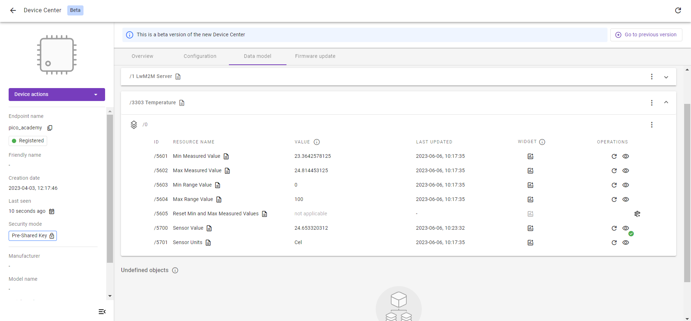
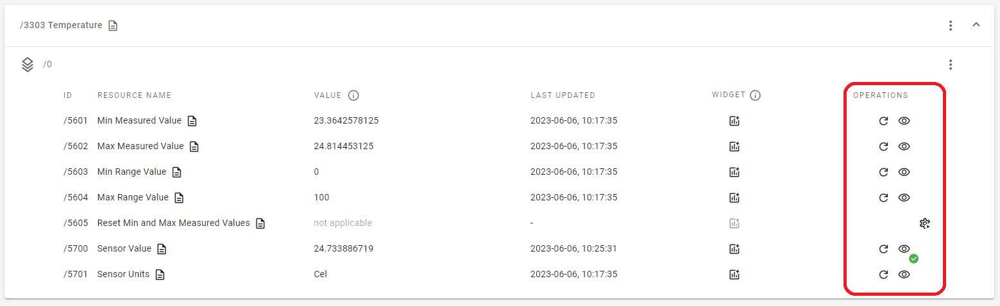
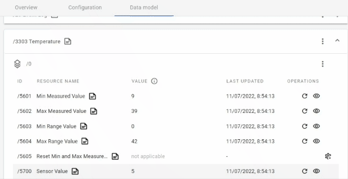
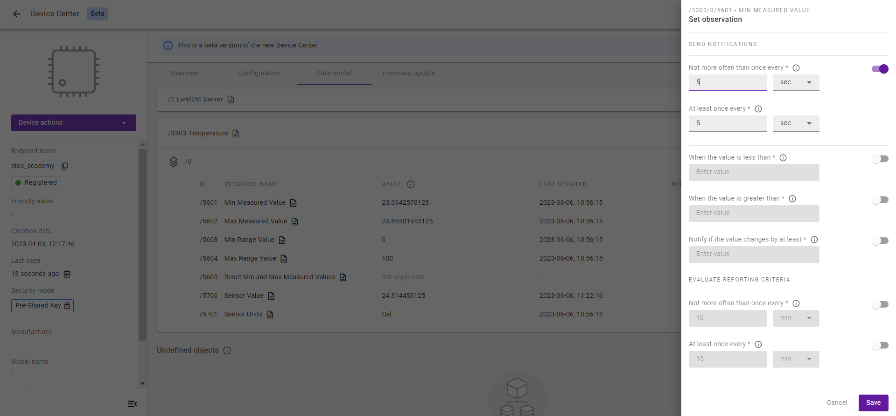
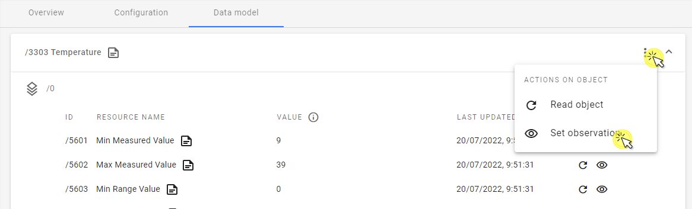
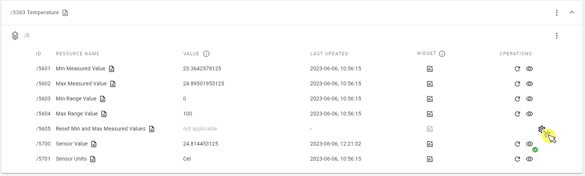

# Exercise 4A: LwM2M Operations

Some Resources represent values that change over time, like sensor readings. The LwM2M Server may request the Client to send notification messages at regular intervals or when values exceed a certain threshold. To do so, the Server can send an Observe Operation to the device, after which the device responds with periodic Notify messages containing the values of the observed Object, Object Instance, or Resources.

Next to the Observe Operation, the Server can request the Client to send the value of a specific Resource using the Read operation or it can change a parameter using the Write operation. These operations are performed only once.

In this exercise, we start sending LwM2M Operations to the Client to monitor the Temperature Object implemented in the previous 3B exercise.

!!! Note
    The Write operation won’t be used in this exercise. If you want to use this operation you can perform this on the Time Object.

## Prerequisites

* A Raspberry Pi Pico W board with a USB cable
* Installed **minicom** (for Linux), **RealTerm**, **PuTTy** (for Windows), or another serial communication program.
* An active [Coiote IoT DM](https://eu.iot.avsystem.cloud/) user account.
* Completed [exercise 3B](../academy/exercise3b.md) from module 3
* The LM35 temperature sensor

## Notifications support
Let’s get started by connecting our Raspberry Pi Pico W to the computer via a USB cable. Open a serial communication program to watch the device logs and go to the Coiote IoT Device Management to check if your device has connected successfully. If so, you are ready to perform your first Observe/Read/Write operations on your LwM2M Device (a.k.a. The LwM2M Client).

Go to **Coiote IoT DM**, select the **Data model** tab and open the **Temperature Object /3303**.

Find in the **Operations** column three different icons representing three different Operations.

- **Read** - The Read operation requests the Client to send its latest value. The operation can be invoked on an Object, Object Instance, Resource or Resource Instance.

- **Observe** - After invoking the Observe operation, the Server requests the Client to send Notify messages periodically based on configurable time intervals or triggers.

- **Execute** - Execute operation invokes an action or operation on a Resource. For example instructing a device to reset, reboot, upgrade its firmware or just turn some LED on.

!!! Note
    There is no Write operation visible here, because the Sensor Objects do not have any “writable” resources (i.e. resources into which you can write your value). Such operation can be found in e.g. Time Object’s Application Type resource.

## Read Operation
The Server can perform a LwM2M Read operation on a Resource, Object Instance or a whole Object. To do this, click the circular icon in the **Operations** column (or use the 3 vertical dots menu in case of Objects and Object Instances).

{:style="float: left;margin-right: 817px;margin-top: 17px;margin-bottom: 17px;"}

You can see that each time you perform a Read Operation on a specific Resource, its value is updated because the Client has been instructed to send the newest value to the server.

## Observe Operation
The Server can set observations on a Resource, Object Instance or a whole Object. To set an observation on the Sensor Value Resource `/3303/*/5700`, click an **eye** icon to open the **Set observation** panel. Change the default **“Not more often than once every”** and **“Not more often than once every”** values.

* **Not more often than once every** - the minimum time in seconds between two notifications.
* **At least once every** - the maximum time in seconds between two notifications. The notification is sent even if the value hasn't changed.

To set an observation on an Object or Object Instance, click on the 3 vertical dots menu and select **Set observation**, then follow the steps described above.

{:style="float: left;margin-right: 817px;margin-top: 17px;margin-bottom: 17px;"}

You can see that after every amount of time which you set in the observation menu, its value is changed and updated due to calling “Update send” by Anjay.

!!! Note
    You can read more about other attributes in our [Brief description of OMA LwM2M](https://avsystem.github.io/Anjay-doc/LwM2M.html#attributes).

## Execute Operation
To perform a LwM2M EXECUTE operation on a resource, click the **cogwheel** icon in the **Operations** column and select **Execute**, or **Execute with parameters** to set additional EXECUTE conditions.

**Well done! You remotely managed your IoT devices using the LwM2M Operations Read and Observe** 👏
