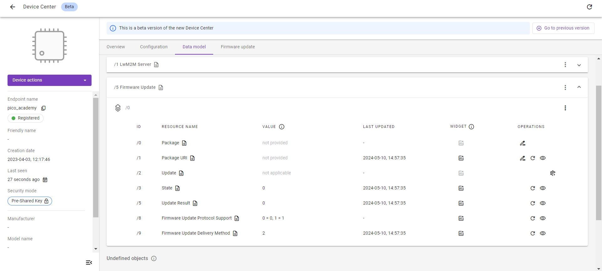
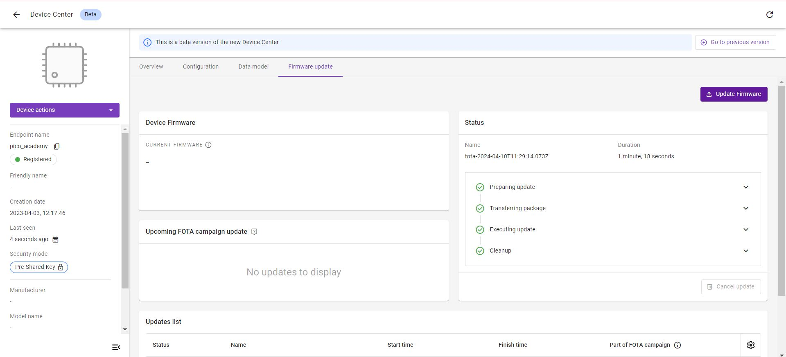
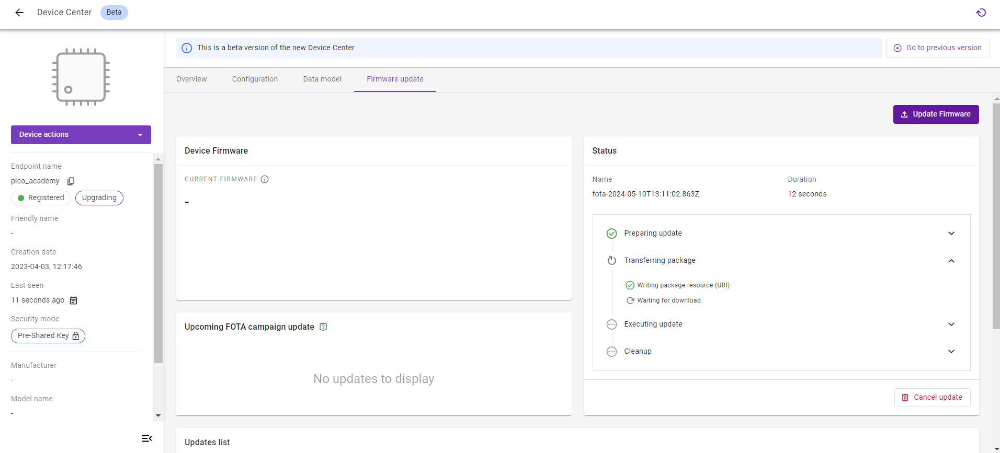

# Exercise 5: Implement Firmware Update
In this exercise, we implement Object 5 - Firmware Update.  It utilizes the [pico_fota_bootloader](https://github.com/JZimnol/pico_fota_bootloader) to swap the flash partitions after downloading the appropriate binary file from Coiote IoT DM.

## Prerequisites

* A Raspberry Pi Pico W board with a USB cable
* Installed **minicom** (for Linux), **RealTerm**, **PuTTy** (for Windows), or another serial communication program.
* An active [{{ coiote_short_name }}]({{ coiote_site_link }}/) user account
* Completed [exercise 4A](../academy/exercise4a.md) from module 4
* Completed [exercise 4B](../academy/exercise4b.md) from module 4

## Implement Firmware Update

Anjay comes with a built-in Firmware Update module, which simplifies FOTA implementation for the user. Let’s dive into the code and discuss its most important fragments.

!!! Note
    This part only describes functions that are in the code in **Anjay-pico-client/firmware_update** folder. The user doesn’t have to modify the code.

In our code, firmware update module installation will be taken by the function declared in **firmware_update.h**:

<p style="text-align: center;">firmware_update.h</p>
``` c
#pragma once

#include <anjay/anjay.h>

int fw_update_install(anjay_t *anjay);
```

In the main.c file the installation of the Firmware Update module takes place in the *anjay_task()* funktion:

<p style="text-align: center;">main.c</p>
``` c
void anjay_task(__unused void *params) {
    init_wifi();

    anjay_configuration_t config = {
        .endpoint_name = ENDPOINT_NAME,
        .in_buffer_size = 2048,
        .out_buffer_size = 2048,
        .msg_cache_size = 2048,
    };

    if (!(g_anjay = anjay_new(&config))) {
        avs_log(main, ERROR, "Could not create Anjay object");
        exit(1);
    }

    if (setup_security_object() || setup_server_object()) {
        avs_log(main, ERROR, "Failed to initialize basic objects");
        exit(1);
    }

    if (fw_update_install(g_anjay)) {
        avs_log(main, ERROR, "Failed to initialize FOTA object");
        exit(1);
    }

    main_loop();

    anjay_delete(g_anjay);
}
```

The Firmware Update module consists of user-implemented callbacks of various sorts implemented in the firmware_update.c file:

- `stream_open` is called whenever a new firmware download is started by the server. Its main responsibility is to prepare client for receiving firmware chunks - e.g. by opening a file or getting flash storage ready, etc.

    <p style="text-align: center;">firmware_update.c</p>
    ``` c
    static int fw_stream_open(void *user_ptr,
                            const char *package_uri,
                            const struct anjay_etag *package_etag) {
        (void) user_ptr;
        (void) package_uri;
        (void) package_etag;

        pfb_initialize_download_slot();
        flash_aligned_writer_new(writer_buf, AVS_ARRAY_SIZE(writer_buf),
                                pfb_write_to_flash_aligned_256_bytes, &writer);

        downloaded_bytes = 0;
        update_initialized = true;
        avs_log(fw_update, INFO, "Init successful");

        return 0;
    }
    ```


- `stream_write` is called whenever there is a next firmware chunk received, ready to be stored. Its responsibility is to append the chunk to the storage.

    <p style="text-align: center;">firmware_update.c</p>
    ``` c
    static int fw_stream_write(void *user_ptr, const void *data, size_t length) {
        (void) user_ptr;

        assert(update_initialized);

        int res = flash_aligned_writer_write(&writer, data, length);
        if (res) {
            return res;
        }

        downloaded_bytes += length;
        avs_log(fw_update, INFO, "Downloaded %zu bytes.", downloaded_bytes);

        return 0;
    }
    ```


- `stream_finish` is called whenever the writing process is finished and the stored data can now be thought of as a complete firmware image. It may be a good moment here to verify if the entire firmware image is valid.

    <p style="text-align: center;">firmware_update.c</p>
    ``` c
    static int fw_stream_finish(void *user_ptr) {
        (void) user_ptr;

        assert(update_initialized);
        update_initialized = false;

        int res = flash_aligned_writer_flush(&writer);
        if (res) {
            avs_log(fw_update, ERROR,
                    "Failed to finish download: flash aligned writer flush failed, "
                    "result: %d",
                    res);
            return -1;
        }

        return 0;
    }
    ```


- `reset` is called whenever there is an error during firmware download, or if the Server decides to not pursue firmware update with downloaded firmware (e.g. because it was notified that firmware verification failed).

    <p style="text-align: center;">firmware_update.c</p>
    ``` c
    static void fw_reset(void *user_ptr) {
        (void) user_ptr;

        update_initialized = false;
    }

    static void fw_update_reboot(avs_sched_t *sched, const void *data) {
        (void) sched;
        (void) data;

        avs_log(fw_update, INFO, "Rebooting.....");
        pfb_perform_update();
    }
    ```


- `perform_upgrade` is called whenever the download is finished, the firmware is successfully verified on the Client and the Server decides to upgrade the device.

    <p style="text-align: center;">firmware_update.c</p>
    ``` c
    static int fw_perform_upgrade(void *anjay) {
        pfb_mark_download_slot_as_valid();
        avs_log(fw_update, INFO,
                "The firmware will be updated at the next device reset");

        return AVS_SCHED_DELAYED(anjay_get_scheduler(anjay), NULL,
                                avs_time_duration_from_scalar(1, AVS_TIME_S),
                                fw_update_reboot, NULL, 0);
    }

    ```

To install the module, we are going to use the *fw_update_install()* function which is called in the main.c file:

<p style="text-align: center;">firmware_update.c</p>
``` c
static const anjay_fw_update_handlers_t handlers = {
    .stream_open = fw_stream_open,
    .stream_write = fw_stream_write,
    .stream_finish = fw_stream_finish,
    .reset = fw_reset,
    .perform_upgrade = fw_perform_upgrade
};
int fw_update_install(anjay_t *anjay) {
    anjay_fw_update_initial_state_t state = { 0 };

    if (pfb_is_after_firmware_update()) {
        state.result = ANJAY_FW_UPDATE_INITIAL_SUCCESS;
        avs_log(fw_update, INFO, "Running on a new firmware");
    }
    if (pfb_firmware_sha256_check(downloaded_bytes)) {
        avs_log(fw_update, ERROR, "SHA256 check failed");
        return -1;
    }

    return anjay_fw_update_install(anjay, &handlers, anjay, &state);
}
```

## Flash alignment

Flash APIs require that the length of data to write will be a multiple of 256 bytes, so we need to enforce that by additional buffering. For this in the firmware_update directory there are two more files:

- flash_aligned_writer.c

<p style="text-align: center;">flash_aligned_writer.c</p>
``` c
    #include <assert.h>
    #include <stddef.h>
    #include <stdint.h>

    #include <avsystem/commons/avs_utils.h>

    #include "flash_aligned_writer.h"

    void flash_aligned_writer_new(uint8_t *batch_buf,
                                size_t batch_buf_max_len_bytes,
                                flash_aligned_writer_cb_t *writer_cb,
                                flash_aligned_writer_t *out_writer) {
        assert(batch_buf);
        assert(batch_buf_max_len_bytes);
        assert(writer_cb);

        out_writer->batch_buf = batch_buf;
        out_writer->batch_buf_max_len_bytes = batch_buf_max_len_bytes;
        out_writer->batch_buf_len_bytes = 0;
        out_writer->write_offset_bytes = 0;
        out_writer->writer_cb = writer_cb;
    }

    int flash_aligned_writer_write(flash_aligned_writer_t *writer,
                                const uint8_t *data,
                                size_t length_bytes) {
        while (length_bytes > 0) {
            const size_t bytes_to_copy = AVS_MIN(
                    writer->batch_buf_max_len_bytes - writer->batch_buf_len_bytes,
                    length_bytes);
            memcpy(writer->batch_buf + writer->batch_buf_len_bytes, data,
                bytes_to_copy);
            data += bytes_to_copy;
            length_bytes -= bytes_to_copy;
            writer->batch_buf_len_bytes += bytes_to_copy;

            if (writer->batch_buf_len_bytes == writer->batch_buf_max_len_bytes) {
                int res = writer->writer_cb(writer->batch_buf,
                                            writer->write_offset_bytes,
                                            writer->batch_buf_len_bytes);
                if (res) {
                    return res;
                }
                writer->write_offset_bytes += writer->batch_buf_len_bytes;
                writer->batch_buf_len_bytes = 0;
            }
        }

        return 0;
    }

    int flash_aligned_writer_flush(flash_aligned_writer_t *writer) {
        if (writer->batch_buf_len_bytes == 0) {
            return 0;
        }

        int res = writer->writer_cb(writer->batch_buf, writer->write_offset_bytes,
                                    writer->batch_buf_len_bytes);
        if (res) {
            return res;
        }
        writer->write_offset_bytes += writer->batch_buf_len_bytes;
        writer->batch_buf_len_bytes = 0;

        return 0;
    }
```

- flash_aligned_writer.h


<p style="text-align: center;">flash_aligned_writer.h</p>
``` c
    #pragma once

    #include <stddef.h>
    #include <stdint.h>

    typedef int
    flash_aligned_writer_cb_t(uint8_t *src, size_t offset_bytes, size_t len_bytes);

    typedef struct {
        uint8_t *batch_buf;
        size_t batch_buf_max_len_bytes;
        size_t batch_buf_len_bytes;
        size_t write_offset_bytes;
        flash_aligned_writer_cb_t *writer_cb;
    } flash_aligned_writer_t;

    void flash_aligned_writer_new(uint8_t *batch_buf,
                                size_t batch_buf_max_len_bytes,
                                flash_aligned_writer_cb_t *writer_cb,
                                flash_aligned_writer_t *out_writer);
    int flash_aligned_writer_write(flash_aligned_writer_t *writer,
                                const uint8_t *data,
                                size_t length);
    int flash_aligned_writer_flush(flash_aligned_writer_t *writer);
```
## Recompile the application and flash the board

Your data model doesn't have Firmware Update Object `/5`. For updating this set Raspberry Pi Pico W to the BOOTSEL state (by powering it up with the BOOTSEL button pressed) and copy the `build/firmware_update/pico_fota_bootloader/pico_fota_bootloader.uf2` file into it. Right now the Raspberry Pi Pico W is flashed with the bootloader but does not have proper application in the application FLASH memory slot yet. Then, set Raspberry Pi Pico W to the BOOTSEL state again and copy the `build/firmware_update/firmware_update.uf2` file. The board should reboot and start the firmware_update application.

## Prepare the Firmware Update in Coiote

1. In the {{ coiote_long_name }}, go to [**Device Inventory**]({{ coiote_site_link }}/ui/device/inventory).

1. Go to the **Data model** tab to validate if the Firmware Update Object `/5` is present. If so, the Object is supported by the LwM2M Client.

    

1. Go to the **Firmware update** tab.

1. Click the **Update Firmware** button.

    

1. Select **Basic Firmware Update**.

    

1. Upload the **firmware image**.

    

    !!! Note
        The firmware image `firmware_update_fota_image_encrypted.bin` file can be found in the `build/firmware_update` directory.

1. Choose between **Pull** and **Push**:

    * **Pull method** (recommended): The LwM2M Client receives the URI of the file that is to be downloaded and pulls the file from it.

    * **Push method**: The LwM2M Server pushes the firmware file to the device.

    !!! Info
        **Pull** supports the following **transport types**:

        - `CoAP` or `CoAPs` over `UDP`
        - `CoAP` or `CoAPs` over `TCP`
        - `HTTP` or `HTTPs`

        **Push** transmits the firmware over the same transport type as is used for device management, which is `CoAPs` over `UDP` by default.

    !!! Tip "Which transport protocol to choose?"

        Downloads using `CoAP(s)` over `UDP` tend to be slow due to the limitation of the maximum CoAP Block size of 1024 bytes and the required acknowledgements for each Block transfer.

        Choosing `CoAP(s)` over `TCP` or `HTTP(s)` usually results in faster download speeds. However, not every device supports these transport protocols.


    


1. Click **Schedule Update** to trigger the Firmware Update process.

    !!! Note
        After doing so, a Firmware Update process will begin. Check the serial output logs - the `INFO [fw_update] [/anjay-pico-client/firmware_update/firmware_update.c]: Downloaded X bytes` logs should appear.

        

## Download & Upgrade Process

If the Firmware Update is scheduled successfully, the device starts **downloading** the firmware at the next practical opportunity. The actual firmware **update** starts once the integrity and authenticity of the firmware image has been validated by the LwM2M Client.



Once executed successfully, the status in the **Update list** panel changes to `Success`.


!!! note
    While the device is updating its firmware, it will deregister and reboot using the new firmware. This process may time several minutes.

    

### Monitoring the update process

During the update process, the status of the firmware update can be monitored by reviewing the Resources **State** `/5/0/3` and **Update Results** `/5/0/5`.

To find the Resources, select the **Data model** tab and open the **Firmware Update Object** `/5`.


If no errors occur, the update process follows this pattern:

1. **Downloading** `state 1` & `update result 0`
2. **Downloaded** `state 2` & `update result 0`
3. **Updating** `state 3` & `update result 0`
4. **Updated** `state 0` & `update result 1`

!!! important "Update successful?"
    Does the **State** `/5/*/3` report `0` and the **Update Result** `/5/*/5` report `1`? Congratulations! You've successfully updated the firmware of your device. 🎉