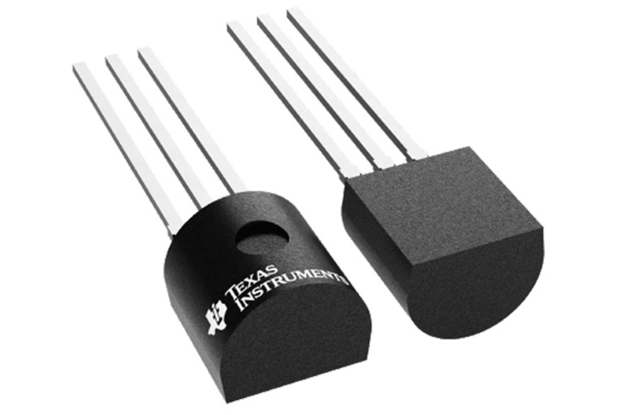

# LwM2M Academy (beta)

## Welcome!

**Welcome to the LwM2M Academy**, an immersive online course tailored to equip you with understanding of the Lightweight Machine to Machine (LwM2M) protocol. This program is designed to provide you with both the theoretical understanding and hands-on skills necessary to utilize this powerful IoT standard.

The course consists of **5 modules** which will journey you through the diverse aspects of LwM2M, from the underlying principles and architecture to its implementation and optimization for creating robust IoT applications.

By the end of the course, you will understand the advantages of the LwM2M standard and possess the skills to implement it effectively. With a strong emphasis on real-world applications, the course is designed to provide you with practical experience, empowering you to build IoT applications confidently using LwM2M.

**Embark on this learning journey and explore the fascinating world of LwM2M.**

## Invitation to Discord Community

Step right into the heart of learning with the <a href="https://discord.avsystem.com/" target="_blank">**AVSystem Discord Community**</a>. During the course, Discord is the place for expert guidance on LwM2M, networking with fellow course students, and showcasing the cool stuff you're building.

We've dedicated an exclusive channel for our learners, named **lwm2m-academy**.

We invite you to join the AVSystem Discord Community to enrich your learning experience and interact with the LwM2M community.

## Provide your feedback

We're constantly working on improving the LwM2M Academy. Please share with us your feedback throughout the course so we can create an even better learning experience.

[Feedback form](https://forms.gle/UAFLJs9LJocAeger9){: .md-button .md-button--big }

## Intro to the hardware used in this course
Throughout this course, we will be using the [Raspberry Pi Pico W](https://www.raspberrypi.com/documentation/microcontrollers/raspberry-pi-pico.html#raspberry-pi-pico-w), Raspberry Pi's first wireless microcontroller board. It has been designed as a tiny and low-cost yet flexible development platform for the RP2040 MCU.

{: style="width:300px"}

The 21 mm × 51 mm board comes with a 2.4GHz wireless LAN interface (802.11n). It provides 26 GPIO pins, three of which can function as analog inputs. Four RP2040 I/O pins are used for internal functions: driving an LED, on-board switch mode power supply power control, and sensing the system voltages.

Reprogramming the Pico W flash can be done using USB (simply drag and drop a file onto the Pico W, which appears as a mass storage device), or using the serial wire debug (SWD) port. The SWD port can also be used to debug code running on the RP2040 interactively.

**Purchase hardware** via [Raspberry's website](https://www.raspberrypi.com/products/raspberry-pi-pico/?variant=raspberry-pi-pico-w)

### Sensor used in the course:
In this course, we will be using the **LM35** analog temperature sensor.

**Purchase the sensor** via [Kiwi electronics](https://www.kiwi-electronics.com/en/lm35dz-analog-temperature-sensor-10530) (EU), [Amazon](https://www.amazon.com/Bridgold-Analogue-Precision-Centigrade-Temperature/dp/B07Y7FCZYB) (US) or [Mouser](https://www.mouser.com/ProductDetail/Texas-Instruments/LM35DZ-LFT4?qs=QbsRYf82W3FEZkSvxC%252BtOg%3D%3D) (EU/US)

{: style="width:300px"}

## Intro to Anjay LwM2M Client

Anjay is a free and open-source LwM2M Client written in C for rapidly building LwM2M solutions. It comes with an SDK comprising pre-built examples and reference implementations for popular hardware platforms such as STM32, Raspberry Pi, Nordic or ESP32. Anjay eases the development of LwM2M applications by taking care of the implementation of the LwM2M protocol.

The project was created and is actively maintained by [AVSystem](https://avsystem.com/). Some expert features such as support for hardware security modules or SMS binding are available commercially.

**Anjay features**

* Automatically implements the LwM2M data format & Smart Objects
* Security by default (DTLS, OSCORE)
* Support for FOTA (firmware updates over the air)
* Device management mechanisms to update configurations over time
vStandard implementations available for many hardware platforms

Find [more information](https://www.avsystem.com/coiote-iot-device-management-platform/) about Anjay and its features, or visit the [official documentation](https://avsystem.github.io/Anjay-doc/index.html) website directly.

## Intro to {{ coiote_short_name }}
{{ coiote_long_name }} is built around the LwM2M standard. It acts as a LwM2M Server and is designed as a scalable platform to manage large numbers of devices. The platform comes with tools to monitor groups of devices, manage device configurations, and perform firmware updates. In addition, it supports cloud integrations with platforms such as AWS IoT Core or Azure IoT Hub.

{{ coiote_short_name }} has a developer version, allowing you to connect up to 10 devices free of charge. To create a developer account, visit [**eu.iot.avsystem.cloud**]({{ coiote_site_link }}/)

**{{ coiote_short_name }} features**

* **Data collection and storage**

    Connect LwM2M devices securely and store their data.

* **Device management**

    Remotely manage device configurations and firmware.

* **Developer tools**

    Tools include time series data visualization, hardware in loop testing, server-side logs collection and automated alerts.

* **Processing data**

    Collect data from your sensors and send them directly in the unified data format to the cloud thanks to various options of data integrations, including AWS IoT Core, Azure IoT Hub, Kafka, and Webhooks.

Find [more information](https://iotdevzone.avsystem.com/docs/) about getting started with {{ coiote_long_name }}.
