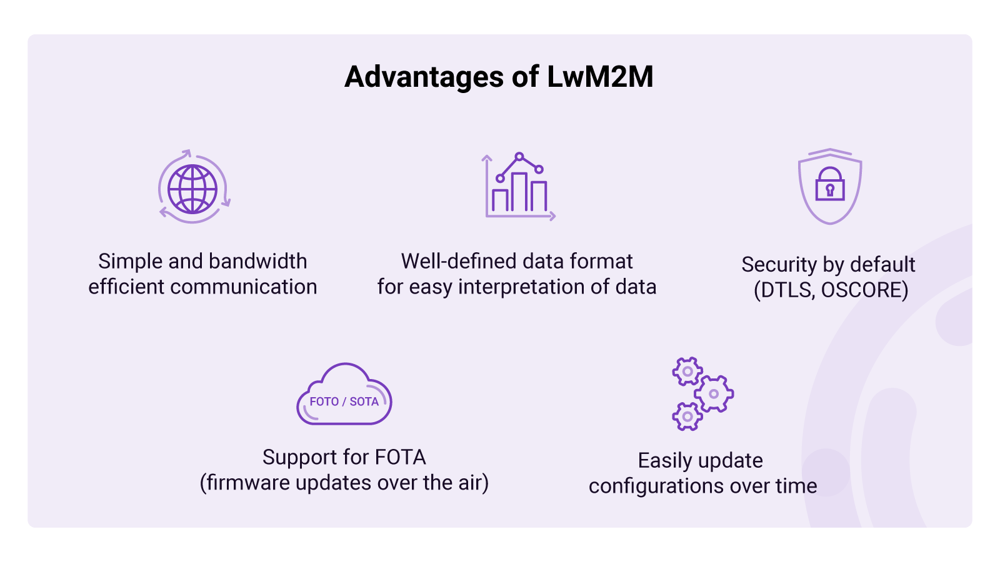
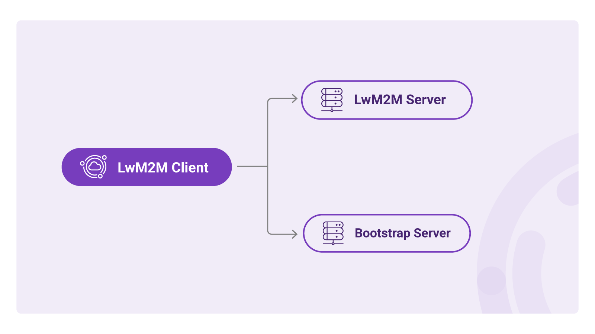
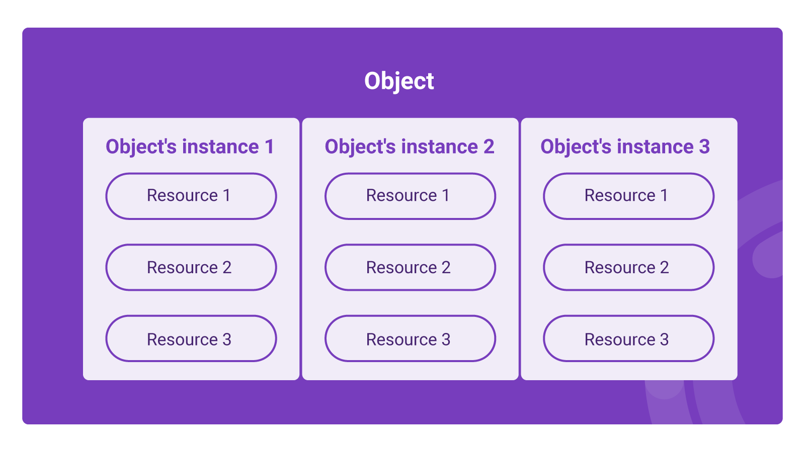
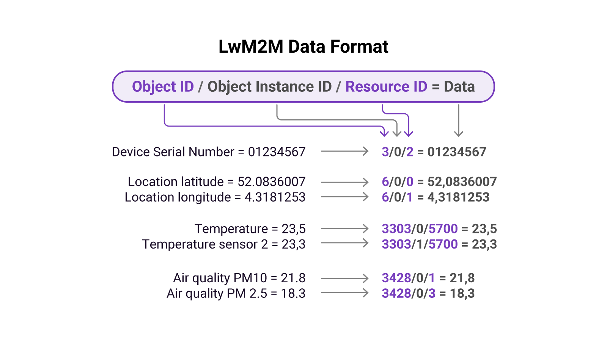

# Module 1: Introduction to LwM2M

!!! tip "Today’s challenges"
    
    ### Today’s challenges when developing IoT solutions

    One of today’s biggest challenges in IoT is interoperability. There are a plethora of devices, all of which solve specific problems with the help of sensors, actuators, communication modules, and local processing. Due to a lack of standards, devices use different communication protocols, data formats, and device management mechanisms. As a result, unique processes need to be implemented in order to make sense of the devices’ data and manage them remotely over time. 

    Once the device data reaches the cloud, it becomes challenging to interpret as each device uses a unique data format. Device management is usually embedded into the application firmware, and configurations can be updated using specific commands sent from the server, making it complex to implement when working with various devices. 
    
    Finally, firmware updates are very challenging to implement. If FOTA (Firmware Over The Air) is implemented at all, it is custom built for each project. Managing a mixed fleet of devices and integrating the data into one platform is hard to realize.

    ---

## Lightweight M2M

To answer the industry’s need for an easy, fast, and power-efficient device management mechanism, the [OMA SpecWorks](https://omaspecworks.org/) created a communication standard for IoT devices called **Lightweight Machine-to-Machine (LwM2M)**.

The LwM2M protocol, released in 2017, was designed to simplify messaging and device management for resource-constrained IoT devices. The LwM2M optimizes bandwidth efficient consumption by using space-efficient binary payloads and introduces support for wireless standards such as NB-IoT, LTE-M, Bluetooth, WiFi, and SMS transport. It includes a uniform data format for easy interpretation of data, standardized device management processes, and support for FOTA (Firmware Over The Air).

When IoT devices adhere to the LwM2M standard, cloud applications can easily interpret data, and devices independent of the manufacturer, hardware, or software can be managed the same way. 

## LwM2M architecture
The architecture of a LwM2M application contains 3 components:

1. The **LwM2M Client** runs on the end device and ensures a secure connection with the LwM2M Server and optionally Bootstrap Server. All data sent from the clients is formatted as dictated by the LwM2M standard.
1. The **LwM2M Server** manages devices including their configurations and firmware in the cloud. It also captures and stores all telemetry data sent from the LwM2M Clients.
1. The **LwM2M Bootstrap Server** is a cloud service to authenticate and provision LwM2M Clients. This is an optional component used to improve the application’s security.

## LwM2M data format

In order to manage devices and process their data, components of IoT systems must be able to “speak” the same language. This not only relates to the communication protocol but also to the data structure. The LwM2M standard realizes an interoperable data structure through the use of its **LwM2M Object Model**.

**LwM2M Objects** represent configurations, functionalities, and sensors of IoT devices. By structuring the Objects in a particular manner, a language is created which both the LwM2M Client and the LwM2M Server can understand.

This language is organized in (most situations as) a three-level tree comprising **Objects** which consist of **Object Instances**, and Object Instances consist of **Resources**. Entities on each of those levels are identified with numerical identifiers in the range 0-65534 and defined by the OMA in the [LwM2M Registry](https://technical.openmobilealliance.org/OMNA/LwM2M/LwM2MRegistry.html).

The language follows a sequence containing the Object ID, Object Instance ID, and Resource ID. To be more precise, a URI is made up of three unsigned 16-bit integers that are separated by the '`/`' character and look like this:

`/<object_ID>/<object_instance_ID>/<resource_ID>`

For example, a GNSS module generates location data containing latitude and longitude values. The URI of the latitude is: `/6/0/0`, and the URI of the longitude is: `/6/0/1`.

`6` → The ID of the Location Object

`0` ​​→ Instance 0 of the Location Object

`0` → The ID of the latitude Resource

`1` → The ID of the longitude Resource

* **Objects** - Devices contain different building blocks, each of these blocks is represented by an Object and identified by an **Object ID**. For example, the Firmware Update Object is used to invoke and track the status of the firmware update process. Objects can also describe the connectivity technology (e.g. cellular or WiFi), device information (serial number, manufacturer, firmware version), sensors (temperature, air quality), or peripherals (GPS, LEDs, buzzers).

* **Object Instances** - Some Objects are described as “single-instance”. Such Objects have exactly one Instance with the identifier `/0`. Examples are the *Device Object* which describes the device itself, and the *Firmware Update Object* which is used to perform firmware upgrades.

    Other Objects have multiple Instances. Examples of such Objects include the Object that manages connections to LwM2M Servers as multiple LwM2M Servers can be configured. Devices can also use Object Instances when using multiple SIMs with different APN profiles. When devices contain multiple identical sensors, Object Instances are used to distinguish the different sensors.

* **Resources** - Object Instances have one or multiple Resources. Resources can be represented as certain data types such as string, integer, Boolean, or float. For example, the “Device” Object has multiple Resources such as the *manufacturer*, *serial number*, and *firmware version*. The “Location” Object has the Resources' *latitude, longitude*, and *altitude*.

*  **Resource Instances** - In some cases, Resources have multiple Resource Instances which turns the language into a four-level tree. For example: Device Object `/3` includes Resource `/6`: Available Power Sources. The different Resource Instances describe the different power sources:

    `0`: DC power

    `1`: Internal Battery

    `2`: External Battery

    `3`: Fuel Cell

    `4`: Power over Ethernet

    `5`: USB

    `6`: AC (Mains) power

    `7`: Solar

    To describe the availability of solar power, the URI becomes: `/3/0/6/7`

!!! important "Provide your feedback"

    We're constantly working on improving the LwM2M Academy. Please share with us your feedback about this module so we can create an even better learning experience.

    [Feedback form](https://forms.gle/UAFLJs9LJocAeger9){: .md-button .md-button--big }
