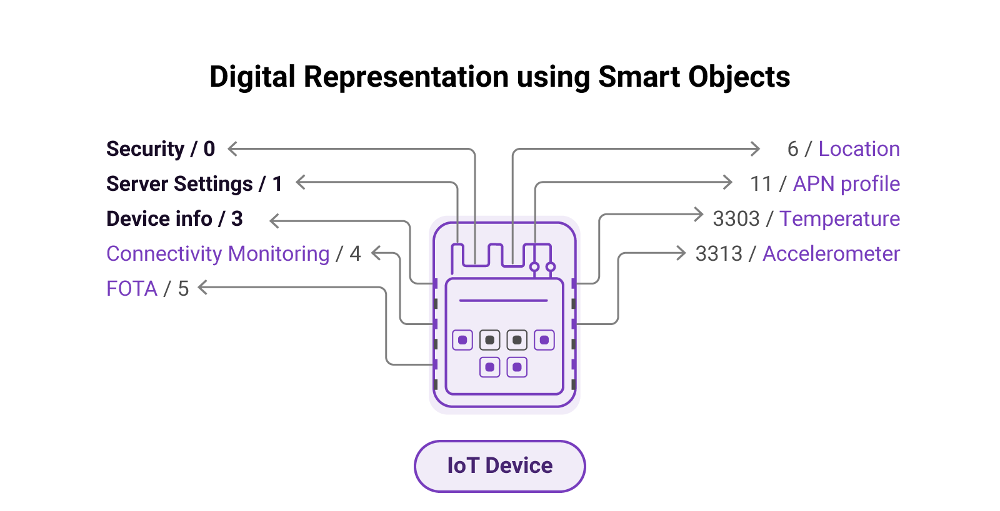

# Module 2 - Getting Started with LwM2M 

## Introduction

Welcome to the second module of the LwM2M Academy. In the previous module, we introduced the LwM2M protocol and its key features. In this module, we will dive deeper into the technical details of LwM2M by focusing on the mandatory Objects that must be implemented by all compliant devices. These Objects provide a standardized way to represent various aspects of an IoT device, such as its security settings, device information, and server connection. Additionally, we will discuss the different security modes of LwM2M both in theory as well as in practice.

*
Mandatory Objects are: Security `/0`, Server Object `/1` & Device `/3`
*

## Mandatory Objects

LwM2M is a protocol designed for efficient communication between IoT devices and servers. It is a client-server protocol where IoT devices (known as **LwM2M Clients**) communicate with **LwM2M Servers** using various networking technologies such as cellular, WiFi, or Ethernet.

To ensure interoperability and standardization among different LwM2M implementations, the protocol defines a set of **mandatory Objects** that LwM2M Clients must implement. These Objects provide a baseline level of functionality that enables LwM2M Servers to communicate effectively with LwM2M Clients, regardless of the specific use case or vendor.

The mandatory Objects cover essential aspects of the LwM2M protocol regarding security, server management, and device management. They enable LwM2M Servers to authenticate and authorize LwM2M Clients, manage their connection, and retrieve important information about their status and capabilities.

By defining mandatory objects, the LwM2M protocol ensures that LwM2M implementations are consistent and interoperable, which ultimately leads to greater efficiency, scalability, and ease of deployment for IoT devices and services.

### The three mandatory Objects are:

* **Security Object** (Object `/0`) - This Object is responsible for the management of security credentials and the establishment of secure communication between the LwM2M Client and the LwM2M Server. It contains Resources for specifying the security mode, identity, keys, and other security-related parameters. 

* **Server Object** (Object `/1`) - This Object is responsible for the management of the LwM2M Server to which the LwM2M Client is connected. It contains Resources for specifying the server address, lifetime of the registration, and other server-related parameters.

* **Device Object** (Object `/3`) - This Object provides information about the LwM2M Client device. It contains Resources for specifying the device manufacturer, model number, firmware version, battery level (if available), and other device-related parameters.

!!! info "The OMA LwM2M Object and Resource Registry"
    The [**OMA LwM2M Object and Resource Registry**](https://technical.openmobilealliance.org/OMNA/LwM2M/LwM2MRegistry.html) is a comprehensive database containing all the LwM2M Objects and Resources that have been defined by the Open Mobile Alliance (OMA). The registry serves as a reference guide for developers who are implementing the LwM2M standard. 

    The Registry is organized by Object ID. Each Object in the Registry is associated with a set of Resources, which are identified by Resource ID. The registry provides clear descriptions, data types, and usage guidelines for each Object and Resource.

    Open up the [Object and Resource Registry](https://technical.openmobilealliance.org/OMNA/LwM2M/LwM2MRegistry.html) and have a look at the Registry and go through the three mandatory Objects. *Note: At the time of writing, LwM2M version 1.1 is most commonly used.*

## LwM2M security
Security is a crucial aspect of any IoT deployment. The LwM2M standard defines security features to ensure secure and reliable communication between devices and servers. These security features are critical for protecting IoT devices from attacks and ensuring the authenticity, confidentiality, and integrity of the data exchange. 

* **Authentication** means that a receiver can determine the sender of a message – and vice versa. 
* **Confidentiality** means that only the receiving endpoint can read the sender’s message. 
* **Integrity** means that the data message has not been tampered with.

Two layers of security are implemented when using LwM2M. The transport layer is secured using **DTLS** (for UDP traffic) or **TLS** (for TCP traffic). The application layer is protected using **OSCORE** (optional).

DTLS and OSCORE can work together to provide end-to-end security. DTLS/TLS is used to establish a secure channel between the client and server, and OSCORE is used to encrypt and protect messages exchanged within that channel. This approach provides multiple layers of security, ensuring that the communication channel and the data being exchanged within that channel are both protected against unauthorized access and tampering.

*
The transport layer is secured using DTLS or TLS. The application layer is protected using OSCORE.
*

## Security modes

There are different ways for the LwM2M Server to authenticate LwM2M Clients. All options as defined in the **Security Mode Resource**: `/0/x/2`.

The most commonly used modes are:

* **Pre-Shared Key mode** - Communication is symmetrically encrypted and authenticated using the same secret key, shared between the server and the client.

* **Certificate mode** - An asymmetrical public-key cryptographic algorithm is used to authenticate the connection endpoints and initialize payload encryption.

    Appropriate certificates need to be generated for both the LwM2M Client and the LwM2M Server. Public certificates of both parties are mutually available, and each party also has access to its own corresponding private key.

* **NoSec mode** - Encryption and authentication are disabled and the messages are passed in plain text over the network. It is not recommended to be used in production environments unless end-to-end security is provided on a lower layer (e.g. IPsec). The NoSec mode is mostly useful for development, testing, and debugging purposes.

### Bootstrap Server

When using the LwM2M standard, a Bootstrap Server can be used to provision LwM2M Clients. Instead of connecting to the LwM2M Server directly, the Client connects to a Bootstrap Server to derive the necessary configuration information to securely connect to a LwM2M Server. Configuration information includes the address of the LwM2M Server and the security credentials to establish a secure connection.

At any time, the LwM2M Server can instruct the device to send a new bootstrap request to update its security credentials, and/or to update the server address it’s connected to.

The Bootstrap Server is defined in the **LwM2M Server URI Resource:** `/0/x/0`, and **Bootstrap-Server Resource** `/0/x/1`.

*Note: Bootstrapping is an advanced feature and won’t be covered in detail throughout this course.*

## Registration
Before telemetry data can be exchanged, the device needs to register to a LwM2M Server. In the registration process, the Client connects to a Server and includes device-specific information such as its name, security credentials, and a list of supported Objects and Object Instances. The Server validates this information and responds whether the registration was successful.

At regular intervals, the Client sends update messages informing the Server about being alive and functioning properly. If new Objects, Object Instances, or Resources are added over time, the Server gets synchronized with the Client during the status update message.

!!! important "Provide your feedback"

    We're constantly working on improving the LwM2M Academy. Please share with us your feedback about this module so we can create an even better learning experience.

    [Feedback form](https://forms.gle/UAFLJs9LJocAeger9){: .md-button .md-button--big }
