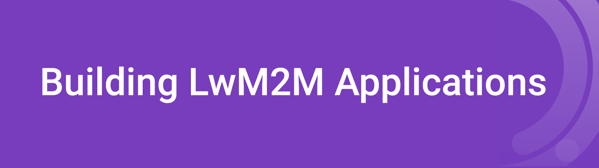
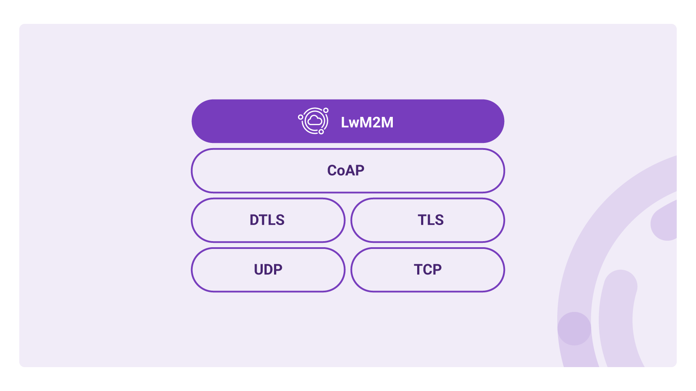

# Module 3 - Building LwM2M Applications



## Introduction
LwM2M uses a Client-Server architecture, designed to efficiently communicate data between IoT devices and cloud services. Let’s dive into the communication process and discuss the underlying communication mechanisms to ensure reliable communication of application payload and device management operations.

## IoT Communication Protocols
In order to convey a message from the device to the cloud and vice versa, both the Client and the Server need to agree on a common language to make sense of the data, as well as a delivery method to communicate effectively. As we learned in the previous modules, the LwM2M standard uses the **LwM2M Object Model** to format the data so it can be comprehended by both the Client and Server.

Let’s have a look at the delivery method which ensures the LwM2M data messages end up in the right place at the right time.

### CoAP
The LwM2M standard uses the **CoAP** (Constrained Application) protocol to get the messages from the Client to and from the Server. Think of CoAP as the HTTP protocol, but optimized for resource-constrained devices. CoAP is designed to be lightweight using low overhead due to a small header size and the use of **UDP** (User Datagram Protocol) as its underlying transport protocol. Because UDP does not guarantee data delivery, CoAP provides message reliability mechanisms, e.g. by allowing devices to send **unconfirmed** and **confirmed** messages, the latter needs to be acknowledged by the receiver, hence improving the reliability of the data transfer. 


Although CoAP supports transmission over TCP, UDP is typically the preferred choice for IoT applications due to its small overhead and simple implementation. This comes at the cost of reliability; UDP does not guarantee data delivery as acknowledgments or retransmissions are not embedded in the protocol. In contrast, TCP does establish and maintain a connection before the start of the data transmission. TCP ensures that data gets delivered by tracking which packets are received and retransmitting the packets which get lost during transmission. This results in more reliability which comes at the cost of larger overhead and higher latency compared to UDP.



!!! info "CoAP vs MQTT"    
    **MQTT** (Message Queuing Telemetry Transport) is the most widely implemented messaging protocol in IoT. MQTT is often compared with CoAP as both protocols provide a lightweight transport mechanism which are well-suited for resource-constrained IoT devices. Whereas CoAP is  relatively new with its specifications being introduced in 2014, MQTT dates all the way back to 1999. Even though the messaging protocols can be seemingly used interchangeably, there are some key differences in the architectures.
    
    MQTT is a publish-subscribe messaging protocol where clients (IoT Devices) communicate using TCP to a server which is referred to as the Broker. Each message is sent to an address known as a topic, e.g. /temperature. Clients can subscribe to one or multiple topics and get notified when new data is received on any of those topics. Due to the publish-subscribe architecture, communication can happen one-to-one, one-to-many and many-to-one. 
    
    MQTT knows three levels of Quality of Service (QoS), from 0 to 2
    
    * QoS 0: At most once. Data is sent without acknowledgement
    * QoS 1: At least once. A message requires an acknowledgement, ensuring the data reaches the receiver.
    * QoS 2: Exactly once. Through the process of a four-step handshake the sender ensures the data is received exactly once.
    
    A variation of the MQTT protocol is called MQTT-SN (MQTT for Sensor Networks) and is designed for sensor networks as it supports UDP transport.
    
    **CoAP** uses — similar to HTTP — a request-response model. It uses UDP by default, but it can also run on top of TCP or SMS. Unconfirmed messages are similar to MQTT QoS 0, confirmed messages with MQTT QoS 1. Similar to MQTT, data is sent to specific addresses. When using CoAP we refer to these addresses as **URIs**.
    
    CoAP provides support for a publish-subscribe architecture; specific resources can be **Observed**. Every time an observed value changes an update is sent to the Server. 
    
    Due to the underlying UDP transport layer, CoAP messages are somewhat smaller than MQTT packets due to the smaller overhead. An advantage of CoAP is the interoperability with HTTP. Because of the many similarities, it is relatively easy to translate HTTP requests to and from CoAP requests.


## LwM2M operations
CoAP took its inspiration from web APIs which depend on the REST architecture. CoAP uses similar methods but optimized for IoT applications. A Client or Server sends a request and – depending on the request – awaits a response which includes a response code. The methods used by CoAP are GET, POST, PUT, DELETE, FETCH, and (i)PATCH. Due to its similarities with HTTP, CoAP is interoperable with HTTP with only a translation proxy between the protocols.

The **CoAP GET** request can be used to **Observe** a specific resource. When a resource updates its value (e.g. after a new sensor reading), the Client directly sends an update to the Server.

These CoAP commands are utilized by the LwM2M standard and are referred to as **Operations**. Operations come in different forms to support the registration of devices, to report telemetry data and to manage device configurations or firmware. **All LwM2M Operations are based on the CoAP request/response methods**.

In the previous modules, we learned about the **Bootstrap** and **Registration** processes – referred to as *interfaces*. Both interfaces use a combination of CoAP commands. E.g. during the registration process, the LwM2M Client sends a **Request operation** to the LwM2M Server using a **CoAP POST** to inform the Server of its existence and provides metadata describing its data model and IP address. When a Bootstrap Server is used, the LwM2M Client sends a **Bootstrap-Request (CoAP POST)** to trigger the bootstrap sequence, after which the Bootstrap server sends a **Bootstrap Discover** using the **CoAP GET** command to request information about the data model supported by the Client.


## Data encoding formats
Whereas humans comprehend information through words, computers prefer information to be encoded in a more compact way, allowing for faster processing of data. There are different **encoding formats** (also known as *content formats*) which are optimized for resource-constrained devices. LwM2M supports several encoding formats including **plain text**, **opaque**, **TLV**, **JSON**, **CoRE Link**, **CBOR**, and **SenML**. The different encoding formats are used for different LwM2M Operations, as [defined by the specifications](http://www.openmobilealliance.org/release/LightweightM2M/V1_1_1-20190617-A/HTML-Version/OMA-TS-LightweightM2M_Transport-V1_1_1-20190617-A.html#6-4-0-64-URI-Identifier-and-Operation-Mapping). Let’s discuss these formats in more detail.

!!! Note
    It is not required to fully understand the data encoding formats. LwM2M Client libraries automatically encode the information in such a way it meets the encoding and LwM2M data format criteria.

* **Plain text**: used for READ and WRITE operations on Resources.

    *Example:*
    ```
    Req: Get /3/0/0

    Res: 2.05 Content
    Open Mobile Alliance
    ```

* **Opaque**: used for READ and WRITE operations on Resources where the value of the Resource is an opaque sequence of binary octets.

* **CBOR**: the Concise Binary Object Representation format is used for READ and WRITE operations on Resources.

* **CoRE Link**: the CoRE Link content format is used as a response to DISCOVER operations and contains a list of Objects, Objects Instances, Resources and Resource Instances.

* **TLV**: the Type-Length-Value format can be used for READ and WRITE operations and represents a singular or an array of values.

    *For example, if the LwM2M Server requests to READ the Device Object Instance `/3/0`, the client may reply using TLV payload which includes all readable Resources.*

    <table>
    <tr>
    <td> TLV payload </td> <td> Translation </td>
    </tr>
    <tr>
    <td> 
    ```
    C8 00 14 4F 70 65 6E 20 4D 6F 62 69 6C 65 20 41 6C 6C 69 61 6E 63 65
    C8 01 16 4C 69 67 68 74 77 65 69 67 74 20 4D 32 4D 20 43 6C 69 65 6E 74
    C8 02 09 33 34 35 30 30 30 31 32 33
    C3 03 31 2E 30
    86 06
    41 00 01
    41 01 05
    C1 09 64 
    ```
    </td>
    <td>
    ```
    /0 Open Mobile Alliance 
    /1 Lightweight M2M Client 
    /2 345000123 
    /3 1.0 
    /7
        /0 
        /5 
    /9 100
    ``` 
    </td>
    </tr>
    </table>

*  **SenML** (Sensor Measurement Lists) is a popular encoding format used for READ and WRITE operations, specifically with the operations READ-Composite and WRITE-Composite. SenML comes in a **SenML JSON** and **SenML CBOR** variant.

    For example, the following shows a single SenML JSON Record containing temperature (`/3303/x/5700`), humidity (`/3304/x/5700`) and location data (`/6/x/0` & `/6/0/1`).

    ```
    [
    {"n":"/3303/0/5700","t":1681817678,"v":23.1},
    {"n":"/3304/0/5700","t":1681817678,"v":54.4},
    {"n":"/6/0/0","t":1681817678,"v":43.61092},
    {"n":"/6/0/1","t":1681817678,"v":3.87723},
    ]
    ```

    `“n”` represents the name and follows the LwM2M Object Model, `“t”` contains the timestamp and `“v”` field represents the value as a float. Alternative value fields are: **Boolean** `“vb“`, **Object Link Value** `“vlo“`, **Opaque Value** `“vd“` or **String** `“vs“`.


    **SenML CBOR** follows the same pattern as SenML JSON, but is harder to read for humans. The previous message can also be written in SenML CBOR which is a binary format and looks something like this:

    ```
    A4 83 18 67 98 56 42 02 82 00 18 3B 0F 7B 76 82 00 18 3E 48 3C 29 82 00 18 41 CE 4B FD 82 01 18 3F B2 A7 28
    ```


## Useful Resources

* [Efficient transport of telemetry data in IoT with the LwM2M protocol](https://www.avsystem.com/blog/efficient-transport-measurement-data-iot/)
* [Comparing the efficiency of LwM2M and MQTT: hands-on test results of two technology clients on a typical IoT device](https://f.hubspotusercontent20.net/hubfs/1727672/Technical%20Content/LwM2M-and-MQTT-test-lab-comparison-MachNation-MIT-E-v1.3.pdf)
* [LwM2M v1.1 Technical specifications](https://www.openmobilealliance.org/release/LightweightM2M/V1_1_1-20190617-A/OMA-TS-LightweightM2M_Core-V1_1_1-20190617-A.pdf)
* [CoAP specifications](https://www.rfc-editor.org/rfc/rfc7252)
* [SenML specifications](https://www.rfc-editor.org/rfc/rfc8428)
