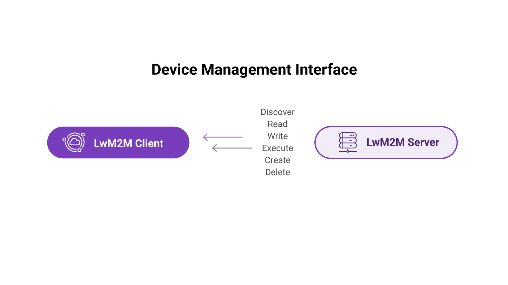
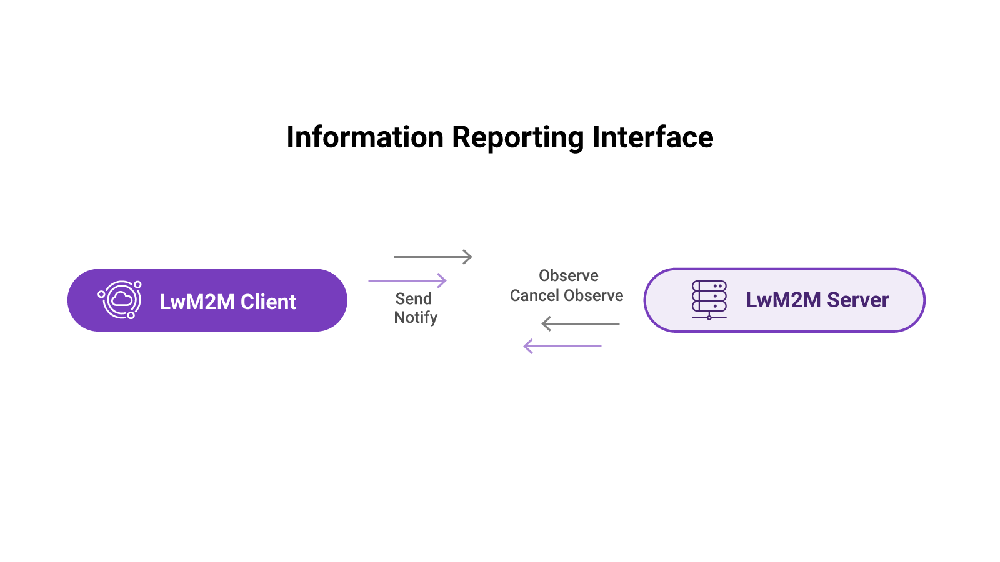
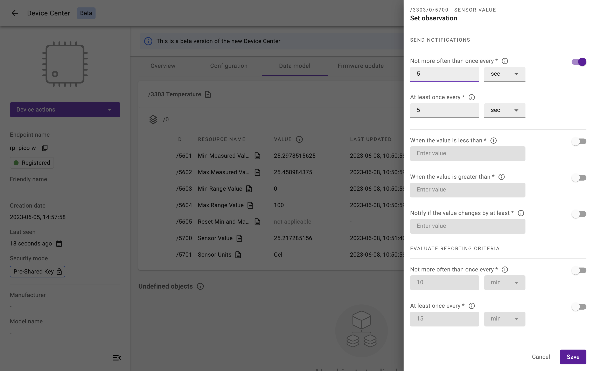

# Module 4: Device Management using LwM2M


## Introduction
One of the key reasons people choose LwM2M is its ability to manage IoT devices at scale. Device management is critical for ensuring reliable operation of IoT systems throughout their entire lifetime.

Device management involves the remote configuration of device parameters. This includes renewing security credentials, adjusting the intervals between data collections, updating the device’s firmware and modifying device settings such as the APN, WiFi credentials or sensor calibrations.

The LwM2M protocol defines a standardized approach for efficiently managing IoT devices deployed in the field. In this module we will dive into the device management capabilities of the standard and explore its features and functionalities in detail.

## Interfaces
LwM2M specifies four distinct interfaces. We have already discussed two of them in previous modules: the **Bootstrap Interface** and the **Registration Interface** (see module 2). The standard defines two additional interfaces: the **Device Management Interface** and the **Information Reporting Interface**. Let’s explore these interfaces and understand how they contribute to efficient IoT device management

### Device Management Interface

The Device Management and Service Enablement Interface (as the full name goes) serves as the primary interface for device management. In this interface, all of the requests are initiated by the LwM2M Server and include standardized instructions which the LwM2M Client needs to act upon. Various Operations can be initiated from the Server, ranging from reading a specific resource and executing a specific task, to writing device parameters and creating new Objects, Instances or Resources.



Six different **Operations** can be sent to the LwM2M Client:

* **DISCOVER**: Retrieving the list of Objects and Resources supported by the Client.
* **READ**: Retrieving the current value of a specific Resource, or an Instance or Object as a whole.
A variation of the READ operations is the READ-Composite which is used when reading multiple Objects, Object Instances and/or Resources in a single request.
* **WRITE**: Modifying the value of a specific Resource, Resource Instance, or an Instance or Object as a whole.

    Variations of the WRITE operation are WRITE-Composite and WRITE-Attributes.

    * **WRITE-Composite**: Whereas the WRITE operation is limited to one Resource, Instance or Object, the WRITE-Composite operations can be used to updated values of a number of different Resources, Instances and/or Objects.
    * **WRITE-Attributes**: Altering the attributes related to an Object, Object Instance or Resources, e.g. Minimum Period, Maximum Period, Greater Than, Less Than etc.

* **EXECUTE**: Invoking an action or operation on a Resource. For example instructing a device to reset, reboot or upgrade its firmware.
* **CREATE**: Creating a new Object Instance.
* **DELETE**: Deleting an Object Instance.


## Information Reporting Interface

The Information Reporting Interface is used by the Client to transmit telemetry data or state changes without explicit request from the LwM2M Server. The triggers for transmitting data can be programmed in the application firmware of the device.

In this interface, the Server holds the ability to define the behavior of the device by requesting it to send data based on conditional logic. This involves requesting the Client to send data at specific time intervals (e.g. every 10 minutes), or when values exceed predefined thresholds (e.g. when temperature rises above 30 degrees). This way, the server keeps control over the data flow and can effectively monitor and manage the device's behavior in response to changing conditions or requirements.



**Server Operation**

* **OBSERVE**: When the Observe operation is invoked, the Client starts sending NOTIFY messages to the Server about its data or state at configurable intervals. The OBSERVE operation is canceled when sending **CANCEL OBSERVE**.


*<p style="text-align: center;">Set Observation in {{ coiote_long_name }}</p>*


**Client Operations**

* **SEND**: The SEND message is used by the Client to send data to the server without explicit request. Depending on the application firmware it can be used to report new measurements or inform the server about a change in telemetry data or state.
* **NOTIFY**: In response to the OBSERVE operation initiated from the server, the client sends NOTIFY operations with data. Usually, the server provides a bandwidth in which the client needs to send its data. Either time bound: e.g. at least every 1 hour, but no more than once every 15 minutes, or value bound: e.g. when value is greater than 30, less than 20 or when the value changes by at least 2.

Example payload of a SEND operation containing the location and radio signal strength could look something like this (using SenML JSON):

```
[
  {"n":"/4/0/2", "v":-49},
  {"n":"/6/0/0", "v":43.61092},
  {"n":"/6/0/1", "v":3.87723}
]
```

!!! important "Provide your feedback"

    We're constantly working on improving the LwM2M Academy. Please share with us your feedback about this module so we can create an even better learning experience.

    [Feedback form](https://forms.gle/UAFLJs9LJocAeger9){: .md-button .md-button--big }
