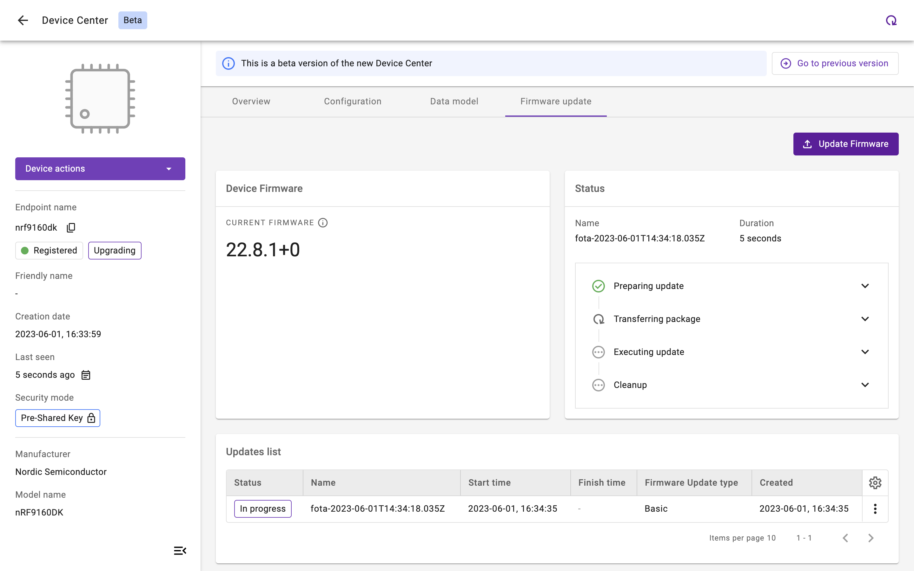
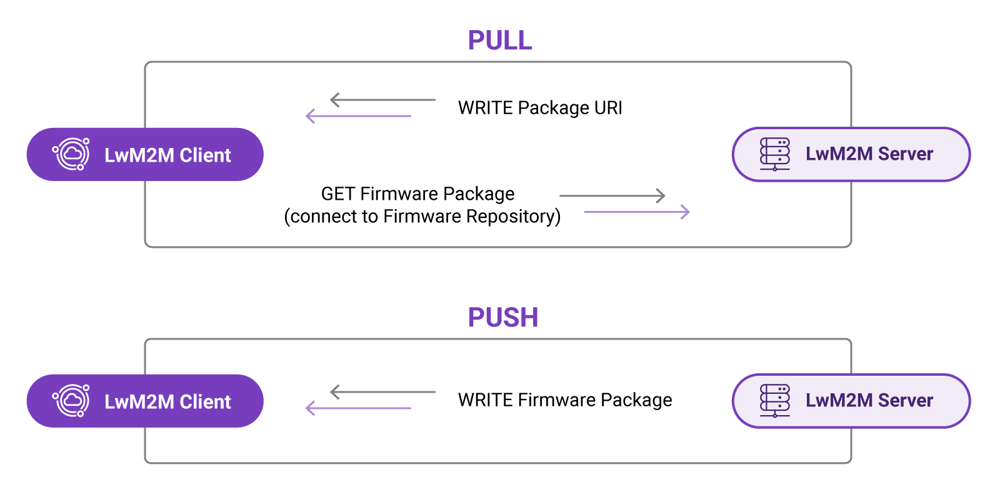
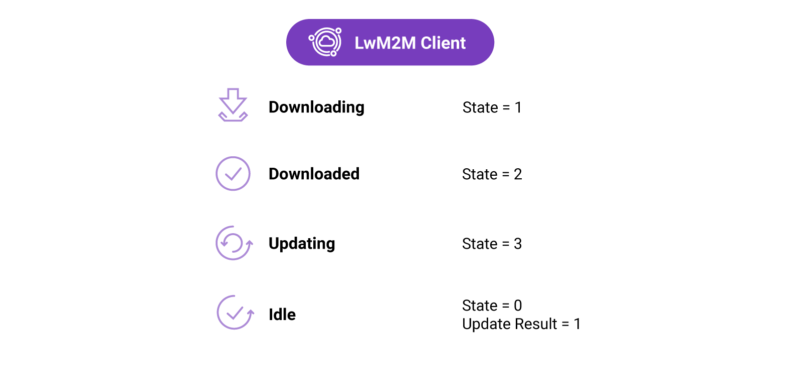

# Module 5: Firmware Updates Over The Air

Firmware updates over the air (FOTA) are becoming increasingly important as more and more resource-constrained IoT devices are being deployed. Physical access to devices can be expensive or impossible to realize when devices are deployed in remote, hard-to-reach locations. As a result, FOTA is in many cases the only way to fix bugs, patch security vulnerabilities, or add functionality to devices which are deployed in the field.

The LwM2M protocol provides a standardized process for remote firmware updates. When developers follow the standardized guidelines provided by the protocol, updating the firmware of resource-constrained devices remotely can be accomplished effortlessly, regardless of the device or platform used.

<iframe width="640" height="360" src="https://www.youtube.com/embed/_3GfJ6Nq9U8" title="FOTA" frameborder="0" allow="accelerometer; autoplay; clipboard-write; encrypted-media; gyroscope; picture-in-picture; web-share" allowfullscreen></iframe>

## The LwM2M way of updating firmware

Remote firmware updates know many names, such as Firmware Update OTA (FUOTA) or Device Firmware Upgrade (DFU). Device vendors can develop their own custom FOTA mechanisms, however, these implementations are specific to the vendor or platform and cannot be easily ported to other systems. The problem of vendor compatibility can be resolved by adopting the LwM2M standard, which is hardware agnostic and can be implemented on any hardware platform.

The LwM2M firmware update process consists of four steps:

1. The LwM2M Client is **triggered** to initiate the firmware update process
1. The Client **downloads** the firmware and reports to the LwM2M Server when the download is finished
1. The Client performs the **firmware update** after validating the integrity and authenticity of the new firmware which is done through a process called **secure boot**.
1. The Client attempts to **run the new firmware** and reports the status to the Server. If the update is successful, the device starts running the new firmware, if not, the device performs a **rollback** to the earlier firmware version.

This procedure is defined in detail in the LwM2M specifications (see [LwM2M specifications](https://www.openmobilealliance.org/release/LightweightM2M/V1_1_1-20190617-A/HTML-Version/OMA-TS-LightweightM2M_Core-V1_1_1-20190617-A.html#13-6-1-0-E61-Firmware-Update-State-Machine)). To add firmware update capabilities to a device, the [Firmware Update Object /5](http://devtoolkit.openmobilealliance.org/OEditor/LWMOView?url=https%3A%2F%2Fraw.githubusercontent.com%2FOpenMobileAlliance%2Flwm2m-registry%2Fprod%2F5.xml) needs to be implemented containing all essential functionalities for conducting the update and reporting the status. Several LwM2M Clients natively support this Firmware Update Object, including [AVSystem’s Anjay LwM2M Client](https://www.avsystem.com/products/anjay/) and [Zephyr’s LwM2M Client](https://docs.zephyrproject.org/latest/samples/net/lwm2m_client/README.html).

*
Updating a device’s firmware using {{ coiote_long_name }}
*

## Download a new firmware
The LwM2M standard defines two methods to perform a firmware update, allowing either the Client or the Server to decide on the best moment to start the download of the new firmware.

#### PULL method

In the PULL scenario, the LwM2M Server provides the device with the address of the server containing the firmware file known as the **Package URI**. The device subsequently downloads the firmware from the so-called firmware repository at the earliest available opportunity.

#### PUSH method

In the PUSH scenario, the LwM2M Server determines the moment to initiate the firmware download, ideally based on the connectivity conditions. The device must have access to information such as Radio Signal Strength and Link Quality to support such server-side decision making. These resources are available in the **LwM2M Connectivity Monitoring Object** `/4`.

*Firmware Delivery Methods*

## Firmware Update Object

The FOTA process is defined in the **Firmware Update Object** `/5`. This Object defines the update process using **four states** (defined by Resource `/5/*/3`), as well as multiple **update results** (defined by Resource `/5/*/5`) representing the most common outcomes of the firmware update process.

Learn more about the Firmware Update Object on the [OMA LwM2M Object and Resource Registry](http://devtoolkit.openmobilealliance.org/OEditor/LWMOView?url=https%3A%2F%2Fraw.githubusercontent.com%2FOpenMobileAlliance%2Flwm2m-registry%2Fprod%2F5.xml).

=== "**Update States**"

    | ID          | State       | Description |
    | ----------- | ----------- | ----------- |
    | `state 0`   | **Idle**    | Before downloading and after successfully updating |
    | `state 1`   | **Downloading** | The new firmware is on the way |
    | `state 2`   | **Downloaded** | The firmware download is completed |
    | `state 3`   | **Updating** | The Client starts updating its firmware, after which it changes its state back to *Idle* |

=== "**Update Results**"

    | Result          | Description |
    | ----------- | ----------- |
    | `update result 0`   | **Initial value** |
    | `update result 1`   | **Firmware updated successfully** |
    | `update result 2`   | **Insufficient flash memory for the new firmware package** |
    | `update result 3`   | **Out of RAM during downloading proces** |
    | `update result 4`   | **Connection lost during downloading process** |
    | `update result 5`   | **Integrity check failure for new downloaded package** |
    | `update result 6`   | **Unsupported package type** |
    | `update result 7`   | **Invalid URI** |
    | `update result 8`   | **Firmware update failed** |
    | `update result 9`   | **Unsupported protocol** |
    | `update result 10`  | **Firmware update cancelled** |
    | `update result 11`  | **Firmware update deferred** |

## Conclusion

Remote IoT device updates are essential for the long-term success of IoT applications, as physical access to devices is often impossible to realize. Updating firmware remotely poses some serious challenges, such as limited memory, battery capacity, available bandwidth, and unstable connections to the cloud. However, by adopting the LwM2M standard and following a structured approach with standardized states and error codes, developers can ensure that new firmware images can be safely sent to their fleet of devices in the field, regardless of hardware vendor or cloud platform used.

## Useful Resources

* [DevZone Firmware update documentation](https://iotdevzone.avsystem.com/docs/Coiote_IoT_DM/firmware_update/)
* [Anjay firmware update documentation](https://avsystem.github.io/Anjay-doc/FirmwareUpdateTutorial.html)
* [Anjay Demo for Zephyr](https://github.com/AVSystem/Anjay-zephyr-client/tree/master/demo)

!!! important "Provide your feedback"

    We're constantly working on improving the LwM2M Academy. Please share with us your feedback about this module so we can create an even better learning experience.

    [Feedback form](https://forms.gle/UAFLJs9LJocAeger9){: .md-button .md-button--big }
