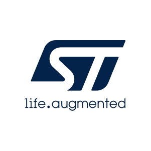
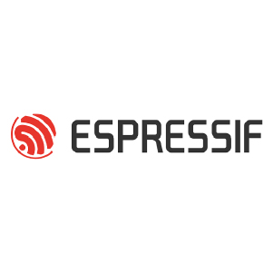
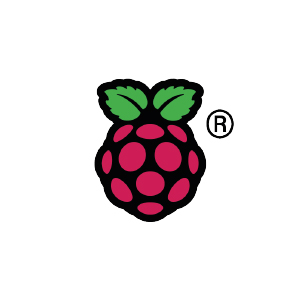

<meta content="img/AVSystem-social.png" property="og:image"/>

# Welcome

Welcome to the AVSystem DevZone!

In the DevZone you will find documentation related to our scalable LwM2M Server **{{ coiote_long_name }}**, as well as our LwM2M Client **Anjay**.

## Quick Start Guide

Follow the Quick Start to build your first LwM2M application using a simulated device within 20 minutes.

The guide walks you through the process of building your first LwM2M application using AVSystem’s LwM2M Client **Anjay** and AVSystem’s LwM2M Server **{{ coiote_long_name }}**.

[Quick Start](quickstart/){: .md-button .md-button--big}

## Get started with popular hardware platforms

Follow the **Getting Started Guides** to kickstart your LwM2M application using one of the popular hardware platforms: [Nordic](LwM2M_Client/Nordic/Thingy91/), [STMicroelectronics](LwM2M_Client/STMicroelectronics/Building_LwM2M_applications/Building_LwM2M_applications_with_I-CUBE-Anjay/), [ESPRESSIF](LwM2M_Client/ESP32/M5Stick/) or [Raspberry Pi](Anjay_integrations/RaspberryPi_integration/RaspberryPi-Pico-W/).

## Learn more about {{ coiote_short_name }}

Dive into {{ coiote_long_name }}, the scalable LwM2M server and explore its numerous features. From [device onboarding](Coiote_IoT_DM/User_Interface/Device_onboarding/) to [Data Visualization](Coiote_IoT_DM/Quick_Start/Visualize_device_data/) and running automated [Device Tests](Coiote_IoT_DM/Device_tests/Overview/).

[{{ coiote_short_name }} docs](Coiote_IoT_DM/introduction/){: .md-button .md-button--big }

## Explore cloud integrations

With the {{ coiote_long_name }}, you can easily integrate your LwM2M data with platforms such as **Azure IoT Hub**, **AWS IoT Core**, **nRF Cloud Location Services**, **InfluxDB** or any public endpoint or Kafka cluster using the Data Integration Center.

The guides will take you on a step-by-step journey to seamlessly activate the integrations.

[Webhooks](Cloud_integrations/Device_Integration_Center/webhooks.md){: .md-button .md-button--big :style="float: left;margin-right: 30px;"}
[Kafka](Cloud_integrations/Device_Integration_Center/kafka.md){: .md-button .md-button--big :style="float: left;margin-right: 30px;"}
[Azure IoT](Cloud_integrations/Azure_IoT/Azure_IoT_Hub/Configure_Azure_IoT_Hub_integration.md){: .md-button .md-button--big :style="float: left;margin-right: 30px;"}

## LwM2M Academy

**Take a deep-dive into the LwM2M standard by following the LwM2M Academy**. A comprehensive online course designed to provide you with both the theoretical understanding and hands-on skills necessary to utilize the powerful LwM2M standard.

[Join course](/docs/academy/exercise1.md){: .md-button .md-button--big :style="float: left;margin-right: 30px;"}

## Join our community on Discord

Join us on <a href="https://discord.avsystem.com/" target="_blank">Discord</a> to get in touch with AVSystem experts and to meet fellow LwM2M developers.

