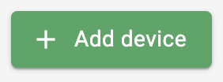
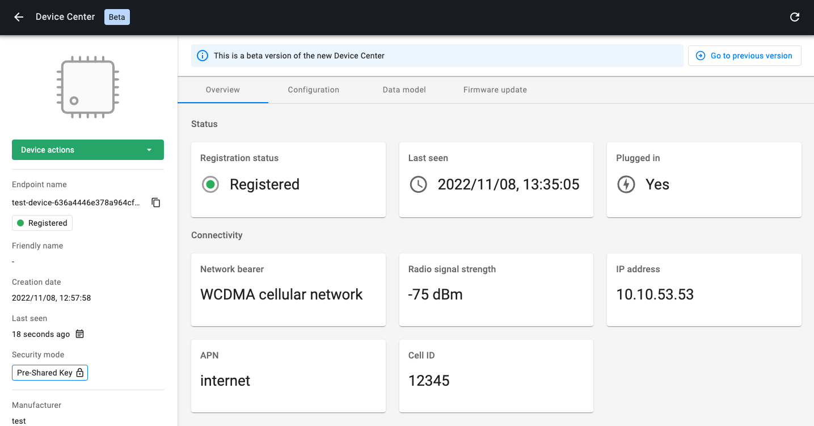
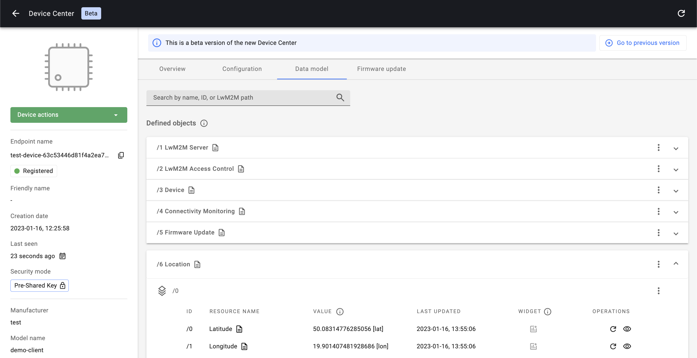

# Quick Start

**Welcome to the DevZone of AVSystem!**

This Quick Start walks you through the process of building your first LwM2M application using AVSystem’s LwM2M Client: **Anjay** and AVSystem’s LwM2M Server: **Coiote IoT Device Management**.

Follow this guide to simulate a LwM2M application within 20 minutes.

## Introduction to LwM2M

*TBD*

## Access the Coiote IoT DM portal

Get started by [signing up](https://eu.iot.avsystem.cloud/) to Coiote IoT Device Management. You can sign up for a free developer account, allowing you to connect up to 10 devices free of charge.

[Coiote IoT DM](https://eu.iot.avsystem.cloud/){: .md-button .md-button--big }


*Empty device inventory at Coiote IoT DM*

## Run Anjay LwM2M Client Demo

Anjay LwM2M SDK is a set of tools that enables device vendors and IoT developers to easily implement a LwM2M client on their hardware or develop a customized LwM2M client for testing purposes. It is available both in an advanced commercial version as well as in the open-source model - to download it, go to [github.com/AVSystem/Anjay](https://github.com/AVSystem/Anjay).

Find below the guide to start implementing Anjay on your Linux, Mac or Windows machine.

!!! note
    If preferred, you can directly jump to the Getting Started guides of the popular hardware platforms:

    * [Nordic](LwM2M_Client/Nordic/Thingy91/)
    * [STMicroelectronics](LwM2M_Client/STMicroelectronics/Building_LwM2M_applications/Building_LwM2M_applications_with_I-CUBE-Anjay/), 
    * [ESP32](LwM2M_Client/ESP32/M5Stick/) 
    * [Raspberry Pi](Anjay_integrations/RaspberryPi_integration/RaspberryPi-Pico-W/)


!!! Info
    For more information about the Anjay LwM2M Client, visit the [Anjay Library Documentation](https://avsystem.github.io/Anjay-doc/index.html) 


### Compile the Anjay demo client:

=== "Linux"
    Open up your command line interface and install the required dependencies:

    ```
    brew install cmake mbedtls
    ```
    sudo apt-get install git build-essential cmake libmbedtls-dev zlib1g-dev

    ```
    mkdir ~/AVSystem \
    && cd AVSystem
    ```

    Clone the Anjay GitHub repository and compile the Anjay demo client using Cmake.

    ```
    git clone https://github.com/AVSystem/Anjay.git \
    && cd Anjay \
    && git submodule update --init \
    && cmake . \
    && make -j
    ```

=== "Mac"
    Open up your terminal dependencies and install the required dependencies using [Homebrew](https://brew.sh/)

    ```
    brew install cmake mbedtls
    ```
    Create a new directory, e.g. called `AVSystem`

    ```
    mkdir ~/AVSystem \
    && cd AVSystem
    ```

    Clone the Anjay GitHub repository and compile the Anjay demo client using Cmake.

    ```
    git clone https://github.com/AVSystem/Anjay.git \
    && cd Anjay \
    && git submodule update --init \
    && cmake . \
    && make -j
    ```

=== "Windows"
    **Install the required dependencies**

    1. Install [MSYS2](http://www.msys2.org/)
    
    1. Install [Git for Windows](https://gitforwindows.org/)
    
        !!! Note 
            You can also install these using [Chocolatey](https://chocolatey.org/): `choco install git msys2` but please make sure to still follow the instructions to update MSYS2 after installing it.
    
    1. Open the appropriate MINGW shell (e.g., `C:\msys64\mingw32.exe` or `C:\msys64\mingw64.exe`, depending on whether you want to build 32- or 64-bit binaries) and install the compile-time dependencies:

        ```
        pacman -Sy make ${MINGW_PACKAGE_PREFIX}-gcc ${MINGW_PACKAGE_PREFIX}-cmake ${MINGW_PACKAGE_PREFIX}-mbedtls
        ```

    **Compile the project**

    Run the following commands in the MINGW shell, after navigating to the directory created using Git above:

    ```
    cmake -G"MSYS Makefiles" -DDTLS_BACKEND="mbedtls" .
    make
    ```

### Add a new device in Coiote IoT DM:

After compiling the demo project, go back to the [Coiote IoT DM Portal](https://eu.iot.avsystem.cloud/).

Click the button **+ Add device** in the top-right corner.



Add a new device using the option: **Anjay LwM2M Client Demo**


Open the terminal in your Anjay repository folder and **run the command** you find in Coiote to establish the connection.


## Monitor your demo device in the Coiote IoT DM

If the demo product runs successfully, the demo device is shown in the Coiote platform.



### Review the Data model

Click the tab **Data model** in the top-menu.


Under Data model you will find all the configured LwM2M **Objects**, **Object instances** and **Resources** containing property values or telemetry data. This includes:

- Object `/1 LwM2M`
    - Resource `/0 Short Server ID`
    - Resource `/1 Lifetime`
    - Etc.
- Object `/3 Device`
    - Resource `/0 Manufacturer`
    - Resource `/1 Modem Number`
    - Resource `/2 Serial Number`
    - Etc.
- Object `/6 Location`
    - Resource `/0 Latitude`
    - Resource `/1 Longitude`
    - Resource `/2 Altitude`
    - Etc.
- Object `/3303 Temperature`
    - Resource `/5601 Min Measured Value`
    - Resource `/5602 Max Measured Value`
    - Resource `/5700 Sensor Value`
    - Etc.



## Up next

Did you manage to run the Anjay LwM2M Client Demo? **Well done! 👏**

Now the fun begins. Below you can find useful links to continue your LwM2M journey.

#### Get started with popular hardware platforms

[Nordic](LwM2M_Client/Nordic/Thingy91/){: .md-button .md-button--big} [STMicroelectronics](LwM2M_Client/STMicroelectronics/Building_LwM2M_applications/){: .md-button .md-button--big} [ESP32](LwM2M_Client/ESP32/M5Stick/){: .md-button .md-button--big} [Raspberry Pi Pico](Anjay_integrations/RaspberryPi_integration/RaspberryPi-Pico-W/){: .md-button .md-button--big }


#### Learn more about Coiote IoT DM

[Coiote IoT DM docs](Coiote_IoT_DM/Quick_Start/Connect_device_quickstart/){: .md-button .md-button--big }


#### Explore our cloud integrations:

[Azure IoT Hub](Cloud_integrations/Azure_IoT/Azure_IoT_Hub/Configure_Azure_IoT_Hub_integration.md){: .md-button .md-button--big :style="float: left;margin-right: 30px;"} [AWS IoT Core](Cloud_integrations/AWS_IoT_Core/Configuring_AWS_integration.md){: .md-button .md-button--big } [nRF Cloud](Cloud_integrations/nRF_Cloud_Location_services/Configure_nRF_Cloud_integration.md){: .md-button .md-button--big }


### Invitation to Discord

Join us on [Discord](https://discord.avsystem.com/) to get in touch with the AVSystem experts and to meet fellow LwM2M developers.

<a href="https://discord.avsystem.com/" target="_blank">

</a>
