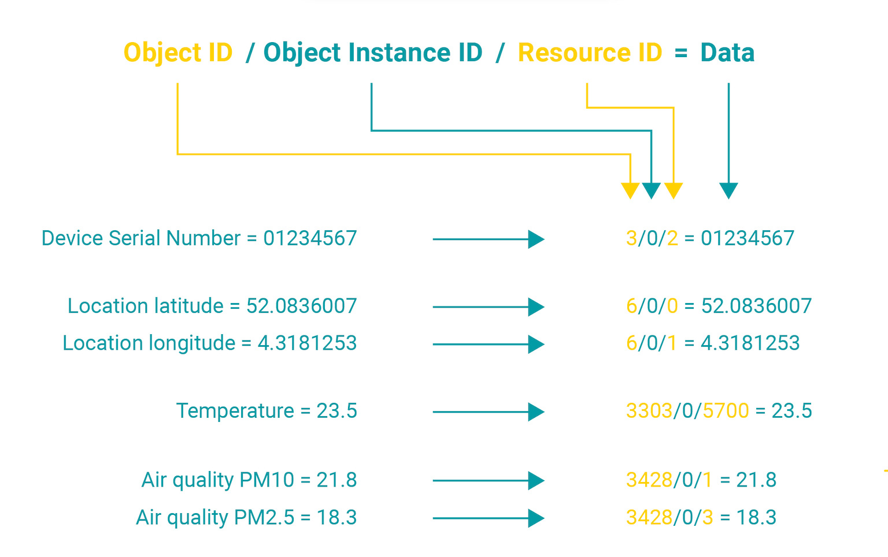

# Introduction to LwM2M 

LwM2M is an application-layer communication protocol developed by the <a href="https://omaspecworks.org/" target="_blank">**OMA SpecWorks**</a> to simplify messaging and device management of IoT devices. The protocol defines device management mechanisms, over-the-air updates (FOTA, SOTA), service enablement and is well suited for resource-constrained devices.

### LwM2M architecture

The architecture of a LwM2M application comprises 3 components: 

1. The **LwM2M client** runs on the end device and ensures a secure connection with the LwM2M Server and Bootstrap Server, and sends data in the right format as dictated by the standard.
2. The **LwM2M Server** manages the device, its data and firmware in the cloud. 
3. The **LwM2M Bootstrap Server** a cloud service to authenticate and provision the LwM2M Client (optional)

### LwM2M data format

Each data message is sent using a data format which identifies standardized **objects**, **object instances** and **resources**, all defined by the OMA in the
<a href="https://technical.openmobilealliance.org/OMNA/LwM2M/LwM2MRegistry.html" target="_blank">**LwM2M Registry**</a>. 

- **Objects** - Devices contain different building blocks, each of these blocks is represented by an **Object** and identified by an **Object ID**. For example, the Firmware Update Object is used to invoke and track status of the firmware update process. Objects can also describe the connectivity technology (e.g. cellular or WiFi), device information (serial number, manufacturer, firmware version), sensors (temperature, air quality) or peripherals (GPS, LEDs, buzzers).

- **Object instances** - Each Object may have different **Instances**, e.g. multiple temperature sensors embedded on one device.

- **Resources** - Object Instances have one or multiple **Resources**. For example, the “Device” object has multiple resources such as the *manufacturer*, *serial number* and *firmware version*. The “Location” object has the resources *latitude*, *longitude* and *altitude*.

