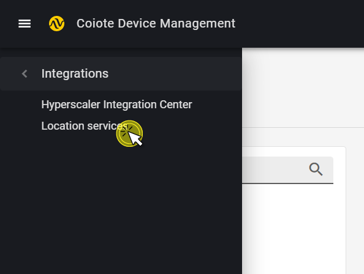

# Connect nRF Cloud integration

Connect your nRF Cloud devices to Coiote DM to track their location and save battery life. [Read more about Nordic Semiconductor Location services](https://www.nordicsemi.com/Products/Cloud-services?lang=en#infotabs).

## Prerequisites

  - An nRF Cloud account. If you don't have it, [create one here](https://nrfcloud.com/#/).
  - A Coiote DM user account with permissions to use the nRF Cloud integration.

To enable communication and data flow between the Nordic Semiconductor nRF Cloud and Coiote DM platforms, you first need to integrate them using the **nRF Cloud integration**  in Coiote DM. Follow the instructions below to learn how to do it.

### Obtain Service Evaluation Token from nRF Cloud

0. In your nRF Cloud user account, go to ****.
  

## Integrate nRF Cloud with Coiote DM

0. In your Coiote DM user account, go to **Administration --> Integrations --> Location services**.
  
0. In the **nRF Cloud** tile, click **Connect**.
0. In the dialog window, paste the previously copied IoT Hub connection string and Azure Blob storage connection string into the relevant fields.
  {:style="float: left;margin-right: 1177px;margin-top: 17px;"}
      - click **Save** to keep the setting.

Use the obtained credentials to establish the integration between Coiote DM and your Azure IoT hub:

### View location in Coiote DM

Your integration should now be established. To get location services, see 
