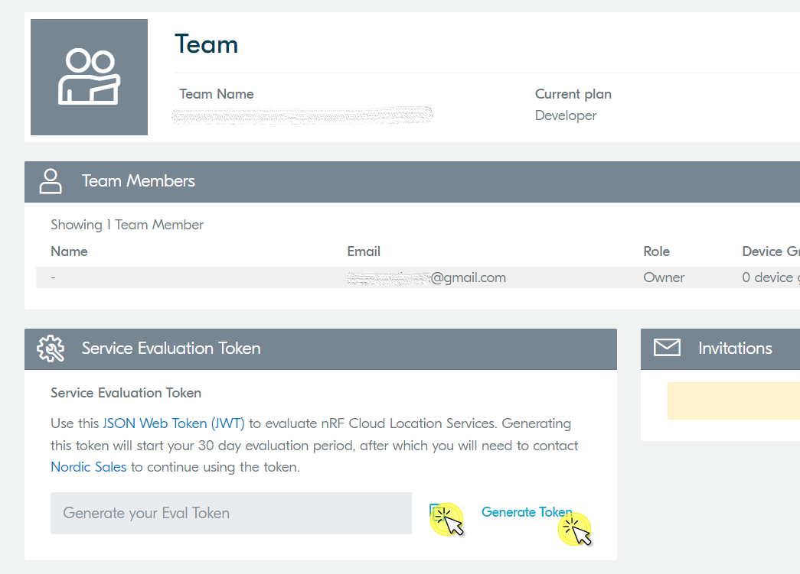

# Connect nRF Cloud integration

Connect your nRF Cloud devices to Coiote DM to track their location and save battery life. [Read more about Nordic Semiconductor Location services](https://www.nordicsemi.com/Products/Cloud-services?lang=en#infotabs).

## Prerequisites

  - An nRF Cloud account. If you don't have it, [create one here](https://nrfcloud.com/#/).
  - A Coiote DM user account with permissions to use the nRF Cloud integration.

To enable communication and data flow between the Nordic Semiconductor nRF Cloud and Coiote DM platforms, you first need to integrate them using the **nRF Cloud integration**  in Coiote DM. Follow the instructions below to learn how to do it.

### Get the Service Evaluation Token from nRF Cloud

0. In your nRF Cloud user account, from the expandable top-right menu, select **Team**.
0. In the **Service Evaluation Token** field, click **Generate Token** and click on the icon to copy it.

## Integrate nRF Cloud with Coiote DM

0. In your Coiote DM user account, go to **Administration --> Integrations --> Location services**.
  
0. In the **nRF Cloud** tile, click **Connect**.
0. In the dialog window, paste the previously copied nRFC Service Evaluation Token.
  {:style="float: left;margin-right: 1177px;margin-top: 17px;"}
      - click **Save** to keep the setting.

Now the integration between Coiote DM and nRF Cloud is established. Read the next section on how to display device location in Coiote DM.

### View device location in Coiote DM

To display your device location, you first need to set up the Google Maps property for your domain.

0. In your Coiote DM user account, go to **Device Inventory**.
0. Click the **Management** link next to your device to enter the **Device Center**.
0. If not selected, click the **Overview** tab and scroll down to the **Device location** section.
  {:style="float: left;margin-right: 1177px;margin-top: 17px;;margin-bottom: 17px;}
